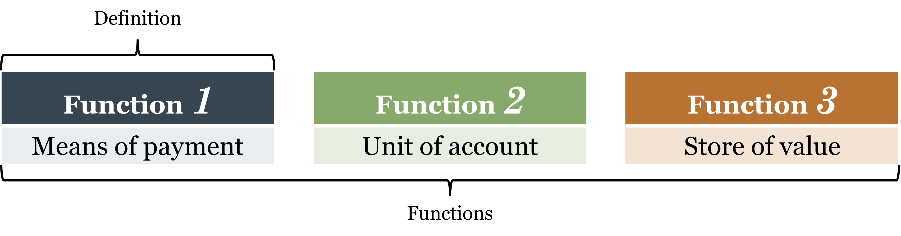
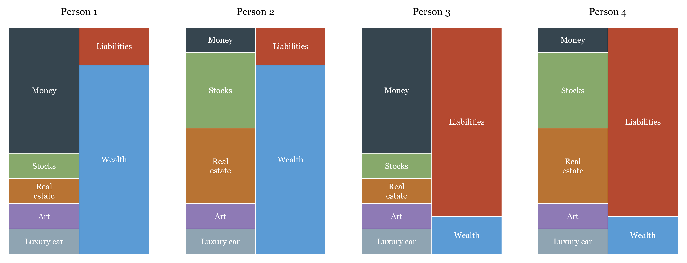
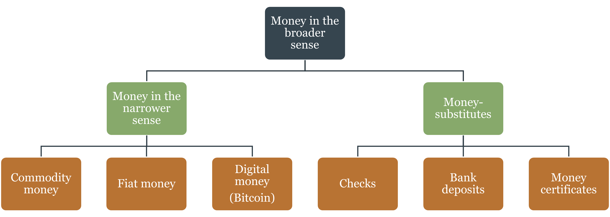
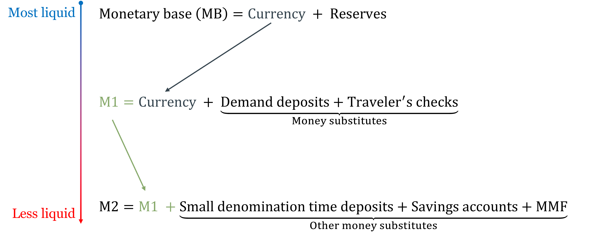
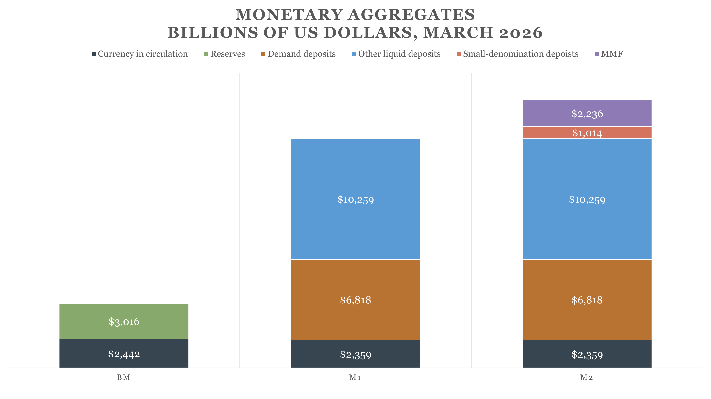
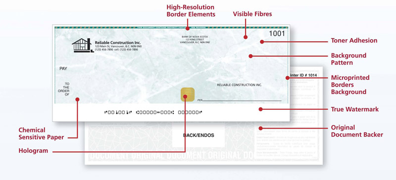
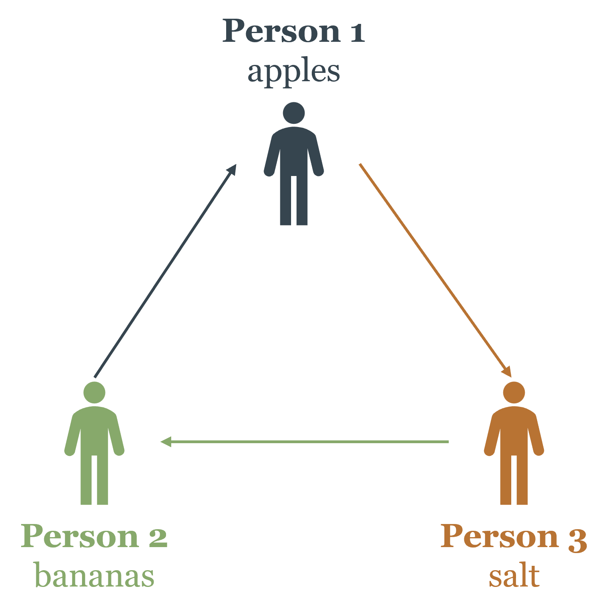
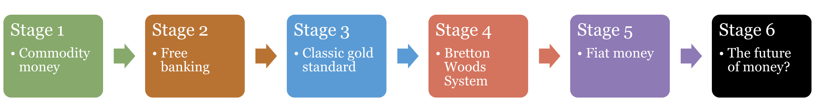
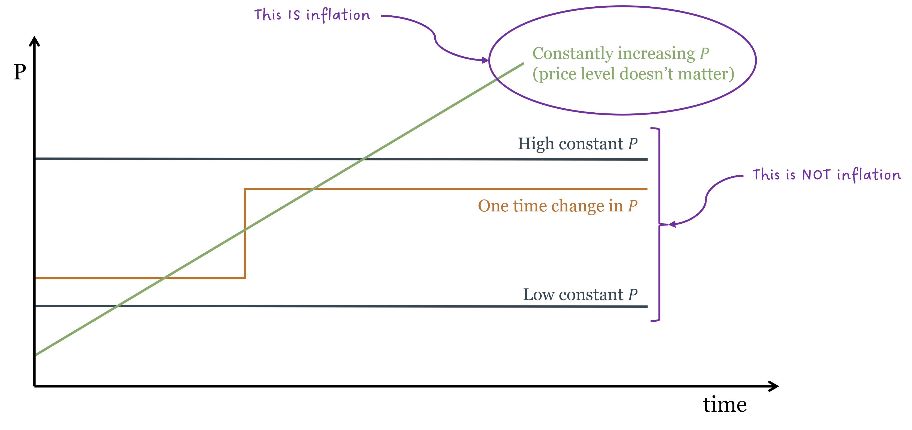

# The Nature and Price of Money {#sec-ch01}

::: {.callout-note}
## Learning Objectives

By the end of this chapter, you will be able to:

- Define money using its three core functions and explain why the definition matters more than the functions
- Distinguish money from related concepts such as wealth, income, and payment technologies
- Explain how money emerged historically, and evaluate two competing theories of that origin
- Use the equation of exchange to explain the relationship between money supply and the price level
- Apply the Quantity Theory of Money to understand inflation, including the mechanics of hyperinflation
- Identify the key features of cryptocurrencies and Central Bank Digital Currencies, and assess whether Bitcoin qualifies as money
:::

## What Is Money?

Let's start with a question that sounds almost too simple to be worth asking: what is money?

Most people would point to the dollar bills in their wallet or the balance in their bank account. That's a reasonable start — but it turns out that what money *is* and what money *does* are two different things. Economists care a lot about getting the distinction right, because sloppy thinking about money leads to serious confusion in economic policy.

The most useful way to understand money is not to look at what it's made of, but at what it *does*. Money performs three essential functions in any economy.

### The Three Functions of Money

**Function 1: Means of Payment.** The most fundamental job of money is to serve as a means of payment — a commonly accepted asset that finalizes transactions. When you hand over cash (or swipe a card that triggers a transfer of funds) for a cup of coffee, the transaction is complete. The seller accepts the payment and lets you walk away. No further obligation exists between you.

This might sound obvious, but it's actually an extraordinary achievement. Before money existed, people had to trade goods directly for other goods. That system is called **barter**, and it has a fatal flaw we'll explore in section 1.3. Money solves that problem elegantly by becoming the universal go-between in every transaction.

Notice also that money enables anonymous transactions. The coffee shop doesn't need to know anything about you — your reputation, your creditworthiness, your relationship to anyone — to accept your payment. Money carries its own credibility. This anonymity is economically profound. In a barter economy, or in any system where payment depends on personal trust, you can only trade with people you know and who know you. Money dissolves that constraint: you can transact with almost anyone who carries the same commonly accepted medium of exchange, whether they live next door or on the other side of the country. This represents a massive reduction in **transaction costs** — the time, effort, and resources spent finding, evaluating, and negotiating with trading partners — and a correspondingly massive expansion in the potential size of the market. [Adam Smith](https://en.wikipedia.org/wiki/Adam_Smith)'s insight that the division of labor is limited by the extent of the market cuts both ways: money extends the market, which deepens specialization, which raises productivity. Much of modern economic prosperity traces back to this single feature of money.

::: {.callout-note}
## Key Definition: Money

**Money** is an asset that is generally accepted as a means of payment for goods and services. This is the definition, and it flows from the first function. The other two functions — unit of account and store of value — are necessary conditions for money to work, but they don't constitute its definition.
:::

**Function 2: Unit of Account.** Money provides a common measuring stick for prices. In a modern economy with thousands of goods and services, prices are expressed in money terms: a coffee costs \$4, a textbook costs \$80, an apartment rents for \$1,200 a month. This is enormously useful because it allows us to compare the value of very different things using a single scale.

Think about what life would be like without a unit of account. If you wanted to know how much a textbook was worth relative to coffee, you'd need to know the textbook-to-coffee exchange rate directly. In a world with $n$ goods, you'd need to track $\frac{n(n-1)}{2}$ different bilateral exchange ratios — for just 1,000 goods, that's nearly half a million prices. A unit of account collapses this to just $n$ prices, one for each good expressed in money.

More importantly, money prices make **profit and loss calculation** possible. Entrepreneurs can add up revenues and subtract costs — all in the same units — to figure out whether an activity creates or destroys value. Without a unit of account, this calculation is practically impossible, and market economies cannot function.

**Function 3: Store of Value.** For money to work as a means of payment, people need to be willing to hold it. A seller who accepts money today must be confident that it will still be worth something tomorrow. If money lost its value overnight, nobody would want to hold it, and it would cease to circulate.

Money is not the only store of value — stocks, bonds, real estate, and even fine art can all preserve purchasing power over time. But money is the most *liquid* store of value: it can be used immediately in any transaction without needing to be converted into something else first.

It is worth pausing to distinguish the *definition* of money from its *functions*. The definition — a generally accepted means of payment — tells us what money *is*. The three functions tell us what money *does*, and they also give us a way to evaluate money's **quality**. Money that performs all three functions well is high-quality money: it is widely accepted, prices are reliably quoted in it, and it holds its value over time. Money that performs them poorly is low-quality money. The Argentine peso, for instance, qualifies as money by definition — it is the accepted means of payment within Argentina — but it performs poorly as a store of value due to persistent inflation, making it low-quality money by the three-function standard. This quality dimension matters for policy: a central bank that destroys the store-of-value function through excessive money creation does not stop producing money, it just produces worse money.

::: {#fig-functions-of-money}
{width="80%"}

Functions of money; do not confuse with the **definition** of money.
:::

::: {.callout-warning}
## Common Mistake: Confusing the Functions with the Definition

Students often assume that anything performing all three functions *is* money. That's not quite right. The **definition** rests on the first function: general acceptance as a means of payment. Storing value alone doesn't make something money. Gold stores value beautifully, but you can't walk into a grocery store and pay with gold coins — gold is not money in modern economies. Bitcoin may store value (though extreme volatility makes that debatable), but it is not generally accepted as a means of payment, so it too is not money, at least not yet.
:::

### Money vs. Wealth, Income, and Payment Technologies

Three things are frequently confused with money. Clearing them up now will prevent headaches later.

**Money is not the same as wealth.** This is one of the most common everyday confusions. When someone says "she has a lot of money," they usually mean she is *wealthy* — not that she is literally carrying large amounts of cash. But the two are genuinely distinct, and conflating them causes real analytical errors.

Wealth is your total assets minus your total liabilities:

$$W = (\text{money} + \text{stocks} + \text{real estate} + \text{cars} + \text{art}) - (\text{mortgage} + \text{other loans})$$

Money is just one item on the asset side — and often a small one. Consider two people. The first owns a home, a diversified stock portfolio, and a car, but keeps only \$200 in her checking account: she is wealthy but holds very little money in the economic sense. The second has \$5,000 in cash but owes \$40,000 in credit card debt and has no other assets: he holds a lot of money but has strongly negative net wealth. Having cash and being wealthy are related but distinct conditions. Indeed, a truly wealthy individual typically *chooses* to hold little money, because idle cash earns little return — they prefer to keep assets in higher-yielding forms like stocks or real estate.

**Money is not the same as income.** Income is a *flow* — earnings over a period of time. Money is a *stock* — an amount held at a point in time. But the relationship between them is worth spelling out carefully, because money is the *form* in which income is typically delivered. Your employer pays your salary in dollars rather than in apples or hours of legal advice for the same reason money exists at all: it is far more practical. Receiving income in money rather than in goods eliminates the need to negotiate what you are paid in, find buyers for your in-kind income, and evaluate its quality. Money makes income fungible — a dollar of wages buys the same things as a dollar of rental income or dividend income. That said, not all income arrives as money. Senior executives often receive part of their compensation in [stock options](https://en.wikipedia.org/wiki/Employee_stock_option) — claims on equity that are not money but may be converted into money later. This is a reminder that the boundary between money and other assets is not always sharp in practice, even though the conceptual distinction is clear.

**Money is not the same as payment technologies.** The technology used to transfer money is not money itself. When you pay with a debit card, the card is not money — your bank deposit is. The card is just a tool to move it. This is the subject of the next section.

::: {#fig-balance-composition}

Wealth is composed of money plus other assets, minus liabilities. Having cash and being wealthy are not the same thing.
:::

One concept bridges the definition of money and its legal context: **[legal tender](https://en.wikipedia.org/wiki/Legal_tender)**. Legal tender is an asset that a state has designated as acceptable for settling debts and paying taxes. In the US, Federal Reserve notes are legal tender — a creditor cannot legally refuse them in settlement of a debt, though a private store may choose to refuse cash for a spot transaction. Legal tender status is neither necessary nor sufficient for something to be money in the economic sense: an asset can circulate as money without legal tender designation (as privately issued banknotes did in the free banking era), and legal tender status cannot by itself make a worthless asset into functioning money. But it is an important part of the institutional framework that supports modern monetary systems.

#### Applied: Is It Actually Money?

The table below applies the three functions to four familiar assets. Notice that both gold and Bitcoin fail the means-of-payment criterion — and therefore fail the definition — even though gold clearly stores value and Bitcoin might. The Argentine peso qualifies as money despite failing as a store of value, because it is still widely accepted and used for transactions and pricing within Argentina.

|                          | **U.S. Dollar** | **Argentine Peso** | **Gold**  | **Bitcoin** |
|--------------------------|:---------------:|:------------------:|:---------:|:-----------:|
| Common means of exchange | ✅ Yes          | ✅ Yes            | ❌ No     | ❌ No      |
| Unit of account          | ✅ Yes          | ✅ Yes            | ❌ No     | ❌ No      |
| Store of value           | ✅ Yes          | ❌ No             | ✅ Yes    | ❓ Maybe   |
| **Is it money?**         | **✅ Yes**      | **✅ Yes**        | **❌ No** | **❌ No**  |

: The three-function test applied to four assets. {#tbl-is-it-money}

## How Much Money Is There? The Money Supply

Knowing what money *is* immediately raises a follow-up question: how much of it is there? The answer turns out to be surprisingly slippery, because the money supply is not a single number — it's a hierarchy of assets that shade from perfectly liquid to somewhat less liquid. Where you draw the line determines the number you get.

### Base Money and Money Substitutes

Total money has two broad components. **Base money** — also called the monetary base or [high-powered money](https://en.wikipedia.org/wiki/Monetary_base) — is the narrow core: historically, gold and silver coin; today, currency issued by the central bank plus the reserves that commercial banks hold on deposit at the central bank. Base money is the foundation. It is either physically in your hands or held as an electronic claim directly on the central bank.

**Money substitutes** are assets that function like money for most practical purposes but are not themselves base money. A checking account balance is the clearest example: you can use it to pay for almost anything, it is denominated in dollars, and it is redeemable on demand — but it is a claim on a commercial bank, not on the central bank directly. Other money substitutes include savings accounts, money market funds, and short-term certificates of deposit. These are slightly less liquid — they may require a transfer step or a waiting period — but they are close enough to money that they belong in any serious accounting of the money supply.

::: {#fig-money-composition}

The conceptual structure of the money supply. Base money (commodity, fiat, or digital) is the narrow foundation. Money substitutes — bank deposits, money market funds, certificates of deposit — extend it into the broader economy. The dividing line between "narrow money" and "broad money" depends on how strictly you define general acceptance.
:::

The key insight is that money substitutes are created by the banking system through lending, not by the central bank directly. When a bank makes a loan, it credits the borrower's deposit account — creating a new money substitute "out of thin air," backed by the borrower's promise to repay. This process, called **[fractional reserve banking](https://en.wikipedia.org/wiki/Fractional-reserve_banking)**, is why the total money supply is always a multiple of the monetary base. We'll examine the mechanics in detail in Chapter 2.

### The Official Monetary Aggregates

Because the line between "money" and "near-money" is not sharp, economists track the money supply at several levels of breadth. The official U.S. measures, defined by the [Federal Reserve](https://www.federalreserve.gov/releases/h6/), are organized from most to least liquid:

::: {#fig-money-aggregates}
{width="80%"}

The U.S. monetary aggregates. Each level includes everything inside it plus additional, slightly less liquid assets. The monetary base is the most narrow; M2 is the broadest standard measure.
:::

- **Monetary Base (MB):** currency in circulation plus bank reserves held at the Federal Reserve. This is the portion of the money supply under direct Fed control. A dollar of monetary base is either physical cash or an electronic reserve balance — both are claims on the central bank itself.
- **M1:** currency in circulation plus demand deposits (checking accounts) plus other liquid deposits. This is "transaction money" — the assets you can spend directly, without any conversion step. Note that reserves are *already embedded* in the deposits that banks have created against them — adding reserves again when going from MB to M1 would double-count them. M1 picks up the currency held by the public and the deposit liabilities of banks, not the reserves backing those deposits.
- **M2:** M1 plus savings accounts, small-denomination time deposits (certificates of deposit under \$100,000), and retail money market funds. These assets are liquid but require a small step to convert into spending power — you might need to initiate a transfer or wait a day.

As of July 2024, the U.S. monetary base stood at roughly \$5.6 trillion, M1 at around \$18 trillion, and M2 at roughly \$21 trillion. The chart below shows the components of each aggregate in dollar terms.

::: {#fig-monetary-aggregates-values}
{width="80%"}

Components of U.S. monetary aggregates, March 2026 (billions of dollars).  
Source: [Federal Reserve H.6 Release](https://www.federalreserve.gov/releases/h6/20260428/).
:::

The gap between the monetary base and M2 is striking — M2 is nearly four times the size of the base. This multiplier reflects the banking system's role in creating money substitutes through lending. A \$1 increase in base money can generate several dollars of additional deposits as the same reserves circulate through multiple rounds of lending and redepositing. This is not magic, and it has limits: the multiplier depends on how much cash people want to hold and how much reserves banks choose to keep. But it means the Fed's control over M2 is indirect — it controls the base directly, and M2 responds, with some lag and uncertainty.

::: {.callout-warning}
## Common Mistake: Treating Any Single Aggregate as the "Real" Money Supply

Students sometimes ask: which aggregate is the "true" money supply? The answer is that they measure different things and are useful for different purposes. The monetary base is what the Fed directly controls. M1 is the best measure of money used in transactions. M2 is the best measure of the total stock of liquid assets held by the public. None is more "real" than the others — each answers a different question.
:::

## Payment Technologies

Now that we know what money is and how much of it exists, a separate question arises: how does it actually move from one person to another? That is the job of **payment technologies** — the mechanisms and instruments that transfer money between buyers and sellers. Understanding this distinction is essential, because payment technology is often confused with money itself.

Think of it like a railroad and a train. The railroad (payment technology) is the infrastructure that moves things from one place to another; the train (money) is what actually travels along it. Building more railroads — faster, cheaper, more extensive — does not create more trains. It just moves existing trains more efficiently. In the same way, improving payment technology makes transactions faster and cheaper, but it does not create more money or change the money supply.

Here is a question that illustrates the confusion: if you pay for lunch with Apple Pay, what are you actually paying with? The answer is not "Apple Pay." Apple Pay is the railroad — a method of routing a transfer of funds. What you're paying with is money held in a bank account: the train. The technology is the interface; the money is the underlying asset being moved.

Cash transactions are where the confusion is most acute, because the technology and the money look like the same thing. When you hand over a \$20 bill, the physical act — moving your arm, passing paper — is the payment technology. The money is the dollar claim that bill represents. In a digital payment this is obvious (you can clearly see the app is separate from your bank balance); with cash it is less visible, but the distinction is real. The \$20 bill is both the instrument and the carrier, which is what makes cash the special case — and why understanding payment technologies separately from the money supply matters most when we move beyond cash.

### Cash

Cash is the most direct form of payment. When you hand over physical currency, you are transferring money itself — no intermediary needed, no clearing required, no counterparty risk. The transaction is immediate and final.

Three types of money can circulate as cash:

- **Commodity money:** physical objects with value both as money and as goods — gold, silver, salt, silk. Historically important; rarely used today.
- **Fiat money:** paper currency issued by a government with no significant non-monetary use. The US dollar, euro, and yen are all fiat money. They are valuable because governments declare them legal tender and people accept them as payment.
- **Digital money:** money that exists only as electronic records, with no physical counterpart and no non-monetary use.

### Checks

A check is not money. It is an instruction — an order from you to your bank to transfer funds to someone else's account. The paper itself has no intrinsic value; it is a claim on the deposit behind it.

::: {#fig-check}

A check is a payment instruction, not money itself. Its design incorporates multiple security features: an authorized signature acting as a password, a MICR line encoding routing and account numbers, and intricate graphic patterns that make counterfeiting difficult..
:::

A check's security comes from several built-in design features. The **authorized signature** acts as a "password" — the bank checks it against the account holder's signature on file before honoring the instruction. The **MICR line** (the row of machine-readable numbers at the bottom of every check) encodes the routing number identifying the bank, the account number, and the check number, allowing automated processing and verification at scale. Sequential check numbers provide an audit trail, making it easy to detect gaps or duplicates. Magnetic ink and printed security features on the paper itself make physical counterfeiting difficult. Together, these features make checks significantly more secure than handing cash to a stranger.

A bounced check is not "bad money" — it's a failed instruction, because the deposit balance wasn't there to cover it.

### Electronic Payments

Electronic payments are the digital evolution of the check. Instead of paper, an electronic signal triggers the fund transfer.

- **Debit cards** work like electronic checks — they draw directly from your bank account in near real time.
- **Credit cards** work differently: the card issuer pays the merchant on your behalf, and you repay the issuer later. You are spending borrowed money — a credit line — not your own deposit.
- **Electronic funds transfers** move money between accounts through networks like Fedwire (large-value, real-time) or ACH (Automated Clearing House, used for recurring transactions like payroll and bills).
- **Real-Time Payments (RTP):** The newest development is truly instantaneous settlement. Private networks (like The Clearing House's RTP) and the Federal Reserve's FedNow service now clear payments in seconds, 24/7 — unlike traditional ACH, which can take one to two business days.

More recently, payment apps like Venmo, Zelle, Apple Pay, and Google Pay have made electronic transfers almost frictionless. In some markets — Kenya's M-Pesa being the most striking example — mobile phone-based payments have replaced both cash and traditional banking for tens of millions of people. Worldwide, more individuals have a mobile phone than a bank account, making mobile money the most realistic path to financial inclusion in many developing economies.

::: {.callout-tip}
## Intuition Builder: The Plumbing vs. the Water

Think of the money supply as water in a plumbing system. Cash, checks, and electronic payments are different types of pipes — they move water from one place to another. The amount of water in the system is determined by monetary policy, not by the choice of pipes. A better payment technology (faster, cheaper pipes) makes the system more efficient, but it doesn't change how much water there is. This is why the Federal Reserve tracks M1 and M2, not the volume of card or app transactions.
:::

## A Short History of Money

Money is one of humanity's great institutional inventions. But unlike the steam engine or the smartphone, nobody sat down and designed it. It emerged — gradually, spontaneously, and independently in different parts of the world — as societies grew too complex for barter.

### The Problem of Barter

Imagine a world without money. You're a farmer with a surplus of apples. You want bananas. Across town, someone has bananas but wants salt. Somewhere else, a third person has salt but wants apples.

::: {#fig-barter}
{width="35%"}

Barter economy and the problem of *double-coincidence of wants*.
:::

For direct [barter](https://en.wikipedia.org/wiki/Barter) to work, you need a **double coincidence of wants**: person A must have what person B wants, **and** person B must have what person A wants, at the same time and place. In a small village this might be manageable. But as economies grow — more people, more specialization, more goods — the double coincidence of wants becomes a crippling constraint on trade.

Money dissolves this problem. Instead of finding someone who has bananas **and** wants apples, you just find someone who has bananas and accepts money — which everyone does.

### How Money Emerged: Two Competing Theories

**Explanation 1: The Spontaneous Market Account**

The Austrian economist [Carl Menger](https://en.wikipedia.org/wiki/Carl_Menger) provided the classic account in the late 19th century, later formalized by [Ludwig von Mises](https://en.wikipedia.org/wiki/Ludwig_von_Mises) as the **regression theorem**. In a barter economy, some goods are more salable than others — more widely desired, more divisible, more durable. A smart trader realizes that even if the person offering salt doesn't want what the trader has, acquiring salt is still useful because it can be traded with almost anyone later. Salt becomes a medium of exchange before it becomes money, simply through its high marketability.

As more traders adopt this strategy, salt's value increases: it acquires both its consumption value and a monetary premium. This self-reinforcing process can elevate a commodity to the status of a general medium of exchange.

The regression theorem's critical point: for a good to first serve as money, it must already have an established value from non-monetary uses. When adopted as money, people use yesterday's non-monetary prices as a reference. Trace this logic backward and you always arrive at a good that had value *before* it was money. This means purely fiat money — with no non-monetary value — cannot emerge spontaneously from barter. It can only arise as an outgrowth of a prior commodity money system.

What kinds of goods ended up as money? History gives a consistent answer: **precious metals** — durable (they don't rot or rust), divisible (meltable into any denomination), portable (high value in small volume), and relatively scarce.

::: {.callout-tip}
## Intuition Builder: Why Salt Before Gold?

In coastal regions with easy sea access, salt was cheap and abundant — a poor money candidate. In landlocked regions where salt required long-distance transport, it was scarce and universally desired. The word "salary" comes from the Latin *salarium*, related to salt payments made to Roman soldiers. Context and scarcity determine what becomes money — not any intrinsic property of the good itself.
:::

**Explanation 2: The Chartalist Theory**

The chartalist tradition ([Georg Friedrich Knapp](https://en.wikipedia.org/wiki/Georg_Friedrich_Knapp)) offers a radically different account: money is a creature of the state, created by law rather than emerging from market exchange.

The core argument: what makes an asset **generally accepted** is not its marketability but its legal status. When a state declares an asset legal tender and demands taxes be paid in it, it creates enormous demand for that asset across the entire population. Everyone with a tax obligation must acquire it. This legally-mandated demand is what turns paper into money.

Chartalism is not primarily trying to explain money's first appearance, but why a particular currency becomes **widely** accepted across a large population. The debate between spontaneous-market and chartalist views resurfaces directly in modern discussions: cryptocurrencies attempt to create money without state backing; CBDCs represent state money in new digital form.

It is worth noting an important distinction between the two explanations. The spontaneous market account focuses on the **economic origin and role** of money — why certain goods are adopted as media of exchange through voluntary market processes. The chartalist theory focuses on the **legal definition and status** of money — why a particular asset is declared and enforced as the accepted means of payment by state authority. These are not mutually exclusive: both economic forces and legal institutions shape what functions as money in practice. But they do point to a real and unresolved tension: can an asset become genuine money — widely accepted, broadly used as a unit of account, reliably holding its value — purely through market adoption, without any legal backing? Or does money always ultimately rest on state authority? Cryptocurrencies are, at this moment, the live experiment testing that question.

### Six Stages in the History of Money

Monetary history can be organized into six broad stages. Each stage reflects a different answer to the same underlying questions: who issues money, what backs it, and how is its supply constrained? The progression is not a smooth line of progress — each stage solved some problems while creating others, and the transitions between them were often forced by war, financial crisis, or technological change. The figure below summarizes the sequence; the discussion that follows explains what changed at each step and why.

::: {#fig-history-of-money}

Six stages in the history of money. The first five are well-established; the sixth is unfolding now.
:::

**Stage 1 — Commodity Money.** The earliest monetary systems used commodities directly. Shells, cattle, salt, copper, silver, and eventually gold served as money in different times and places. The key feature: the money itself has non-monetary value, which puts a natural limit on supply — you can only have as much gold money as you can mine and refine.

**Stage 2 — Free Banking.** As economies grew, carrying gold became impractical. Private banks began issuing paper certificates (banknotes) redeemable for a fixed weight of gold on demand. Multiple competing private banks issued their own notes, all convertible to gold. This era flourished in Scotland, parts of the US, Canada, and Australia during the 18th and 19th centuries. We examine it closely in Chapter 2.

**Stage 3 — The Classical Gold Standard.** By the late 19th century, most major economies converged on a system where national currencies were defined as a fixed weight of gold, and central bank notes were redeemable for gold on demand. It is important to be precise here: money was still gold itself. Central bank notes were *gold substitutes* — claims on gold held in reserve, analogous to the way a bank check is a claim on dollars, not a separate currency. This means there was no "exchange rate" between, say, a Bank of England note and a Banque de France note in the conventional sense: both were claims on the same underlying money (gold) at fixed weights, just as there is no exchange rate between a Wells Fargo check and a JPMorgan check if both are denominated in dollars. What the gold standard constrained was the ability of governments to expand the money supply beyond what their gold reserves could back. The result was remarkable long-run price stability — but also an inability to respond flexibly to financial crises, since injecting liquidity required acquiring more gold.

**Stage 4 — The Bretton Woods System.** The Classical Gold Standard collapsed with World War I, as nations abandoned convertibility to finance wartime spending. After World War II, a modified system was established at [Bretton Woods](https://en.wikipedia.org/wiki/Bretton_Woods_system) (1944): the US dollar was pegged to gold at \$35 per ounce, and other currencies were pegged to the dollar. Only foreign central banks could exchange dollars for gold. The [IMF](https://en.wikipedia.org/wiki/International_Monetary_Fund) was established to support the system.

**Stage 5 — Fiat Money.** As the US ran persistent balance-of-payments deficits through the 1960s, foreign central banks increasingly sought to convert dollar holdings into gold. On August 15, 1971, President Nixon suspended dollar-gold convertibility — ending Bretton Woods. All major currencies became **fiat money**: money by government decree, backed by nothing but the state's authority and public acceptance. The regression theorem still applies: fiat money derived its initial value from the gold-linked money it replaced, using those existing market prices as a reference on Day 1.

**Stage 6 — The Future of Money.** We're living through Stage 6 now — a period of genuine experimentation. Two paths are opening: a return toward private money through cryptocurrencies, and a continuation of state money through Central Bank Digital Currencies. The next section previews both.

## The Price of Money and Inflation

So far we've covered what money is and where it came from. Now we turn to something more immediately practical: how does the value of money change over time, and what drives those changes?

The short answer is that money, like any other good, has a price determined by supply and demand.

### The Price of Money Is Its Purchasing Power

The price of a good is how much money you give up to get it. The price of money, then, is how much of everything else you can get in exchange for a unit of money — its **purchasing power**. If the price level is $P$ (a weighted average of all goods' prices), then the purchasing power of money is $\frac{1}{P}$.

When the price level rises, the purchasing power of money falls: each dollar buys less. When the price level falls, purchasing power rises. **Inflation** is the rate at which the price level is **continuously** increasing — equivalently, the rate at which purchasing power is declining.

A crucial clarification: inflation means a **continuously rising** price level, not merely a *high* price level. The diagram below makes this precise.

::: {#fig-inflation}

What counts as inflation. A persistently high price level, or a one-time jump, is *not* inflation. Inflation is the ongoing, sustained upward movement in the price level over time. The level of prices doesn't matter for inflation — only the rate of change does.
:::

This framing is useful because it reminds us that inflation is not something that happens to goods — it's something that happens to money. Goods don't appear more expensive because they became more valuable; they appear more expensive because the money used to price them became less valuable.

### Supply, Demand, and the Price Level

Like any market, the market for money has a supply and a demand, and equilibrium determines the price level.

**Money demand** is the desire to hold money balances — to keep some wealth in liquid form rather than in stocks or real estate. You hold money because you need it for transactions: you can't pay for lunch with Apple stock. Money demand rises with income (more transactions needed) and falls when interest rates rise (higher opportunity cost of holding idle cash).

There is a fundamental accounting identity that connects money holding to real spending:

$$Y = C + M^D$$

Your income ($Y$) is divided between consumption ($C$) and the money balances you choose to hold ($M^D$). Rearranged:

$$C = Y - M^D$$

This is more than bookkeeping — it's an economic insight. When people choose to hold *more* money, they by definition spend *less* on consumption, holding income constant. When money demand falls and people want to hold less cash, consumption rises. This direct link gives monetary policy its macroeconomic power: changes in the willingness to hold money ripple through to changes in aggregate spending.

**Money supply** is determined in a modern fiat system primarily by the central bank through its control of the monetary base. The banking system then multiplies that base into a larger supply through lending — a process covered in detail in Chapter 2.

The equilibrium price level $P^*$ is where money demand equals money supply. Changes in either shift equilibrium and change the value of money. This is the essence of the **cash-balance approach** to monetary theory: the price level adjusts until people are willing to hold exactly the amount of money the central bank has supplied. If the government supplies more money than people want to hold at current prices, people try to spend the excess — they buy goods, assets, anything to reduce their cash balances. This surge in spending bids up prices until the real value of money balances falls back into line with desired holdings. The price level rises. The reverse holds when the supply falls short of desired holdings: people try to rebuild their cash balances by spending less, demand falls, and the price level adjusts downward. Equilibrium is precisely where desired money holdings equal money supplied — and therefore where the price level is no longer moving. Inflation, from this perspective, is what happens when the central bank persistently supplies more money than the public wants to hold.

### What Causes Inflation?

The general price level $P$ is a weighted average of all individual prices:

$$P = \omega_1 p_1 + \omega_2 p_2 + \cdots + \omega_n p_n$$

For $P$ to rise persistently, many prices must rise simultaneously and continuously. Why would they? It is worth being precise about what can and cannot produce inflation as we have defined it — a *continuous* increase in the price level, not a one-time jump.

Two things are sometimes confused with inflation but are not, properly understood:

- **Supply shocks** (e.g., an oil embargo) raise prices in one sector. But money diverted to oil must come from somewhere — spending on other goods falls, pulling their prices down. The overall price level may shift temporarily, but without an accompanying increase in money supply the effect is a **relative** price change, not a sustained rise across the board. Once the shock passes, prices tend to stabilize at the new level. Additionally, a supply shock is more likely to produce a one-time jump in the price level rather than a continuous increase. The initial shock raises prices, but without ongoing excess money creation, there is no mechanism to keep pushing prices up indefinitely.
- **A fall in money demand**: if people want to hold less cash, they spend more, and prices rise. But this is a one-time adjustment. Once people have rebalanced their portfolios, spending normalizes and the price level stabilizes. A shift in money demand moves the price level to a new plateau; it does not keep pushing it upward indefinitely.

Only one mechanism can produce sustained, continuously rising prices: an **excess of money supply** that keeps growing faster than the real economy. If the central bank continuously creates more money than people want to hold, people continuously try to spend the excess, and prices continuously rise. This is the only source of genuine, persistent inflation in the sense economists mean by the term. The conclusion is stark: sustained inflation requires sustained money growth — a claim confirmed by every serious historical episode of persistent inflation without exception.

### The Equation of Exchange

The **equation of exchange** makes this relationship precise. It is an accounting identity — true by definition:

$$MV \equiv Py$$

where $M$ is the money supply, $V$ is the **velocity of money** (average number of times a dollar is spent per period), $P$ is the price level, and $y$ is real output (real GDP).

The left side, $MV$, is total nominal spending. The right side, $Py$, is nominal GDP. They must be equal: every dollar spent on goods and services generates an equal dollar of income for someone.

Velocity has a useful interpretation: it's the inverse of money demand. When people want to hold less cash relative to income, each dollar turns over faster — high velocity. When money demand is high, velocity falls.

In growth-rate form:

$$\dot{M} + \dot{V} \equiv \pi + \dot{y}$$

where $\pi$ denotes inflation and dots denote growth rates. Money supply growth plus velocity growth equals inflation plus real output growth.

::: {.callout-note}
## Key Definition: Money Velocity

**Velocity** ($V$) is the average number of times a unit of money changes hands in a given period. It is the inverse of money demand. When people want to hold more cash, velocity falls; when they spend more freely, velocity rises. Velocity is not directly controlled by the central bank — it depends on payment habits, financial innovation, and expectations about the future value of money.
:::

### The Quantity Theory of Money

The equation of exchange becomes a theory when we add three empirical assumptions:

1. **Real GDP growth is roughly stable** ($\dot{y} \approx 0$ in the short run)
2. **Velocity is roughly stable** ($\dot{V} \approx 0$)
3. **The money supply is set by the central bank** ($M$ is exogenous)

Under these conditions:

$$\dot{M} \approx \pi$$

Inflation approximately equals money supply growth. This is [Milton Friedman](https://en.wikipedia.org/wiki/Milton_Friedman)'s dictum: *"Inflation is always and everywhere a monetary phenomenon."* Persistent, large-scale inflation requires a sustained increase in the money supply — no exceptions at the extremes.

A real-world caveat: the assumption that velocity is stable has been challenged since the 1990s. M2 velocity in the US has trended downward since then, partly because a growing share of money flows into financial assets — stocks, bonds, real estate — rather than goods and services counted in GDP. This doesn't overturn the Quantity Theory; it reminds us that the assumptions matter and that the link between broad money and inflation has become less mechanical over time.

::: {.callout-important}
## Key Takeaway: The Root Cause of Inflation

The Quantity Theory tells us that sustained, large-scale inflation requires sustained money supply growth. Supply shocks can temporarily raise the price level, but only excess money creation can keep inflation elevated over the long run. This is why central bank independence — keeping money creation out of politicians' hands — is considered so critical for price stability.
:::

### Why Inflation Is Costly

Even moderate inflation imposes real costs.

**Cantillon effects and distorted price signals.** Prices don't rise simultaneously or uniformly. Newly created money enters the economy at specific points — through government spending or bank lending — and spreads outward. First recipients spend it before prices have risen; later recipients get it after prices have adjusted. This uneven process, named after 18th-century economist [Richard Cantillon](https://en.wikipedia.org/wiki/Richard_Cantillon), creates arbitrary redistributions with no relation to productive contribution.

More fundamentally, inflation corrupts the information content of prices. In a market economy, a rising price for a particular good signals genuine increased demand, guiding producers to shift resources accordingly. But when the overall price level is rising, a producer can't easily distinguish whether their product is becoming more valuable or whether everything is just more expensive. This **extraction signal problem** leads to business overexpansion based on "fake" profits — profits that are really just inflation — which eventually must be unwound.

**Wealth redistribution between lenders and borrowers.** Consider a concrete example. John borrows \$100,000 at 7% to open a pizza restaurant. The bank expects 2% inflation ($\pi^E = 2\%$), so it expects a real return of 5%. John must repay \$107,000 a year later — \$2,000 from higher pizza prices (inflation) and \$5,000 from real profits.

Now suppose actual inflation differs from what both parties expected:

| | $\pi < \pi^E$ | $\pi = \pi^E$ | $\pi > \pi^E$ |
|---|---|---|---|
| **Lender** | Gains purchasing power | Unaffected | Loses purchasing power |
| **Borrower** | Loses purchasing power | Unaffected | Gains purchasing power |

: Inflation and wealth redistribution. Only when actual inflation equals expected inflation does neither party gain or lose relative to their plan. {#tbl-inflation-redistribution}

If inflation comes in at 1% — below expectations — John must cover more of the \$107,000 from real profits; the bank does better than planned. At 3%, John's pizza prices rise more, reducing his real burden; the bank earns less in real terms. These gains and losses are purely redistributive — no new wealth is created, just shuffled between parties based on an unpredictable macroeconomic variable. Inflation *uncertainty* may be even more damaging than inflation itself, since it forces lenders to demand higher risk premiums on every long-term contract, raising borrowing costs throughout the economy.

**Fiscal distortions.** Inflation interacts perversely with tax systems based on nominal values. Suppose you buy a stock for \$100 and sell it for \$110 — a \$10 nominal gain on which you owe capital gains tax. But if inflation was 15% over that period, your stock's real value actually *fell*. You pay taxes on an economic loss. This was a serious problem during the high-inflation 1970s in the US and remains acute in high-inflation economies today.

**The cost of stopping inflation.** Perhaps the cruelest cost is that reducing embedded inflation requires accepting real economic pain. Once inflation expectations are built into wage negotiations and price-setting, slowing money supply creates a money shortage relative to expectations. Spending falls, output contracts, unemployment rises. The Federal Reserve's 1980–82 disinflation under Paul Volcker pushed unemployment above 10% and triggered the deepest recession since the Great Depression. That's the price of letting inflation become entrenched in the first place.

### Hyperinflation: When Money Loses All Meaning

Inflation becomes **hyperinflation** when it spirals out of control. The standard quantitative threshold is a monthly inflation rate of at least 50% — roughly 13,000% annually. The qualitative definition may be more instructive: hyperinflation occurs when *money velocity grows out of control*.

Hyperinflations are nearly always triggered by large fiscal deficits financed by printing money. As the government prints, prices rise. As prices rise, people expect more inflation and rush to spend before money loses more value. This accelerates velocity — the same money stock chases goods faster and faster. Eventually the inflation rate *exceeds* the money supply growth rate:

$$\pi > \dot{M} \quad \text{because} \quad \dot{V} > 0$$

At this point, the central bank has lost control. The only remedy is a dramatic institutional shock that credibly re-anchors expectations — a currency reform, a new monetary constitution, sometimes a foreign currency peg.

The historical record is sobering:

| **Country**   | **Period** | **Cumulative inflation** | **Max monthly rate** |
|---------------|------------|-------------------------:|---------------------:|
| United States | 1777–1780  | 2,707%                   | 1,342%               |
| Germany       | 1919–1923  | 500,000,000,000%         | 3,250,000%           |
| Greece        | 1941–1944  | 160,000,000,000%         | 8,500,000,000%       |
| Hungary       | 1945–1946  | 1.3 × 10²⁴%              | 4.19 × 10¹⁶%         |
| Bolivia       | 1984–1985  | 97,282%                  | 196%                 |
| Nicaragua     | 1986–1991  | 12,000,000,000%          | 261%                 |
| Yugoslavia    | 1993–1994  | 1.6 × 10⁹%               | 5 × 10¹⁵%            |
| Zimbabwe      | 2001–2008  | 8.53 × 10²³%             | 7.96 × 10¹⁰%         |

: Selected hyperinflation episodes. {#tbl-hyperinflations}

::: {.callout-tip}
## Intuition Builder: The Wheelbarrow Economy

The famous image of Weimar Germany is people bringing wheelbarrows full of currency to buy bread. This illustrates an economic logic, not just colorful history. When money loses value so fast that prices double within days, no one wants to hold it for even 24 hours. You get paid, immediately spend everything, come back tomorrow and repeat. Velocity approaches infinity. The economy retreats toward barter and foreign currencies. Savings are wiped out, long-term contracts become impossible, and economic calculation breaks down entirely.
:::

---

## The Future of Money

The history traced in section 1.3 ended at Stage 5: fiat money issued by central banks. Over the past fifteen years, the landscape has started to shift again, and Stage 6 is taking shape. Two broad paths are visible — one toward private money free of state control, the other extending state money into new digital forms.

### Bitcoin and the Cryptocurrency Experiment

[Bitcoin](https://en.wikipedia.org/wiki/Bitcoin) launched in January 2009, during the global financial crisis — not a coincidence. Its pseudonymous creator, [Satoshi Nakamoto](https://en.wikipedia.org/wiki/Satoshi_Nakamoto), framed it explicitly as a response to the failures of both central banks and private banks: a peer-to-peer payment system requiring no trusted third party.

The core innovation is the **[blockchain](https://en.wikipedia.org/wiki/Blockchain)**: a decentralized, public ledger recording every transaction. Instead of a bank certifying payment validity, a network of "miners" — computers solving computationally difficult problems — verify transactions and add them to the ledger. Miners are compensated with newly created bitcoins.

Bitcoin's supply is pre-programmed: total bitcoins will never exceed 21 million. This creates a hard supply cap built into the code — a monetary rule no central bank governor can override. In spirit, it mimics the scarcity discipline of a gold standard.

Does Bitcoin qualify as money under our definition? Not yet. Bitcoin is not a common means of exchange (very few merchants accept it for everyday purchases), and it is not widely used as a unit of account (prices are not quoted in bitcoin). It may store value for some holders — though extreme price volatility makes this debatable — but storing value alone doesn't make it money.

The scalability problem reinforces this. Visa processes around 24,000 transactions per second; PayPal around 193; Bitcoin manages roughly 7. This reflects a fundamental trade-off in decentralized networks between speed and security — a constraint that is architectural, not easily patched.

### Stablecoins and Their Risks

Stablecoins are cryptocurrencies designed to maintain a fixed value relative to a conventional currency, usually the US dollar. [Tether (USDT)](https://en.wikipedia.org/wiki/Tether_(cryptocurrency)) and [USD Coin (USDC)](https://en.wikipedia.org/wiki/USDC_(cryptocurrency)) are the largest examples.

The critical question is what backs them. If actual dollar reserves, the stablecoin is essentially a digital money certificate — conceptually identical to what Scottish free banks did with gold in the 18th century. The ancient risk remains: are the reserves actually there? The collapse of the [TerraUSD](https://en.wikipedia.org/wiki/Terra_(blockchain)) algorithmic stablecoin in 2022 — which claimed to maintain its peg through a complex mechanism rather than reserves — wiped out tens of billions in investor wealth overnight, demonstrating that "stable" in the name is not a guarantee.

### Central Bank Digital Currencies (CBDCs)

[CBDCs](https://en.wikipedia.org/wiki/Central_bank_digital_currency) are digital money issued directly by central banks, available to the general public — in effect, a digital version of cash that is a direct central bank liability rather than a commercial bank deposit.

Most major central banks are actively exploring CBDCs; China has already launched a significant pilot with its digital yuan ([e-CNY](https://en.wikipedia.org/wiki/Digital_renminbi)). Potential advantages include faster and cheaper payments, greater financial inclusion, and new tools for monetary policy transmission.

But CBDCs raise serious concerns — most notably privacy. Unlike cash, which is anonymous, a CBDC would give the central bank (and potentially the government) a complete record of every transaction. The contrast with Bitcoin, where anonymity is a design goal, could not be sharper:

|                       | **Cryptocurrencies**    | **CBDC**                           |
|-----------------------|-------------------------|------------------------------------|
| **Issuer**            | Decentralized / private | Central bank (monopoly)            |
| **Financial privacy** | Yes                     | No                                 |
| **Network effects**   | Must build from scratch | Inherits existing monetary network |
| **Geographic scope**  | No constraints          | More geographic limitations        |

: Cryptocurrencies vs. CBDCs: a structural comparison. {#tbl-crypto-cbdc}

### History Coming Full Circle?

The crypto-vs.-CBDC debate maps onto the older debate between private money and state money. For most of the 19th century, private banks issued competing currencies. During the 20th century, the state consolidated control through central banking. Now, in the 21st century, technology is reopening the question.

The regression theorem suggests purely private digital money faces a bootstrapping problem: if Bitcoin has no non-monetary value, where does its initial value come from? The empirical answer seems to be: speculation, network effects, and the expectation that others will value it. Whether that constitutes a stable monetary foundation remains genuinely uncertain. What is certain is that the experiment is underway — and the conceptual tools developed in this course are exactly what you need to evaluate how it unfolds.

---

## Key Takeaways

::: {.callout-important}
## Chapter 1 Summary

**What money is:** Money is an asset generally accepted as a means of payment. It serves three functions — means of payment, unit of account, and store of value — but its definition rests on the first. The functions also measure money's *quality*: money that performs all three well is high-quality money; money that fails on store of value is low-quality money. Money is not the same as wealth, income, or payment technology. Legal tender is the state's formal designation of an asset as acceptable for settling debts — an important institutional support for money, but neither necessary nor sufficient for something to function as money economically.

**The money supply:** Money exists in a hierarchy from narrow (monetary base) to broad (M2). Base money is the foundation — currency and bank reserves, directly controlled by the central bank. Money substitutes, created by the banking system through lending, extend this into a much larger pool of liquid assets. Reserves are embedded in bank deposits and must not be double-counted when moving from MB to M1. The monetary base, M1, and M2 each answer a different question and are useful for different purposes.

**Payment technologies:** Cash, checks, and electronic payments are mechanisms for moving money — the railroad, not the train. Improving payment technology makes transactions faster and cheaper but does not change the amount of money in the economy. Cash is the special case where the instrument and the carrier are the same object.

**How money emerged:** Money arose either spontaneously through market selection of marketable commodities (regression theorem — the *economic* origin) or through state decree and legal tender laws (chartalism — the *legal* definition). These explanations address different questions and are not mutually exclusive. The gold standard was a system of gold *substitutes*, not a fixed exchange rate system. Fiat money emerged from the final break with commodity backing in 1971 and derived its initial value from the gold-linked money it replaced.

**The price of money:** Purchasing power ($1/P$) is determined by money supply and demand. The cash-balance approach: if money supply exceeds desired holdings, people spend the excess, pushing prices up; if it falls short, people cut spending, pushing prices down. Inflation is a *continuously rising* price level. Supply shocks and shifts in money demand can move the price level once but cannot sustain continuous increases. Only persistent excess money growth produces persistent inflation.

**Why inflation is costly:** Cantillon effects create arbitrary redistribution as new money enters unevenly; distorted price signals lead to misallocation; lenders lose and borrowers gain when inflation exceeds expectations; fiscal systems interact perversely with nominal values; and disinflation requires real output losses. Hyperinflation occurs when velocity accelerates out of control and requires a credible institutional reset to stop.

**The future:** Cryptocurrencies and CBDCs represent two competing visions for Stage 6 of monetary history — private decentralized money versus state digital money. Neither has displaced the fiat system, but both are forcing a rethinking of what money is, who should control it, and what it should do.
:::
