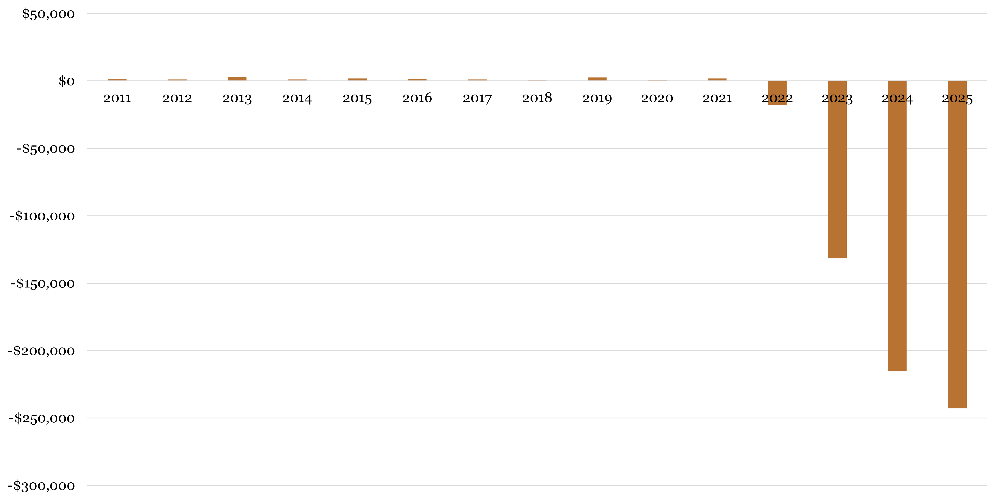
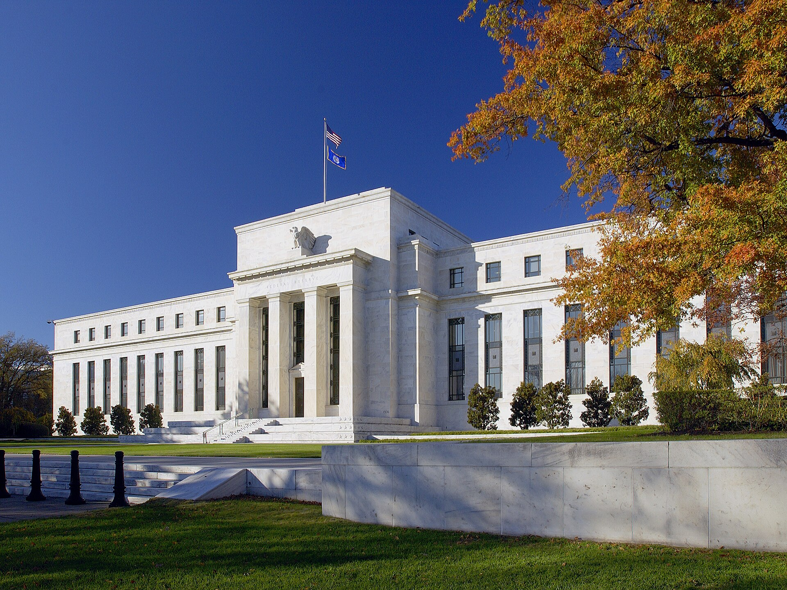
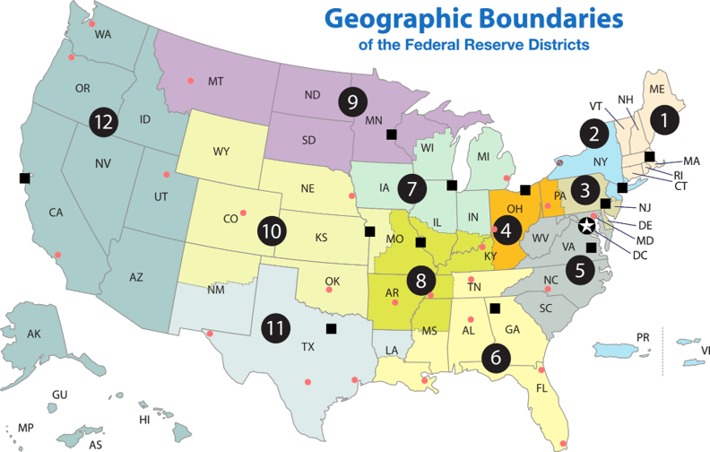
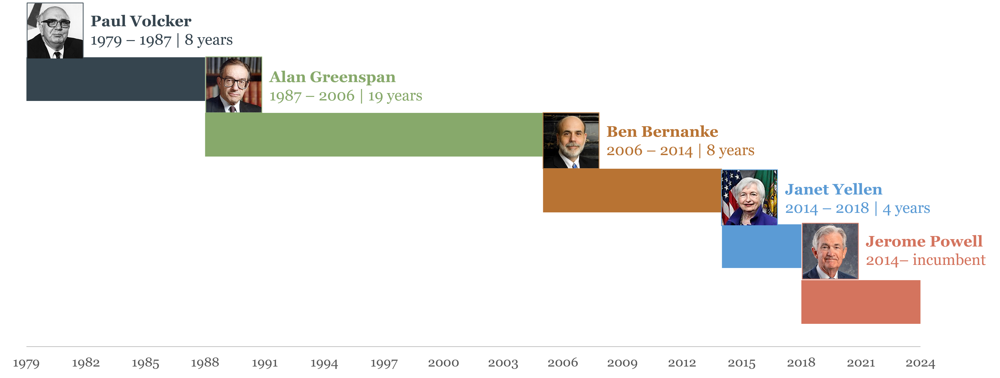
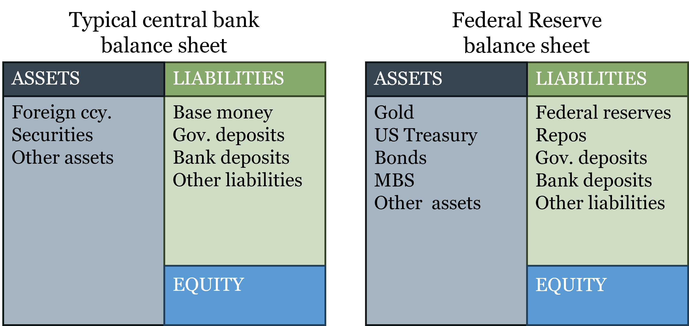
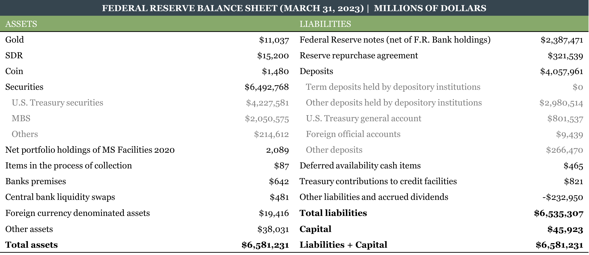

# Central Banks {#sec-ch03}

::: {.callout-note}
## Learning Objectives

By the end of this chapter, you will be able to:

- Explain why central banks emerged historically, and evaluate the fiscal-origins account against the market-failure narrative
- Identify the core functions of a central bank and explain what distinguishes it from a commercial bank
- Define seigniorage under fiat money, distinguish it from the inflation tax, and explain what a quasi-fiscal deficit is
- Explain why central bank independence matters and how institutional design attempts to substitute for the automatic discipline that commodity money once provided
- Define fiscal dominance and explain why it represents the simultaneous failure of both the monetary anchor and central bank independence
- Describe the structure and mandate of the Federal Reserve, explain how the FOMC prepares for and conducts meetings, and identify the role of the New York Fed and primary dealers in policy execution
- Describe the structure and mandate of the European Central Bank and identify the euro area's unique institutional challenge
- Read and interpret a central bank balance sheet, explain why fiat currency appears on the liabilities side, and connect the balance sheet to the tools covered in the next chapter
:::

## Why Central Banks Exist

The standard explanation for why central banks exist runs something like this: private banking is inherently unstable, bank panics are a recurring feature of unregulated financial systems, and governments eventually recognized that only a public institution with the power to create money could provide the lender-of-last-resort function needed to prevent occasional bank failures from cascading into systemic crises. On this account, central banks are a response to market failure.

Chapter 2 should have made you skeptical of this story. The historical record from genuinely competitive banking systems — Scotland, Australia, Canada — does not support the claim that private banking is inherently unstable. The banking crises most commonly cited to justify central banking — those of the American National Banking era — were caused by regulatory constraints (branching prohibitions, bond-backed reserves) that prevented the diversification and market discipline that made other systems stable. The [Panic of 1907](https://en.wikipedia.org/wiki/Panic_of_1907), which directly triggered the Federal Reserve Act of 1913, occurred in a system so distorted by regulation that it bore little resemblance to genuine free banking.

The more historically accurate account was provided by the economist [Vera C. Smith](https://en.wikipedia.org/wiki/Vera_Lutz) in her 1936 study *The Rationale of Central Banking*. Smith surveyed the emergence of central banks across Europe and found a remarkably consistent pattern: central banks arose not from market failure but from the fiscal and political interests of governments seeking privileged access to credit and monopoly revenue from note issuance. The Bank of England is the paradigm case. It was not created to stabilize the financial system. It was created in 1694 to lend £1.2 million to a government fighting a war with France, in exchange for a royal charter granting it privileges — including the exclusive right to operate as a joint-stock bank in England — that no private competitor enjoyed. The stability functions came later, were largely incidental to the founding purpose, and were in some cases used to justify further extension of the bank's monopoly privileges.

The pattern repeats across countries. The [Banque de France](https://en.wikipedia.org/wiki/Bank_of_France) was established by Napoleon in 1800 partly to discipline the chaotic post-Revolutionary monetary system, but primarily to provide the French state with reliable financing. The [Riksbank](https://en.wikipedia.org/wiki/Sveriges_Riksbank), often cited as the world's oldest central bank (founded 1668), originated as a state bank for managing government finances. Even the Federal Reserve, whose founding narrative centers on the [Panic of 1907](https://en.wikipedia.org/wiki/Panic_of_1907), emerged from a political process in which large banking interests played a central role — the famous Jekyll Island meeting of 1910 brought together representatives of the major New York banks and the Treasury to design a reform that would, among other things, protect established banks from competition by smaller rivals. The stability rationale was genuine but not the whole story.

Why does this history matter for understanding central banking today? Because the fiscal origins of central banks create a tension that has never been fully resolved: central banks were designed partly to serve the financial needs of governments, yet effective monetary policy requires insulation from those same governments. A central bank that monetizes government deficits whenever fiscal policy runs short is not conducting monetary policy — it is conducting fiscal policy by other means, at the cost of inflation. The institutional design of modern central banks — their independence, their committee structures, their mandates — can be understood as attempts to manage this tension, with varying degrees of success.

::: {.callout-note}
## Key Definition: Central Bank

A **central bank** is a public financial institution that holds a monopoly on the issuance of base money, conducts monetary policy, and typically serves as lender of last resort to the banking system. Its defining feature — what distinguishes it from all other financial institutions — is the money-creation monopoly. A commercial bank creates deposits through lending, but those deposits are redeemable claims on base money. Only the central bank creates the base money itself.
:::

## Two Problems Fiat Money Creates

The transition from commodity money and free banking to central banks issuing fiat money is not just an institutional change. It creates two fundamental problems that did not exist — or existed only in attenuated form — under the previous monetary order. These problems are distinct but related, and together they define the central challenges of modern monetary institutions.

### The Monetary Anchor Problem

Under the gold standard, the question of how much money should exist had an automatic answer: as much as the gold stock and the reserve ratios of the banking system would support. No central banker needed to decide the appropriate quantity of money because market forces determined it. The supply of gold grew slowly with mining; the demand for gold-backed money was disciplined by convertibility; and the adverse clearing mechanism prevented any single bank from departing far from the equilibrium that market demand warranted. The rule governing money supply was *endogenous* — it emerged from the decentralized decisions of market participants under the constraint of gold convertibility — and no single institution had the authority or the ability to override it.

Under fiat money, that automatic anchor is gone. Someone must now decide how much money to create, and on what basis. Should the central bank target the growth rate of the money supply directly? Should it target the price level — aiming to keep prices stable in absolute terms? Should it target the *rate of change* of prices — an inflation target? Should it target nominal GDP, keeping the total dollar value of output on a predictable path? Each of these frameworks leads to a different policy response in any given economic situation, and different responses produce different economic outcomes.

This is the **monetary anchor problem**: in a world of fiat money, there is no automatic constraint on money creation, so an explicit institutional commitment must substitute for the physical constraint that gold once provided. Getting that commitment right — choosing the right target, making it credible, and sticking to it when short-run pressures push in the other direction — is one of the hardest problems in monetary economics. Chapter 4 examines the main candidate frameworks in detail.

### The Independence Problem

The second problem is inseparable from the first. Under free banking and the gold standard, the constraint on money creation was automatic and external: the adverse clearing mechanism and the gold reserve requirement operated regardless of what any bank official intended or any government preferred. With fiat money and a central bank monopoly, those automatic constraints disappear. The only remaining constraint on money creation is institutional — the rules, norms, and organizational structures that make it costly for governments to pressure central banks into monetizing deficits.

**Central bank independence** is the primary institutional substitute for the market discipline that commodity money provided automatically. An independent central bank can resist fiscal pressure and maintain a credible commitment to price stability. A dependent central bank — one subject to direct government instruction, or one whose leadership serves at political pleasure — will tend toward inflation because inflation is the path of least resistance for a government that wants to spend more than it taxes.

Independence, however, is not sufficient on its own — and taken alone it creates a different problem. An institution that is insulated from political pressure but faces no consequences for failing to meet its objectives is simply unaccountable. This is why **accountability** is the necessary complement to independence. Independence without accountability is a blank check; accountability without independence is political capture in slower motion. The combination requires that central banks be insulated from short-term political pressure in their day-to-day decisions, while remaining answerable to a longer-run standard — their stated mandate — against which their performance can be evaluated. Concretely, this means central banks must explain themselves: publishing forecasts, releasing minutes of policy decisions, testifying before legislatures, and being transparent about the reasoning behind their choices. When inflation runs above target for two years, as it did in the US and Europe from 2021 to 2023, the public and their representatives have standing to ask why — and the central bank must answer. The accountability mechanism is what gives independence its legitimacy in a democratic system.

It is also worth being honest about what independence cannot do. Independence is a political equilibrium, not a physical law. A determined government can change central bank legislation, pack the governing board with compliant appointees, or simply ignore the formal rules. Turkey's experience in the 2010s and 2020s — where the government repeatedly pressed the central bank to cut rates despite high inflation, replaced governors who resisted, and eventually saw inflation exceed 80% annually — illustrates what happens when the independence commitment breaks down. The formal institutional structures are necessary but not sufficient: they must be backed by political culture, legal norms, and public understanding of what monetary stability requires.

### When Both Problems Are Unsolved: Fiscal Dominance

The monetary anchor problem and the independence problem can each be addressed imperfectly but manageable on their own. The genuinely dangerous situation is when both fail simultaneously. That failure mode has a name: **[fiscal dominance](https://en.wikipedia.org/wiki/Fiscal_dominance)**.

Fiscal dominance occurs when the fiscal needs of the government — the need to finance a large deficit — override the central bank's monetary policy objectives. It typically unfolds as follows. A government runs large fiscal deficits that it cannot finance through taxes or voluntary borrowing at sustainable interest rates. It then pressures the central bank to purchase government debt, directly or indirectly creating the money needed to cover the shortfall. The central bank's nominal independence is either formally stripped away or quietly overridden. The monetary anchor — whatever target the central bank had been pursuing — is abandoned in favor of whatever money creation the government's fiscal position requires.

The consequences are predictable. Money supply grows not because market demand for money has grown but because the government needs financing. The price level rises. If the process continues, the inflation rate accelerates. In extreme cases — Weimar Germany, Zimbabwe, Venezuela — the result is hyperinflation, as Chapter 1 described. In less extreme but still damaging cases — Argentina, Turkey — the result is persistent high inflation, currency depreciation, and erosion of the financial system's credibility.

::: {.callout-important}
## Key Takeaway: The Two Problems and Their Joint Failure

The transition from commodity money to fiat money creates two institutional problems that did not exist under the gold standard: the need for a monetary anchor (what should constrain money creation?) and the need for independence (who should make that decision, insulated from fiscal pressure?). These problems are related but distinct. Fiscal dominance is what happens when both fail simultaneously: the government captures the monetary decision, sets the anchor to whatever serves its fiscal needs, and the result is inflation as a non-legislated tax on money holders. The institutional design of every modern central bank can be read as an attempt — more or less successful — to prevent this outcome.
:::

## What Central Banks Do

### The Core Functions

Central banks are typically associated with six functions. It is useful to sort them by whether they require a monopoly or can be performed by private institutions.

**Functions requiring the government's monopoly power:**

**(1) Monopoly of note issue.** The central bank has the exclusive legal authority to issue the base money of the economy — currency and bank reserves. This requires precision about what "monopoly" means here. It does not mean that only one type of money can circulate in an economy. Under the gold standard, for instance, many private mints and banks competed to issue gold coins and gold-backed notes — all denominated in the same unit of account (gold), all competing in the same market. More concretely, in many developing economies today, both the national currency and a foreign currency — typically the US dollar — circulate side by side as means of payment. The legal distinction that makes the central bank's currency special is not that it is the only money in circulation, but that it carries **legal tender** status: by law, creditors must accept it in settlement of debts denominated in the domestic unit of account. Legal tender status, backed by the state's taxing power and court system, gives the central bank's base money a privileged position that no private competitor can replicate. The monopoly on note issuance is, at bottom, a legal monopoly rather than a physical one.

**(2) Conduct monetary policy.** Because the central bank controls base money and its base money has legal tender status, it can influence the overall supply of money and credit, and through that channel affect inflation and output in the short run. This function follows directly from function (1).

**Functions that can be, and historically were, performed by private institutions:**

**(3) Serve as the government's bank.** Central banks typically hold the government's accounts and manage public debt issuance. This is a convenience, not a necessity — many governments have at various times used private banks for these services.

**(4) Serve as the bankers' bank.** Central banks hold reserve accounts for commercial banks, process interbank settlements, and provide short-term liquidity. In free banking systems, private clearing houses performed equivalent functions.

**(5) Act as lender of last resort (LOLR).** The LOLR provides emergency liquidity to solvent but temporarily illiquid banks, preventing a liquidity shock from becoming a solvency crisis. Under free banking, the clearing house and market lending performed this function, imperfectly but effectively. The central bank LOLR role is an institutionalization — and some would say a less disciplined version — of what markets already provided.

**(6) Regulate banks.** Central banks often play a supervisory and regulatory role over the banking system. This function is entirely separable from money issuance — bank regulation existed before central banks and can be delegated to other agencies, as it often is in practice.

The key insight from this taxonomy is that only functions (1) and (2) are inherently central banking functions — they require the money-creation monopoly backed by legal tender status. The others are institutional assignments that happen to sit in the central bank for historical and political reasons, not logical necessity.

### Seigniorage Under Fiat Money

In Chapter 2 we discussed seigniorage under commodity money: the difference between the face value of a coin and the cost of the metal it contained, which could only be sustained under monopoly. Under fiat money, the concept carries over but the mechanics change — and the distinctions become more important.

Under fiat money, a central bank issues currency that costs almost nothing to produce and uses it to acquire interest-bearing assets — typically government bonds and loans to commercial banks. **Seigniorage** is the income the central bank earns as the issuer of base money:

$$S = i_F \cdot F - (i_D \cdot D + C)$$

where $F$ is the stock of financial securities held, $i_F$ is the return on those securities, $D$ is the stock of deposits (reserves) held by commercial banks at the central bank, $i_D$ is the interest rate paid on those deposits, and $C$ is operating costs. Seigniorage is the residual profit after paying for the cost of inducing the market to hold the central bank's liabilities.

A numerical example makes this concrete. Suppose the central bank has issued \$1 trillion in currency and holds \$1 trillion in Treasury bonds yielding 4%. It pays no interest on currency (currency earns zero), and its operating costs are \$5 billion. Its seigniorage is approximately:

$$S = 0.04 \times \$1\text{T} - \$5\text{B} \approx \$35\text{B}$$

This example captures the pre-2022 United States reasonably well: when interest rates were near zero, reserve deposits also paid near zero, so the $i_D \cdot D$ term in the formula was negligible and seigniorage flowed largely from the gap between asset yields and near-zero liability costs. The world changed sharply after 2022. When the Fed raised rates rapidly, it began paying substantial interest on the \$3+ trillion in reserve deposits sitting on its liability side — costs that its portfolio of low-yielding bonds acquired during quantitative easing could not cover. The formula shows exactly why: $i_D$ rose sharply while $i_F$ on existing assets was fixed, squeezing and ultimately reversing the seigniorage margin. This is the quasi-fiscal deficit discussed in the next subsection, and it is the direct application of the formula to a high-rate environment.

This income — when positive — belongs to the central bank as the issuer. In the United States, the Federal Reserve remits its profits to the US Treasury after covering operating costs and a statutory dividend to member banks. In 2021 the Fed remitted approximately \$107 billion. But this remittance is a policy choice, not part of the definition: seigniorage accrues to the *issuer* regardless of what is done with it subsequently.

::: {.callout-warning}
## Common Mistake: Confusing Seigniorage with the Inflation Tax

These two concepts are frequently conflated but are analytically distinct and accrue to different parties.

**Seigniorage** is the income to the *central bank* from issuing money — the return on assets acquired in exchange for currency. It is a flow of income to the issuer, not a tax on anyone.

**The inflation tax** is a transfer of *purchasing power from money holders to the Treasury* (not to the central bank) when inflation erodes the real value of nominal money balances. If you hold \$1,000 in cash and the price level rises 5%, your real purchasing power falls by \$50. That \$50 is a loss to you and a gain to the government — which issued the nominal debt that inflation is eroding. Nobody voted for this transfer. Nobody legislated it. It appears in no government budget. It is a non-legislated tax, which is precisely what makes it attractive to fiscally stressed governments and dangerous from a rule-of-law perspective.

The mechanism of the inflation tax is this: the government spends new money *before* prices have risen, acquiring real goods and services at the old price level. The new money then circulates through the economy, and by the time it reaches the general public, prices have already adjusted upward. The public receives the new money *after* prices have risen — they hold more nominal money but the same real purchasing power, at best. The purchasing power transferred in between is the inflation tax.

The two concepts are related — both are higher when money growth is higher — but they are not the same thing and they do not go to the same place.
:::

### The Quasi-Fiscal Deficit

Seigniorage can turn negative. If money demand is low — if people are reluctant to hold the central bank's currency, perhaps because inflation expectations are high — the central bank must pay a higher interest rate on reserves to induce banks to hold them. If that interest rate rises high enough, the interest paid on deposits $i_D \cdot D$ can exceed the interest earned on assets $i_F \cdot F$, producing a **quasi-fiscal deficit**: the central bank is running an operating loss.

This is not hypothetical. The Federal Reserve's rapid rate increases in 2022–2023, while it was still holding a large portfolio of low-yielding bonds acquired during the post-2008 quantitative easing programs, produced exactly this outcome: by late 2022 the Fed was paying more in interest on reserves than it was earning on its asset portfolio, and it stopped remitting profits to the Treasury. The Fed accumulated what it calls a "deferred asset" — essentially an IOU to itself — representing the accumulated operating losses that would need to be recovered from future profits before remittances to the Treasury resumed.

The quasi-fiscal deficit matters because it illustrates the budget constraint that central banks operate under even without a gold standard. A central bank that persistently pays more on its liabilities than it earns on its assets is either eroding its capital or relying on government recapitalization — which creates exactly the fiscal-monetary entanglement that independent central banking is designed to prevent.

::: {#fig-fed-remittances}

Federal Reserve remittances to the US Treasury (millions of US dollars). The sharp drop in 2022–2023 reflects the quasi-fiscal deficit produced by rapid rate increases while the Fed still held a large portfolio of low-yielding assets acquired during quantitative easing.  
Source: Board of Governors of the Federal Reserve, [H.4.1 Factors Affecting Reserve Balances](https://fred.stlouisfed.org/series/RESPPLLOPNWW).
:::

## The Federal Reserve

::: {#fig-fed-remittances}

The Federal Reserve System is headquartered at the Eccles Building in Washington, D.C.
:::

### Origins: The Problem That Demanded a Solution

The [Federal Reserve](https://en.wikipedia.org/wiki/Federal_Reserve_Bank) was created by the Federal [Reserve Act of 1913](https://en.wikipedia.org/wiki/Federal_Reserve_Act), signed into law by President Woodrow Wilson. The immediate catalyst was the [Panic of 1907](https://en.wikipedia.org/wiki/Panic_of_1907) — a severe financial crisis that began with the failure of the Knickerbocker Trust Company in New York and spread through the financial system, causing credit markets to freeze. The crisis was eventually contained largely through the personal intervention of [J.P. Morgan](https://en.wikipedia.org/wiki/J._P._Morgan), who organized a consortium of New York banks to provide emergency liquidity — a private lender-of-last-resort function that worked, but that clearly could not be institutionalized around the availability of a single wealthy financier.

The deeper cause, however, was the structural fragility built into the American banking system by the regulations examined in Chapter 2: the prohibition on branching and the bond-backed reserve requirement, which together created a system of geographically concentrated, undiversified banks with an inelastic currency that could not expand to meet credit demand in a crisis. The National Banking System had produced a series of panics — 1873, 1884, 1893, 1907 — at roughly predictable intervals, and the political system could no longer ignore the problem.

But the solution chosen was telling. Rather than removing the regulations that caused the fragility — allowing branching, eliminating bond-backed reserves — Congress created a central bank to manage the fragility those regulations produced. This was a case where regulatory failure was attributed to markets, and as a result the policy response extended government involvement rather than removing the original distortion.

The banking interests that shaped the Federal Reserve Act — particularly those represented at the Jekyll Island conference of 1910 — had their own reasons to prefer a central bank over deregulation. A central bank would provide an elastic currency (solving the inelasticity problem) and a lender of last resort (solving the panic problem) while leaving the branching restrictions in place — which protected established banks from the competition that nationwide branching would have intensified. The Fed was a political compromise, not an optimal institutional design.

::: {.callout-tip}
## Intuition Builder: The US Monetary History Timeline

| Period       | Years | System                           |
|--------------|:-----:|----------------------------------|
| 1782–1791    | 9     | Bank of North America            |
| 1791–1811    | 20    | First Bank of the United States  |
| 1811–1816    | 5     | No central bank                  |
| 1816–1836    | 20    | Second Bank of the United States |
| 1837–1862    | 25    | "Free Banking" Era               |
| 1863–1913    | 50    | National Banks                   |
| 1913–present | 100+  | Federal Reserve System           |

The US spent most of its first century repeatedly experimenting with central banking, abandoning it, and returning to it — a cycle driven by the same tension between fiscal convenience and monetary stability. Each central bank created a new set of political conflicts over who controlled it; each abolition left a regulatory vacuum that produced new instability.
:::

### Structure: Independence by Design

The Federal Reserve's organizational structure is complex by deliberate design — and understanding *why* it is complex illuminates how the institution is meant to work. Every layer of the structure is an answer to a specific question: how do you build a central bank that is genuinely insulated from short-term political pressure, while remaining accountable to democratic oversight over the long run?

At the center sits the **Board of Governors** in Washington, D.C. — seven members appointed by the President and confirmed by the Senate, each serving a staggered 14-year term. The staggered terms are the key feature: a new seat opens every two years, meaning no single president can appoint a majority in one term and a full replacement takes fourteen years. The Chair and two Vice-Chairs serve four-year renewable terms within their longer appointments. The Board sets reserve requirements, supervises the banking system, and governs the regional banks.

The **12 Regional Federal Reserve Banks** — distributed from Boston to San Francisco, with districts drawn to reflect the economic geography of 1913 rather than today — are the institution's eyes and ears. Each has a nine-member board of directors that mixes commercial bankers and public representatives, creating a direct channel between the Fed and regional business conditions. This structure embeds private-sector knowledge into the Fed's governance in a way that has no parallel among other major central banks, and it was the political price of passing the Federal Reserve Act: regional banking interests insisted on representation. The regional banks also perform a function the Board cannot: they collect the on-the-ground intelligence about local economic conditions that feeds into the Beige Book and, ultimately, FOMC deliberations.

::: {#fig-fed-map}

The 12 Federal Reserve Banks are distributed across the United States, each serving a specific district. This regional structure is designed to ensure that the central bank has access to local economic information and perspectives from across the country.
:::

Monetary policy itself is made by the **Federal Open Market Committee (FOMC)** — twelve voting members drawn from the Board of Governors (all seven) plus five of the twelve regional bank presidents on a rotating basis. The New York Fed holds a permanent voting seat, reflecting its role as the institution that actually executes the Committee's decisions in financial markets. The other eleven regional presidents rotate through the remaining four seats, ensuring that every district's perspective enters the room regularly, even in non-voting years.

### How the FOMC Actually Operates

Understanding the FOMC's formal membership is the easy part. The more instructive picture comes from how the committee actually prepares for and conducts its meetings — a process that combines public data collection, formal analysis, informal negotiation, and careful communication in ways that reveal a great deal about how monetary policy is made in practice.

**The meeting cycle and the blackout period.** The FOMC meets eight times per year, roughly every six weeks. Meetings are scheduled well in advance and last two days, beginning on a Tuesday afternoon and concluding around midday on Wednesday. The afternoon start is not arbitrary: it allows all 19 participants (12 voting members plus the 7 non-voting regional presidents who attend and participate in discussions) to arrive, receive briefings, and begin deliberations, with the formal vote and public announcement occurring the following morning after a final round of discussion. The Wednesday midday timing of the announcement — 2:00 pm Eastern — gives markets a predictable window and allows the Chair to hold a press conference immediately afterward.

In the approximately two weeks before each meeting, FOMC participants observe a **blackout period**: all public statements by governors and regional presidents on monetary policy are suspended. The rationale is to prevent markets from trading on informal signals about the upcoming decision rather than on economic fundamentals. The blackout period is self-imposed — there is no law requiring it — but it has become a strong norm, and violations are treated seriously.

**The information base: Beige Book and Tealbook.** The FOMC's deliberations are grounded in two main analytical documents prepared before each meeting.

The [**Beige Book**](https://www.federalreserve.gov/monetarypolicy/publications/beige-book-default.htm) (formally the *Summary of Commentary on Current Economic Conditions*) is prepared by each of the 12 regional Federal Reserve Banks and compiled into a single report published about two weeks before each meeting. It summarizes anecdotal and qualitative information about economic conditions gathered from business contacts, economists, and community organizations across each district — reports from manufacturers, retailers, real estate developers, transportation companies, and agricultural operators describing what they are actually experiencing in their local economies. The Beige Book is deliberately qualitative and forward-looking in a way that statistical releases are not: a survey of construction contacts in Dallas may reveal a cooling in housing starts weeks before that shows up in national data. It is the Fed's early-warning system, assembled from the ground up.

The **Tealbook** (formerly the Green Book) is the staff's formal economic forecast and policy analysis, prepared by the Board's research staff and distributed to FOMC participants a week before each meeting. It contains the staff's projections for GDP growth, unemployment, and inflation under alternative policy scenarios — the analytical backbone against which the committee evaluates its options.

**Policy execution: The New York Fed's trading desk.** Once the FOMC reaches its decision — expressed as a target range for the [federal funds rate](https://en.wikipedia.org/wiki/Federal_funds_rate), the overnight interest rate at which banks lend reserves to each other — the task of implementing that decision falls to the [Federal Reserve Bank of New York](https://en.wikipedia.org/wiki/Federal_Reserve_Bank_of_New_York). Specifically, it falls to the New York Fed's **Open Market Desk** (formally the Markets Group), which conducts open market operations: buying or selling securities in the open market to keep the federal funds rate within the FOMC's target range.

The New York Fed's permanent FOMC voting seat reflects this execution role: the bank that must actually transact in markets needs to be at the table where the targets are set. The New York Fed also conducts foreign currency operations on behalf of the Treasury, manages the Fed's portfolio of System Open Market Account (SOMA) securities, and serves as the primary point of contact between the Federal Reserve and international central banks and financial institutions. It is, in effect, the operational arm of the entire Federal Reserve System.

**Primary dealers.** The New York Fed does not buy and sell securities by posting ads or calling the general public. It transacts through a designated set of financial institutions called **[primary dealers](https://www.newyorkfed.org/markets/primarydealers)** — currently around 24 large banks and broker-dealers, including firms like JPMorgan, Goldman Sachs, Citigroup, and Barclays. Primary dealers are required to participate in Treasury auctions (bidding for newly issued government securities), to provide the New York Fed with market intelligence and two-way price quotes, and to transact directly with the Open Market Desk in open market operations.

In exchange, primary dealers receive privileged access: they can transact directly with the Fed, participate in repos and reverse repos, and in some circumstances access emergency lending facilities. The relationship is reciprocal — the Fed needs a reliable set of counterparties that can absorb large security purchases or sales without destabilizing markets; primary dealers need the revenue and market intelligence that comes with the relationship.

The primary dealer system means that the Fed's monetary policy operations flow through a small number of large financial institutions before reaching the broader market. This creates a transmission mechanism that is efficient but concentrated — and it raises questions about whether primary dealers, precisely because of their privileged position, have informational advantages over other market participants that are difficult to justify on public interest grounds.

**Transparency and the release of minutes.** The FOMC's approach to disclosure represents a deliberate balance between transparency and the protection of deliberative candor. Individual votes on the policy decision are made public immediately — the statement released at 2:00 pm on the final day of each meeting names which members voted in favor and which dissented, along with a brief explanation of any dissent. This level of individual accountability is relatively high by central bank standards.

The full minutes of each meeting — a detailed account of the discussion, the arguments made, the economic data reviewed, and the range of views expressed — are published with a **three-week delay**, typically on the Wednesday three weeks after the meeting. The delay is intentional. If minutes were released immediately, participants would know that every comment they made would be public within hours, which would create strong incentives to self-censor, speak in generalities, and avoid taking positions that might be politically controversial. The three-week lag gives the committee enough time to implement its decision and allows the discussion to be reported accurately without creating live market-moving events from individual committee members' remarks.

**The Chair's press conference.** Since 2011, the Fed Chair has held a press conference after every FOMC meeting — a practice that was initially quarterly but became standard after every meeting in 2019. The press conference begins immediately after the 2:00 pm policy statement and typically lasts around an hour. It has two parts: an opening statement in which the Chair summarizes the committee's decision and the reasoning behind it, followed by a Q&A with journalists from major financial and news organizations.

The press conference serves a function the written statement cannot. Monetary policy works substantially through expectations — if markets believe the Fed will keep rates high for longer, long-term rates rise even before the Fed has moved, doing much of the tightening work for it. Conversely, if markets expect cuts, financial conditions ease. The Chair's press conference is the primary mechanism through which the Fed manages these expectations in real time. A carefully chosen phrase — or an unguarded one — can move bond markets, stock markets, and the dollar within seconds of being spoken. The Q&A format also provides responsiveness: journalists can push on ambiguities, ask about specific scenarios, and probe the boundaries of the committee's commitments. Occasionally it produces consequential surprises, as when Chair Powell's December 2021 press conference — in which he acknowledged that inflation was no longer "transitory" — accelerated market expectations of rate increases by several months.

Beyond the minutes, the Fed publishes economic projections — the Summary of Economic Projections, sometimes called the "dot plot" — four times per year, showing each participant's forecast for growth, inflation, unemployment, and the appropriate path of interest rates. Individual forecasts in the dot plot are anonymous, which allows participants to reveal their genuine views without creating a public commitment that would constrain their future votes.

::: {#fig-fed-chairs}

Federal Reserve Chairs since 1979. The length of tenure and the economic eras each chair navigated illustrate how much the institution's character depends on individual leadership within a common structural framework.
:::

Why does all this structural complexity matter? Because each layer creates a different constituency with a different set of interests and a different information source. The regional banks bring local economic intelligence and perspectives from outside Washington. The rotating FOMC membership distributes influence over time. The staggered terms insulate the Board from short-term political cycles. The dinner allows informal consensus to form before the formal vote. The Beige Book aggregates knowledge the national statistics miss. And the New York Fed's execution role connects the committee's decisions to actual financial markets through a reliable institutional channel. The result is an institution that is genuinely difficult to capture quickly — and one whose decisions, when they are made, reflect a more diverse information base than a single committee voting in isolation could achieve.

::: {#fig-fed-fomc-meeting}

Meeting of the Federal Open Market Committee in the Board Room of the [Eccles Building](https://en.wikipedia.org/wiki/Eccles_Building).
:::

### Mandate: The Dual Mandate

The Fed's mandate, as established and modified by Congress, is a **dual mandate**: price stability and maximum sustainable employment. These objectives are not always consistent. Fighting inflation typically requires raising interest rates, which slows economic activity and raises unemployment. Stimulating employment typically requires lower rates, which can generate inflationary pressure. The Fed must balance these objectives, with no fixed formula for how to do so — the balance is a matter of judgment that varies across economic conditions and across Fed leadership.

The dual mandate distinguishes the Fed from many other central banks, particularly the ECB, which has a single primary mandate of price stability. The difference reflects different historical experiences: Europe's 20th-century inflations — Weimar Germany, postwar Austria and Hungary — left a deep institutional imprint favoring price stability above all else. The US experience of the Great Depression, by contrast, embedded a concern for employment alongside price stability into the political consensus around central banking.

The dual mandate also creates an accountability problem worth naming directly. When one objective is clearly being missed, Fed officials can always point to the other as justification for their stance. Inflation running above target? The Fed may argue it is prioritizing the employment side of the mandate. Employment running below target? The Fed may argue inflation concerns are paramount. With two objectives and no fixed weighting between them, it is genuinely difficult for outside observers — including Congress — to hold the Fed accountable for underperforming on either one. A single mandate, as the ECB has, makes accountability cleaner: there is one target, and you either hit it or you don't. The dual mandate trades some accountability for the political flexibility to respond to both sides of the economic cycle. Whether that trade is worth making is one of the more contested questions in central bank design.

The tension within the dual mandate is one of the central themes of monetary policy, and it will be a recurring reference point in Chapter 4 and beyond.

## The European Central Bank

::: {#fig-ecb-building}

The European Central Bank is headquartered in Frankfurt, Germany. Its unique structure and mandate reflect the political and economic complexities of managing a common currency across multiple sovereign nations.
:::

### Origins: Monetary Union as a Political Project

The [European Central Bank](https://en.wikipedia.org/wiki/European_Central_Bank) came into existence on June 1, 1998, and assumed responsibility for monetary policy across the euro area when the euro launched on January 1, 1999. Its origins lie not in a financial crisis — there was no European equivalent of the Panic of 1907 — but in a deliberate political project to deepen European integration by creating a common currency.

The intellectual and political foundation was laid by the [Maastricht Treaty](https://en.wikipedia.org/wiki/Maastricht_Treaty) of 1992, which established the European Union and set out the criteria for euro membership: low inflation, low long-term interest rates, exchange rate stability, and sound fiscal position. The convergence criteria were designed to ensure that countries joining the euro had achieved macroeconomic stability before surrendering their individual monetary policies — recognizing that a monetary union requires a degree of economic homogeneity to function well.

Today, 20 of the 27 EU member states use the euro. Montenegro and Kosovo, which are not EU members, have unilaterally adopted the euro as their currency — an interesting case of Gresham's Law in reverse: when domestic currencies are so unreliable that a foreign currency is preferred, adoption can occur without any formal agreement.

### Structure: Independence Embedded in International Treaty

The ECB's organizational structure mirrors the Fed's in its broad outlines but differs in important ways that reflect the ECB's unique mandate and political environment.

The **Executive Board** (analogous to the Fed's Board of Governors) consists of six members — a President, a Vice-President, and four other members — appointed to non-renewable eight-year terms by the European Council. The non-renewable terms are a deliberate independence-enhancing feature: a governor who cannot be reappointed has no career incentive to please the appointing politicians.

The **Governing Council** (analogous to the FOMC) consists of all six Executive Board members plus the governors of the 20 national central banks (NCBs). It meets eight times per year to set monetary policy. The Governing Council's decisions are explicitly insulated from government instruction: the ECB's statute states that neither the ECB nor any NCB governor may seek or take instructions from any government.

**Transparency and secrecy at the ECB.** The ECB's approach to disclosure differs significantly from the Fed's, and the differences are not accidental — they reflect the unique political pressures the ECB faces.

Individual votes on Governing Council decisions are **permanently secret**. The ECB does not publish how individual members voted, and there is no plan to change this. The rationale is straightforward but worth stating plainly: the Governing Council includes 20 national central bank governors, each of whom is a public figure in their home country and each of whom answers, at some level, to their national political establishment. If votes were public, a governor who voted for a rate increase that hurt his country's indebted households would face immediate domestic political pressure — regardless of whether that vote was the right call for the euro area as a whole. The secrecy of the vote is designed to allow each governor to vote in the interest of the *euro area*, not their national constituency, without fear of domestic political backlash. This is not a conspiracy of concealment; it is a deliberate insulation mechanism for a supranational institution operating in a politically charged environment with 20 different national publics.

The ECB does publish an **account of the monetary policy discussion** after each meeting — roughly analogous to the Fed's minutes — but with a **four-week delay** (one week longer than the Fed) and without attributing comments to specific individuals. The account describes the arguments made, the range of views expressed, and the reasoning behind the decision, but readers cannot tell who said what. The press conference held by the President and Vice-President immediately after each meeting serves as the primary channel of real-time communication: the opening statement explains the decision, and the Q&A allows journalists to probe the reasoning.

Full verbatim transcripts of Governing Council deliberations, if they exist, are not published — in contrast to the Federal Reserve, which releases full transcripts with a **five-year delay**. The five-year horizon is long enough that the market-moving sensitivity of specific comments has faded, but short enough that historians, researchers, and the public can eventually reconstruct how the institution actually made its decisions.

The comparison between the two institutions is instructive. The Fed's greater transparency — named votes, detailed minutes within three weeks, full transcripts after five years — is possible in part because the Fed serves one political constituency (the United States) and its governors have no immediate national government to answer to. The ECB's greater secrecy — anonymous votes permanently, anonymous accounts after four weeks — is a necessary adaptation to an environment where 20 national governments are each looking over the shoulder of their national central bank governor. The secrecy is the price of genuine independence in a multi-sovereign context; without it, the Governing Council would effectively become a forum for national interest bargaining dressed up as monetary policy.

::: {.callout-tip}
## Intuition Builder: Parallel Structures

| The Federal Reserve System        | The European Central Bank |
|-----------------------------------|---------------------------|
| The Board of Governors            | The Executive Board       |
| 12 Regional Federal Reserve Banks | 20 National Central Banks |
| Federal Open Market Committee     | Governing Council         |

The parallel architecture reflects similar independence-by-design logic applied in different political contexts. The key differences are in mandate breadth (dual vs. single), term structure (renewable vs. non-renewable), and transparency (named votes vs. anonymous votes).
:::

The independence protection is particularly strong by design — and necessarily so, given the political environment. The ECB serves 20 governments, not one. Without firm independence protections, every policy decision would become a negotiation among 20 national interests, each government preferring lower rates when its economy is weak and price stability when it is overheating. The supranational structure of the ECB is, in a sense, a more extreme version of the same principle that motivated the Fed's regional structure: distributing power to prevent capture.

### Mandate: Price Stability First

The ECB's mandate is explicitly hierarchical. Its primary objective, established in the [Treaty on the Functioning of the European Union](https://en.wikipedia.org/wiki/Treaty_on_the_Functioning_of_the_European_Union), is to maintain price stability. Only subject to that primary objective may the ECB support the general economic policies of the EU — including growth and employment. This is a single mandate in substance, with employment concerns strictly secondary.

The ECB has defined price stability operationally as inflation close to but below 2% over the medium term — later revised to a symmetric 2% target. The precision of this definition serves an important function: it anchors inflation expectations by giving the public a clear benchmark against which to evaluate ECB performance.

### The Euro Area's Unique Challenge

The ECB faces a structural problem that the Fed does not: it conducts a single monetary policy for 20 economies with different economic structures, different fiscal positions, and different inflation dynamics. When Germany is overheating and Greece is in recession, no single interest rate is appropriate for both. The ECB sets one rate; Germany and Greece must adjust through other means — primarily fiscal policy and internal price flexibility.

This is the **one monetary policy, many fiscal policies** problem, and it is the defining tension of the euro area. The US faces an analogous situation — the Fed sets one rate for 50 states with different economic conditions — but the US has features that the euro area lacks: a federal fiscal transfer system (the federal government taxes more in boom states and transfers more to bust states, automatically stabilizing the cycle), high labor mobility across state lines, and a common financial system with a single banking regulator. The euro area has none of these in the same degree: fiscal transfers across countries are politically constrained, labor mobility is limited by language and cultural barriers, and banking supervision remained fragmented across national regulators until the [Banking Union](https://en.wikipedia.org/wiki/European_banking_union) reforms began in 2014.

The tensions in this structure became visible during the [European sovereign debt crisis](https://en.wikipedia.org/wiki/2009%E2%80%932018_Greek_government-debt_crisis) of 2010–2012, when borrowing costs for peripheral economies (Greece, Ireland, Portugal, Spain, Italy) spiked to unsustainable levels while Germany continued to borrow at near-zero rates. The ECB was not — under its founding statute — a lender of last resort for sovereign governments: it could lend to banks, not to countries. President Mario Draghi's 2012 promise to do "whatever it takes" to preserve the euro, followed by the announcement of the Outright Monetary Transactions (OMT) program, effectively extended the LOLR function to sovereign debt markets — a significant institutional evolution that required creative legal interpretation of the ECB's mandate. OMT worked: the mere announcement was enough to calm markets, and the program has never actually been used. But it did not resolve the underlying structural problem. The peripheral economies that faced unsustainable borrowing costs in 2010–2012 still share a monetary policy with Germany today; the fiscal fragmentation that made them vulnerable has not been addressed by any fundamental reform. The ECB bought time through institutional improvisation; the hard structural choices — fiscal union, a common safe asset, a genuine euro-area lender of last resort — remain politically unresolved. Chapter 4 returns to the lender-of-last-resort function and its limits.

## The Central Bank's Balance Sheet

Understanding a central bank's balance sheet is not accounting pedantry — it is the most direct window into what a central bank is actually doing at any moment. Every monetary policy action shows up on the balance sheet. The tools discussed in Chapter 4 are, at bottom, different ways of changing the size and composition of this balance sheet.

### The Gold Miner Analogy

To understand why a central bank's balance sheet looks the way it does, start with an analogy. Consider a gold miner. Gold is his product — the output of his activity. Gold appears on the *asset* side of his balance sheet: it is something he owns, something of value that he can deploy or sell. Just as a car manufacturer's inventory of finished cars appears on the asset side, the gold miner's product is an asset.

Now consider a central bank that issues fiat money. Fiat money is the central bank's "product" — the output of its activity. It is the economy's ultimate means of payment, analogous to the gold miner's gold. Yet fiat money appears on the *liabilities* side of the central bank's balance sheet, not the assets side. Why?

The answer is historical, not logical. When central banks first issued notes, those notes were genuine liabilities — promises to pay gold on demand (IOUs). They appeared on the liabilities side because they were debts: the bank owed you gold when you presented the note. When gold convertibility was suspended and notes became fiat, the economic substance changed — the central bank no longer owes anything specific to a noteholder (IOU-nothing) — but the accounting convention was preserved. Fiat currency remains on the liabilities side as an institutional fossil from the convertibility era.

This matters beyond accounting convention. It reflects the same regression theorem dynamic we traced in Chapters 1 and 2: fiat money's initial legitimacy, its accounting treatment, and the trust that makes it valuable are all inherited from the gold-standard era. A truly new monetary institution starting from zero would have no obvious reason to put its currency on the liabilities side — there is nothing it owes. The fact that it does is a reminder that monetary systems are never built from scratch; they always bootstrap off what came before.

### The Structure of the Balance Sheet

**On the assets side:**

- **Gold and foreign reserves:** holdovers from the gold standard era and international reserve management. The Fed still holds a small amount of gold (at the statutory price of \$42.22 per ounce, far below market value) and Special Drawing Rights (SDRs) from the IMF.
- **Government securities:** the dominant asset in modern central bank portfolios. The Fed acquires Treasury bonds through open market operations — buying bonds injects reserves into the banking system; selling bonds withdraws them.
- **Loans to commercial banks:** the LOLR function in balance sheet form. When the Fed lends to a bank through the discount window, it creates a loan asset and a corresponding reserve liability.

**On the liabilities side:**

- **Currency in circulation:** Federal Reserve notes held by the public. This is the most visible form of base money, and as discussed above, it appears here for historical reasons.
- **Reserve deposits:** the accounts that commercial banks hold at the Fed. These are the reserves of the banking system — the foundation on which the money multiplier operates. When the Fed buys a government bond, it pays by crediting the selling bank's reserve account: the asset side grows (more bonds) and the liability side grows (more reserves). The money supply expands without printing a single physical note.
- **Government deposits:** the Treasury's account at the Fed. When the government collects taxes, funds flow into this account; when it spends, funds flow out into the banking system.

::: {#fig-cb-balance-sheet}
{width=80%}

The general balance sheet structure of a central bank. Assets are what the central bank owns; liabilities are what it owes (or, in the case of fiat currency, the accounting legacy of what it once owed).
:::

### The Fed's Actual Balance Sheet

The Federal Reserve's balance sheet as of late 2024 is a particularly instructive snapshot because it still captures significant legacy effects from a decade of post-2008 quantitative easing, partially offset by the QT (quantitative tightening) program that began in 2022.

::: {#fig-fed-balance-sheet-data}

Federal Reserve balance sheet (millions of dollars). The dominance of securities on the asset side and reserve deposits on the liability side reflects the legacy of post-2008 quantitative easing programs. Chapter 4 explains how these positions were built up and what they mean for monetary policy.
:::

The securities portfolio dwarfs everything else on the asset side — a legacy of quantitative easing, the Fed's purchases of long-term securities to push down long-term interest rates after the federal funds rate hit zero in 2008. The pre-2008 Fed balance sheet was roughly \$900 billion; at its peak in 2022 it exceeded \$8.9 trillion. Reserve deposits on the liability side are the direct counterpart: every bond the Fed bought was paid for by crediting a bank's reserve account.

The capital position is modest relative to total assets — a leverage ratio that would be considered dangerous for any commercial bank but is irrelevant for a central bank that creates its own liabilities. A central bank cannot become technically insolvent in its own currency: it can always create the currency needed to meet its obligations. What it cannot do is maintain price stability while doing so — which is why the institutional commitment to independence matters.

::: {.callout-important}
## Key Takeaway: The Balance Sheet as Policy Instrument

Every monetary policy action is a balance sheet operation. Open market purchases expand both sides (more securities, more reserves). Discount window lending expands both sides (more loans, more reserves). Rate changes alter the cost of holding reserves without directly changing the size of the balance sheet. Quantitative easing is just open market operations conducted at large scale and in long-maturity securities. Understanding the balance sheet is understanding monetary policy. Chapter 4 develops the tools in detail.
:::

## Key Takeaways

::: {.callout-important}
## Chapter 3 Summary

**Why central banks exist:** Central banks emerged primarily from fiscal needs and government desire for monopoly revenue — not from market failure. The stability rationale was real but secondary. The Panic of 1907 occurred in a regulatory system so distorted that it bore little resemblance to genuine free banking; it produced a central bank, not deregulation.

**The two problems fiat money creates:** The transition to fiat money eliminated two automatic constraints — gold reserves and adverse clearing — and replaced them with two institutional problems. The **monetary anchor problem**: someone must now decide how much money to create and on what basis; there is no longer a market-driven answer. The **independence problem**: the only remaining constraint on money creation is institutional, and it must be paired with accountability to be legitimate. **Fiscal dominance** — where government fiscal needs override the central bank's monetary objectives — is what happens when both problems are unsolved simultaneously, with inflation as the result.

**Core functions:** Only the monopoly of note issue and monetary policy are inherently central banking functions. What makes the central bank's money special is not that it is the only money in circulation, but that it carries **legal tender** status — the legally enforceable obligation to accept it in settlement of domestic debts.

**Seigniorage, inflation tax, and quasi-fiscal deficit:** Seigniorage is income to the central bank as issuer — asset returns minus the cost of inducing markets to hold its liabilities. In a low-rate world, the liability cost is near zero and seigniorage is large; in a high-rate world, interest on reserve deposits can exceed asset yields, producing a quasi-fiscal deficit, as the Fed demonstrated in 2022–2023. The inflation tax is a separate and distinct concept: a non-legislated transfer of purchasing power from money holders to the government (via the Treasury), operating because the government spends new money before prices rise while the public receives it after.

**The Federal Reserve:** A political response to regulation-induced banking instability. Its three-body structure distributes power to prevent capture. The FOMC meets eight times per year; a blackout period precedes meetings; an informal dinner enables off-the-record consensus. The Beige Book aggregates local intelligence; the Tealbook provides formal staff forecasts; the NY Fed executes via primary dealers. The dual mandate creates genuine policy tension and an accountability gap: with two objectives and no fixed weighting, it is always possible to invoke one when the other is being missed.

**The European Central Bank:** Created as a political project for monetary union, not in response to a crisis. Non-renewable 8-year terms strengthen independence relative to the Fed. Individual votes are permanently secret — governors must be able to vote for the euro area, not their national constituency, without facing domestic political repercussions. The one-monetary-policy, many-fiscal-policies tension has no institutional solution: OMT bought time through improvisation, but the underlying structural choices — fiscal union, common safe asset, genuine LOLR for sovereigns — remain unresolved.

**The central bank balance sheet:** Fiat currency sits on the liabilities side as an accounting fossil from the gold standard era. Every monetary policy action is a balance sheet operation. The modern Fed's dominant assets are government securities; its dominant policy liabilities are reserve deposits. The balance sheet is the foundation for understanding the tools covered in Chapter 4.
:::
