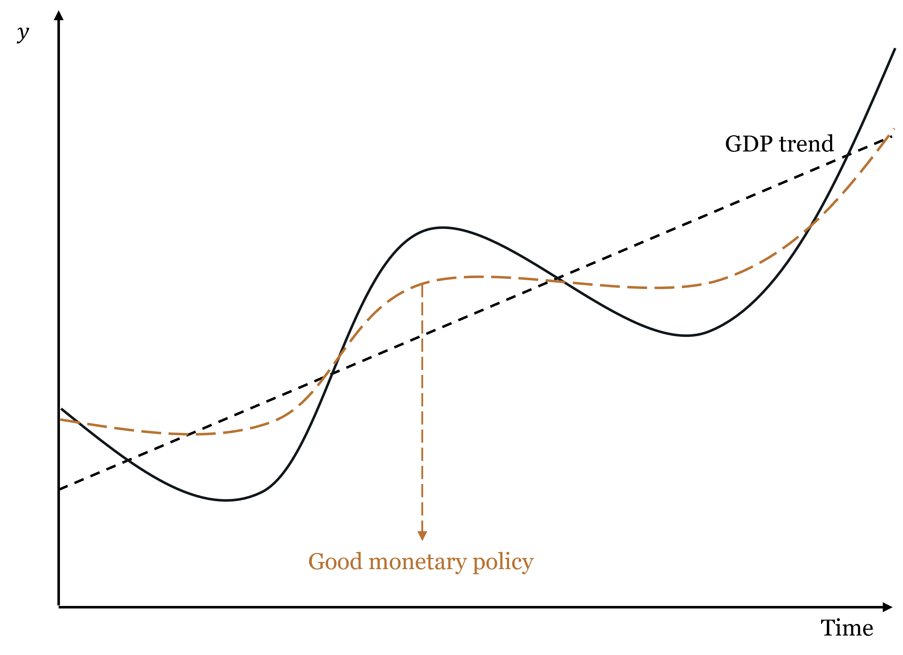
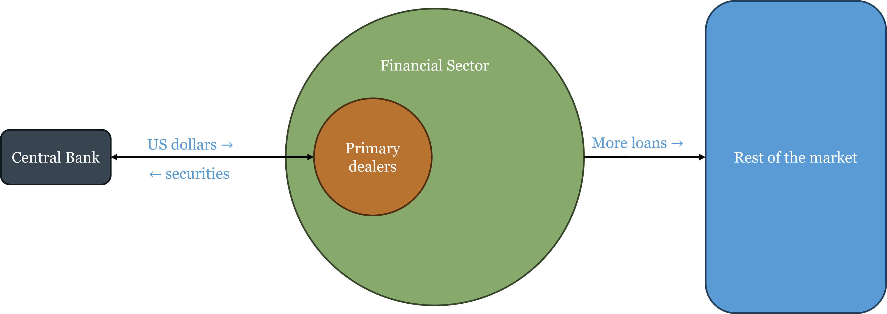
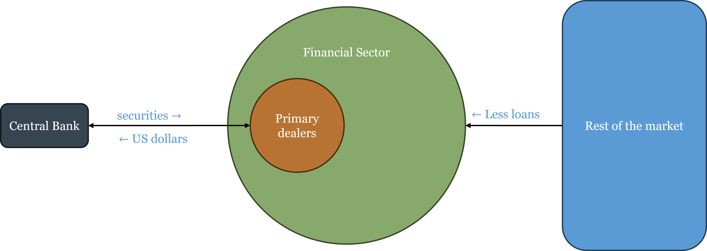
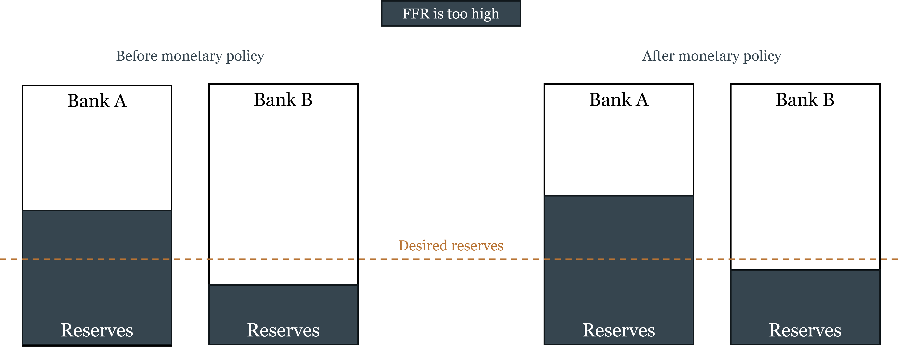
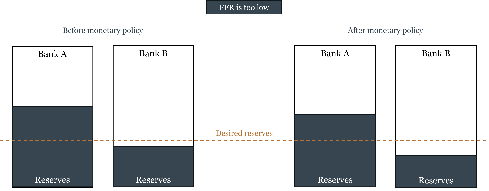
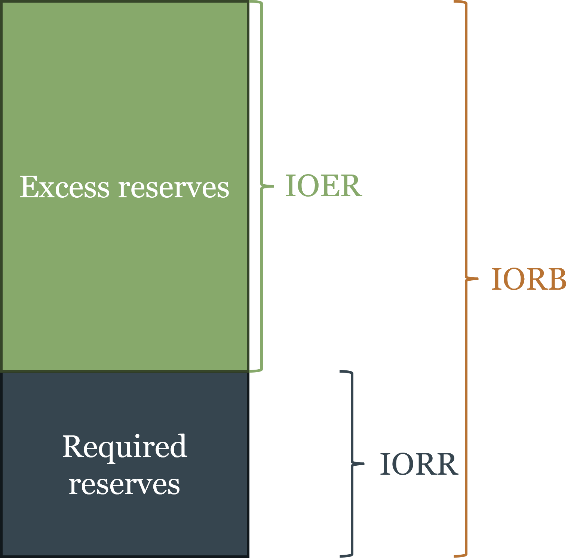
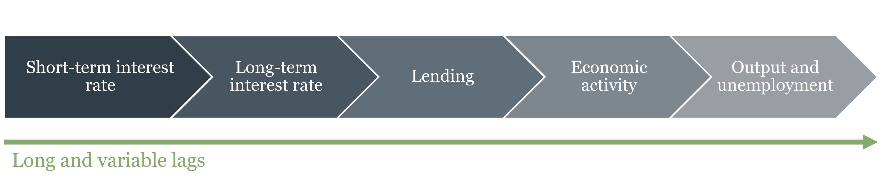

# How Central Banks Operate — and Why It Matters {#sec-ch04}

::: {.callout-note}
## Learning Objectives

By the end of this chapter, you will be able to:

- Explain the credibility problem in monetary policy and why time-inconsistency makes rules preferable to discretion
- Articulate the underlying debate between rules and discretion in terms of minimizing policy mistakes over time
- Describe the three main monetary policy frameworks — discretion, rules, and inflation targeting — and evaluate the strengths and limitations of each
- Explain why inflation targeting is an anchoring device for already-low inflation, not a cure for high inflation, and describe it as a form of constrained discretion
- Distinguish between nominal and real shocks, explain what monetary policy can and cannot fix, and use the equation of exchange to organize the taxonomy
- Explain why price-level stability as a monetary anchor can generate monetary excess during productivity booms, and connect this to the Great Depression and the Great Recession
- Describe the main tools of monetary policy and explain how the Federal Reserve implements its interest rate target through primary dealers
- Distinguish between the corridor system and the floor system, explain the corridor-floor trade-off, and explain how quantitative easing forced the transition from one to the other
- Explain why financial institutions that engage in maturity transformation are fragile, and describe the mechanics of a bank run
- Distinguish between liquidity problems and solvency problems, and explain why the distinction is central to the lender-of-last-resort function
- State Bagehot's rule, explain its historical context, and evaluate the tension between financial stability and moral hazard
:::

## Rules vs. Discretion

Chapter 3 established the two problems that fiat money creates: the monetary anchor problem (what framework should constrain money creation?) and the independence problem (who should make that decision, insulated from fiscal pressure?). This chapter addresses the first problem directly. Given that someone must decide how much money to create, what is the best basis for that decision?

There are essentially three answers in the literature, and they map onto an increasing degree of commitment: pure discretion, rules, and inflation targeting.

### Discretion: The Appeal and the Problem

Discretionary monetary policy means the central bank exercises judgment on a case-by-case basis, responding to whatever conditions it observes without committing to any pre-specified formula. The appeal is obvious: economic conditions are complex, shocks are varied, and no formula can anticipate every situation. A central bank free to respond flexibly can, in principle, do better than any rigid rule.

The problem is equally obvious once you think about it carefully: discretion is only as good as the central bank's incentives. And the incentives facing any central bank include a persistent temptation to inflate. Here is why.

Suppose the central bank announces a 2% inflation target and the public believes it. Wage contracts, loan agreements, and business plans are all written assuming 2% inflation. Now the central bank faces a temptation: if it creates a little more inflation than expected — say 3% instead of 2% — it can temporarily boost output and employment, because workers are locked into real wage contracts that haven't yet adjusted. Surprise inflation is a short-run stimulus.

The problem is that the public understands this incentive. If people know the central bank will cheat on its target whenever the short-run gain seems attractive, they won't believe the target in the first place. They'll set wages and prices expecting higher inflation, and the central bank ends up with permanently higher inflation without any lasting output gain. This is the **[time-inconsistency problem](https://en.wikipedia.org/wiki/Time_consistency)**, formalized by [Finn Kydland](https://en.wikipedia.org/wiki/Finn_E._Kydland) and [Edward Prescott](https://en.wikipedia.org/wiki/Edward_C._Prescott) in their 1977 paper that eventually earned them the Nobel Prize. A discretionary approach to monetary policy is inherently unstable because the central bank's incentives are not aligned with the announced target, and rational private actors will anticipate and respond to that misalignment.

::: {.callout-note}
## Key Definition: Time-Inconsistency

A policy is **time-inconsistent** if the optimal plan announced today will no longer be optimal to carry out tomorrow, because circumstances or incentives have changed. In monetary policy: a central bank announces low inflation, the public adjusts expectations accordingly, and the bank then has an incentive to inflate — because with expectations anchored low, surprise inflation provides a short-run output boost. The rational public anticipates this and sets higher inflation expectations from the start, producing a high-inflation equilibrium with no output benefit. The only escape is a credible commitment device that makes cheating costly.
:::

The time-inconsistency problem does not mean central banks are dishonest — it means that *discretionary* policy creates incentives that rational private actors will anticipate and respond to, producing bad equilibria even with good intentions. The solution is commitment: binding the central bank to a rule or target that makes deviation costly and observable.

### The Underlying Debate: What Minimizes Policy Mistakes?

Before examining the specific frameworks, it is worth pausing on the deeper question that the rules-vs.-discretion debate is really about: what institutional arrangement minimizes policy mistakes over time?

The case for discretion rests on the observation that the economy faces shocks that are, by definition, unforeseen. No rule written in advance can specify the correct response to every possible shock. A central bank with discretion can, in principle, respond to novel circumstances in ways that no formula could anticipate — and if the central bank's judgment is good, this produces better outcomes than any rigid rule.

The case for rules rests on two countervailing observations. First, monetary policy operates with **long and variable lags**: the Fed's decision today affects inflation and output not immediately but after 12 to 18 months, sometimes longer. By the time a discretionary response is formulated, implemented, and takes effect, the economic situation may have changed — the response that was appropriate when the decision was made may be amplifying the cycle rather than dampening it. Second, discretion introduces the time-inconsistency bias described above, systematically pushing toward more inflation than is optimal.

The intuition behind the rules argument is captured in the figure below. Good monetary policy does not eliminate business cycles — it smooths them, keeping the economy closer to its potential path. Bad monetary policy — whether through discretion, poor timing, or systematic bias — can amplify cycles rather than dampen them.

::: {#fig-good-monetary-policy}
{widthh=80%}

Good monetary policy (dashed copper) keeps the economy closer to its potential growth path (black) than unmanaged fluctuations. The goal is not to eliminate all cycles — that is not possible — but to avoid adding monetary instability on top of real economic fluctuations.
:::

The debate is ultimately empirical. Rules advocates argue that central banks have historically made more mistakes through discretion than they would have through rules — the Great Depression, the 1970s inflation, and the post-COVID inflation episode all feature discretionary failures. Discretion advocates argue that the 2008 crisis required unprecedented, unscripted responses that no rule could have specified. Both sides have evidence.

### Rules: Commitment with Varying Degrees of Flexibility

A monetary rule is a pre-specified formula that tells the central bank how to set its policy instrument given observable economic variables. Rules solve the time-inconsistency problem by making the central bank's future actions predictable and by creating accountability for deviations. It is like having a computer take over the thermostat: the central bank inputs the current state of the economy, and the rule outputs the appropriate policy response. The central bank can still make discretionary decisions about how to implement the rule, but it cannot deviate from the rule's prescription without losing credibility.

Three main rule frameworks each answer the same underlying questions differently: what variable to target, what the equilibrium level should be, what inputs to use, and whether there is a feedback mechanism.

**Friedman's k-percent rule.** [Milton Friedman](https://en.wikipedia.org/wiki/Milton_Friedman) proposed the simplest possible rule: grow the money supply at a constant annual rate $k$, regardless of economic conditions. Importantly, Friedman calibrated $k$ to the average long-run growth rate of real GDP — approximately 2.5% for the US. This means the rule is, on average, targeting roughly 0% inflation: money supply grows at the same rate as real output, so the price level stays stable on average. Individual years will see deviations — money demand fluctuates, velocity shifts — but these errors cancel out over time, producing no systematic inflation bias.

The rationale was that monetary policy operates with long and variable lags — by the time the central bank identifies a problem and implements a response, the economic situation has often changed, and the response may amplify rather than dampen the cycle. A constant-growth rule eliminates this source of error by removing discretion entirely. The limitation is that velocity is not constant, so a fixed money growth rate translates into variable nominal spending growth — which is not what Friedman actually wanted to stabilize.

**NGDP level targeting.** A more sophisticated approach targets the total level of nominal spending in the economy — the price level times real output ($P \times y$, or nominal GDP). The central bank commits to keeping nominal GDP on a pre-specified growth path, adjusting policy whenever the economy deviates from the path. The key advantage over inflation targeting is that it responds differently to different types of shocks — a point we develop fully in the next section.

NGDP targeting is not the official framework of any major central bank today, but the idea is not new. In the 1930s, following the Great Depression, a number of economists proposed what was then called "stable money" or "nominal income stabilization" — the same essential idea under a different name. The experience of the Great Depression had convinced them that price-level targeting was dangerous precisely because it required monetary expansion during productivity growth, creating monetary excess. That debate was overtaken by the Keynesian revolution and did not fully resurface until monetary economists began revisiting it after the 2008 crisis.

::: {.callout-tip}
## Why Isn't NGDP Targeting Used?

If NGDP targeting is theoretically superior to inflation targeting, why has no major central bank adopted it? Three objections are commonly raised, and they deserve honest evaluation.

**The data lag objection** holds that NGDP is published quarterly with revisions, making real-time targeting imprecise. This is the weakest objection. Several real-time proxies are available — nominal wages, published monthly with minor revisions, track the income side of nominal spending reasonably well. Whatever imprecision a proxy introduces is likely smaller than the systematic error of targeting the wrong variable altogether. A more ambitious proposal, associated with economist [Scott Sumner](https://en.wikipedia.org/wiki/Scott_Sumner), would create an NGDP futures market: let market participants trade on expected future nominal spending, and let the central bank use that market price as its real-time target. The market would aggregate dispersed information that no statistical agency could match.

**The communication objection** holds that central banks cannot explain NGDP targeting to the public. This objection is weaker than it appears. The Fed's primary technical audience — financial economists, primary dealers, bond traders, academic advisors — are perfectly capable of understanding NGDP targeting. More fundamentally, the public's expectation that "stable prices = good monetary policy" is not an immutable fact about human cognition. It is endogenous to the history of inflation targeting itself. Populations that lived under the gold standard understood that falling prices during productivity growth were normal and benign — that was simply the lived experience of commodity money. A central bank that consistently communicated "the total income of the economy grows at a stable rate each year — what you earn in dollars is predictable" would find that framing perfectly intelligible. The communication challenge is real during a transition, but it is not a fundamental objection.

**The analytical framework objection** is the deepest and most honest explanation. The dominant framework for thinking about monetary policy — the Phillips curve and its modern descendants — assumes that the supply side of the economy is roughly stable, so that the price level serves as a reasonable indicator of the monetary policy stance. Under that assumption, if inflation is low, monetary policy must be approximately right. NGDP targeting directly challenges this: it says that inflation can be low *and* monetary policy can be excessively loose, if productivity growth is simultaneously pushing prices down. Adopting NGDP targeting would require central banks to abandon the Phillips curve as their organizing analytical framework — replacing "is inflation at target?" with "is nominal spending on its path?" That is a more fundamental change than switching an instrument, and it is probably the real reason adoption has been slow.
:::

**The Taylor Rule.** The most influential rule in modern central banking was proposed by [John Taylor](https://en.wikipedia.org/wiki/John_B._Taylor) in 1993. It prescribes the federal funds rate as a function of the inflation gap (actual inflation minus the target) and the output gap (actual output minus potential):

$$i_{FF} = \underbrace{(r^* + \pi^T)}_{\text{neutral rate}} + \underbrace{\frac{1}{2}(\pi - \pi^T)}_{\text{inflation gap}} + \underbrace{\frac{1}{2}\frac{y - y^*}{y^*}}_{\text{output gap}}$$

where $r^*$ is the real neutral interest rate, $\pi^T$ is the inflation target, $\pi$ is current inflation, $y$ is current output, and $y^*$ is potential output.

::: {.callout-tip}
## Intuition Builder: Reading the Taylor Rule

Start from the neutral rate — the rate consistent with stable inflation and output at potential. If inflation is above target, raise rates. If output is below potential, cut rates. The formula systematically adjusts for both deviations simultaneously, balancing both mandates in a disciplined way.

The rule was designed as an *ex-post* evaluation tool — a benchmark to assess whether past policy was too tight or too loose — not necessarily as a real-time operating procedure. Its inputs (the output gap, the neutral real rate $r^*$) are not directly observable and must be estimated, which introduces judgment.
:::

The Taylor Rule's limitations are real: it does not distinguish between nominal and real shocks, estimating $r^*$ and $y^*$ in real time is difficult, and it provides no guidance at the zero lower bound. But if these are genuine shortcomings, why has the Taylor Rule become so widely used? Two reasons. First, it has proven remarkably useful as a *diagnostic* tool — deviations of actual policy from the Taylor Rule prescription have tracked well with subsequent policy mistakes, most notably the extended period of rates below the Taylor Rule prescription in the mid-2000s that is widely associated with the housing bubble. Second, and critically, the Taylor Rule *speaks the language of interest rates* — the communication medium that central banks and financial markets share. Friedman's k-percent rule and NGDP targeting are expressed in terms of money aggregates. The Taylor Rule prescribes a specific interest rate, which is what commercial banks, bond markets, and the financial press all act on. Whatever its technical shortcomings, it fits naturally into how financial institutions price their products (loans, bonds).

### Inflation Targeting: A Practical Middle Ground

**[Inflation targeting](https://en.wikipedia.org/wiki/Inflation_targeting)** (IT) is the framework used by most major central banks today, including the Reserve Bank of New Zealand (which pioneered it in 1990), the Bank of England, the Bank of Canada, the European Central Bank, and the Federal Reserve, which currently operates an explicit 2% inflation target.

Under IT, the central bank publicly announces a specific numerical inflation target, commits to achieving it over the medium term, and is held accountable if it misses. The central bank retains discretion in its choice of instruments — it can use any tool available — but the target provides a clear anchor for expectations. This is why economists sometimes describe inflation targeting as **constrained discretion**: an authority (typically the legislature or Treasury) sets the target, which is the commitment device, but the central bank maintains discretion over how to achieve it. The target constrains the goal; the central bank chooses the path.

The key mechanism is expectation anchoring. If the central bank is credible, the announcement of an inflation target changes how private agents set wages and prices. Wage negotiations settle near the target rate; long-term contracts are written assuming target inflation; financial markets price bonds accordingly. When a shock hits and inflation temporarily deviates from target, these anchored expectations prevent the deviation from spiraling into a persistent inflation problem.

**A critical clarification: what inflation targeting is and is not.** Inflation targeting is a framework for *maintaining* low inflation once it has been achieved. It is not a mechanism for *reducing* high inflation. This distinction matters enormously.

*Case 1: Inflation is already low and near the target.* The announcement reinforces existing expectations at low cost. The credibility mechanism kicks in: private agents incorporate the target into their plans, making the target self-fulfilling. This is inflation targeting working as designed.

*Case 2: Inflation is already high — say, 8%.* The central bank announces a 2% target. Private agents must believe the central bank will actually reduce inflation from 8% to 2% — a large, costly disinflation. Whether they believe it depends entirely on demonstrated commitment, not announcements.

The Volcker disinflation of 1980–1982 is the canonical example of the second case. Inflation had been running above 10% for years. When [Paul Volcker](https://en.wikipedia.org/wiki/Paul_Volcker) raised the federal funds rate to nearly 20%, the Fed's commitment was credible *because it was backed by action*, not because an inflation target had been announced. The disinflation succeeded but cost the US economy the deepest recession since the Great Depression, with unemployment peaking above 10%. The lesson is not that inflation targeting is useless — it is that credibility must be earned through demonstrated commitment, and rebuilding it after it has been lost is enormously expensive.

**Why do central banks target positive inflation rather than zero?** The standard answer is asymmetric costs. Central banks target 2% rather than 0% because the costs of accidentally slipping into deflation are considered greater than the costs of running slightly above zero inflation. Mild deflation creates perverse incentives — consumers postpone spending expecting prices to fall further, debtors face rising real debt burdens, and nominal interest rates cannot go below zero (limiting the ability to stimulate). A 2% buffer provides insurance against these deflationary risks while keeping inflation low enough to avoid significant distortions. Put differently: central banks prefer to err on the side of slightly too much inflation rather than slightly too little.

::: {.callout-important}
## Key Takeaway: Inflation Targeting Anchors Low Inflation, It Doesn't Create It

Inflation targeting works when credibility is already established and inflation is already near the target. It is a form of constrained discretion: the target is the commitment, the tools remain discretionary. It cannot substitute for demonstrated willingness to accept output costs when inflation is already high. And it targets positive inflation — roughly 2% — because the costs of undershooting into deflation are judged to exceed the costs of mild positive inflation.
:::

## Nominal and Real Shocks: What Monetary Policy Can and Cannot Fix

The rules-vs.-discretion debate ultimately turns on a deeper question: what is monetary policy actually trying to correct? The answer depends critically on the nature of the economic disturbance. Not all price movements and output fluctuations are the same, and a central bank that treats them as if they were will make systematic errors.

### A Taxonomy Using the Equation of Exchange

The equation of exchange from Chapter 1 — $MV \equiv Py$ — provides a clean organizing framework for distinguishing types of shocks. In growth-rate form:

$$\dot{M} + \dot{V} = \pi + \dot{y}$$

where $\dot{M}$ is money supply growth, $\dot{V}$ is velocity growth, $\pi$ is inflation, and $\dot{y}$ is real output growth. Rearranging:

$$\pi = (\dot{M} + \dot{V}) - \dot{y}$$

This decomposition says: inflation is driven by the nominal side of the economy ($\dot{M} + \dot{V}$, the growth of nominal spending) minus the real side ($\dot{y}$, the growth of real output). Changes in real output — whether positive or negative — produce what we call *benign* inflation or deflation, because they reflect the real economy doing its job. Changes in the nominal side — whether from money supply growth or velocity shifts — produce *monetary* inflation or deflation, which is what central banks can and should address.

This gives us a two-by-two taxonomy. Rather than four separate cases, it is cleaner to think of two fundamental types:

**Benign price level changes (driven by real shocks, $\Delta \dot{y}$).** When real output changes — due to productivity growth, technology, a resource discovery, or a supply disruption — the price level adjusts in the opposite direction, with no change in monetary conditions. Positive real shocks (rising $\dot{y}$) produce *benign deflation*: more output against the same nominal spending means each unit of output costs less. Negative real shocks (falling $\dot{y}$) produce *benign inflation*: less output against the same nominal spending means prices rise. In both cases, the price level change is a signal from the real economy, not a monetary phenomenon. Monetary policy that tries to offset benign price level changes — easing when productivity-driven deflation occurs, tightening when supply-shock inflation occurs — is fighting the signal, not the problem.

**Monetary price level changes (driven by nominal shocks, $\Delta(\dot{M} + \dot{V})$).** When the nominal side shifts — when money supply expands beyond demand, or when velocity spikes or collapses — the price level changes for purely monetary reasons, with no corresponding change in productive capacity. Positive nominal shocks (rising $\dot{M} + \dot{V}$) produce *monetary inflation*: bad inflation, caused by excess nominal spending. Negative nominal shocks (falling $\dot{M} + \dot{V}$) produce *monetary deflation*: bad deflation, caused by insufficient nominal spending. These are the price level changes that monetary policy can and should correct.

::: {.callout-note}
## Key Definition: Benign vs. Monetary Price Level Changes

**Benign** price level changes are driven by shifts in real output ($\dot{y}$): more output means lower prices (benign deflation); less output means higher prices (benign inflation). The price change is a real signal and requires no monetary response.

**Monetary** price level changes are driven by shifts in nominal spending ($\dot{M} + \dot{V}$): excess money growth means higher prices (monetary inflation); insufficient money growth means lower prices (monetary deflation). These are monetary problems that monetary policy can and should address.
:::

### What Monetary Policy Can Fix: Nominal Shocks

When a disturbance is nominal — when it originates in money supply or money demand — monetary policy can correct it cleanly. A negative nominal shock lowers nominal spending; output falls and unemployment rises for purely monetary reasons. The central bank can reverse this by expanding the money supply, restoring nominal spending to its previous path. Output returns to potential and prices stabilize. No lasting harm is done. This is the case where the central bank functions as a thermostat: it detects a deviation from the target and corrects it.

The classic US illustration is the Great Depression. Between 1929 and 1933, the US money supply fell by roughly one-third — not because the economy became more productive, but because the banking system collapsed and the Federal Reserve failed to offset the nominal contraction. This was monetary deflation of the worst kind: bad deflation that the Fed had both the ability and the responsibility to prevent and did not. [Milton Friedman](https://en.wikipedia.org/wiki/Milton_Friedman) and [Anna Schwartz](https://en.wikipedia.org/wiki/Anna_Schwartz)'s *A Monetary History of the United States* (1963) made this case definitively.

### What Monetary Policy Cannot Fix: The Stagflation Trap

When a disturbance is real — a genuine change in productive capacity — monetary policy cannot fix it, and attempting to do so makes things worse in at least one dimension. This is the most important and most frequently violated principle in monetary economics.

Consider a negative real shock: a severe supply disruption — an oil embargo, a pandemic-induced supply chain collapse — that raises production costs and reduces the economy's productive capacity. From the equation of exchange: $\dot{y}$ falls, so $\pi$ rises for a given level of nominal spending. Two things happen simultaneously: output falls and prices rise. The economy is in a position that no monetary policy can simultaneously fix, because the central bank's two objectives now point in opposite directions.

The central bank faces three options, none of them good:

**Option 1: Fight the inflation.** Tighten — raise rates, contract nominal spending. Inflation moderates. But output, already depressed by the real shock, falls further. The central bank has added a nominal contraction to a real contraction. Inflation falls, but the price is higher unemployment than the real shock alone would have produced.

**Option 2: Fight the unemployment.** Ease — cut rates, expand nominal spending. Employment partially recovers. But prices rise further, because more nominal spending is now chasing the same reduced real output. The central bank has added a monetary inflation layer on top of supply-driven price increases. If expectations adjust upward, the short-run output gain disappears while higher inflation persists.

**Option 3: Do nothing.** Hold nominal spending steady on its established path. Prices rise (less real output is available) and real output falls, but no additional monetary disequilibrium is imposed. This is the correct monetary policy response to a pure real shock. The price level change is benign — it is the real economy's signal that productive capacity has declined — and offsetting it would require either adding to unemployment (Option 1) or entrenching inflation (Option 2).

::: {.callout-important}
## Key Takeaway: The Stagflation Trap

A negative real shock places the central bank in a genuine dilemma. Fighting inflation means accepting higher unemployment than the shock alone would have caused. Fighting unemployment means entrenching inflation beyond what the shock alone would have produced. The best available option — doing nothing extra, holding the nominal anchor steady — requires the central bank to communicate clearly that it will not try to offset real shocks, which is politically difficult. The 1970s stagflation illustrates what happens when the central bank repeatedly chooses Option 2: by 1980, the US had both double-digit inflation and high unemployment. The Volcker cure was more painful than correct policy from the start would have been.
:::

### When Price Stability Generates Monetary Excess

The stagflation trap is the well-known failure mode of inflation targeting when the shock is negative and real. But there is a less well-known failure mode that operates in the opposite direction, during positive real shocks — and it may be responsible for the two largest financial crises in US history.

Consider a sustained productivity boom. Real output grows: $\dot{y}$ rises. From the equation of exchange, for a given level of nominal spending ($\dot{M} + \dot{V}$ unchanged), prices would naturally fall. This is benign deflation — the signal that the economy is producing more.

A central bank targeting price stability, however, will resist this deflation. To keep prices stable, it must expand nominal spending — inject additional money — to offset the natural deflationary tendency of productivity growth. The critical question is: does that additional money reflect any increase in money demand? The answer is no. Productivity growth increases real income, but the money supply expansion required to maintain price stability typically exceeds what money demand has actually increased. The result is monetary excess: more money in the economy than the public wants to hold at prevailing prices.

When goods prices are being held down by productivity gains, the excess money flows into asset markets — equities, real estate, anything offering a return above cash. Asset prices rise beyond what fundamentals justify. A bubble inflates.

**The 1920s and the Great Depression.** The 1920s were a period of remarkable productivity growth — electrification of industry, the spread of the automobile, gains from the assembly line. Under a neutral monetary policy, these gains would have manifested as falling consumer prices alongside rising output. Instead, the prevailing framework kept consumer prices roughly stable — which required ongoing money supply expansion. The excess liquidity inflated the stock market bubble of the late 1920s. When the bubble burst in 1929, the financial collapse triggered a collapse in money demand and velocity. The Fed, rather than offsetting the nominal contraction, allowed the money supply to fall by a third. The benign-deflation productivity era gave way to monetary deflation and depression — two distinct problems, one following from the other.

**The 2000s and the Great Recession.** The period from roughly 1995 to 2005 featured another major wave of productivity growth, driven by information technology. Again, consumer price inflation remained subdued despite monetary expansion — the [Great Moderation](https://en.wikipedia.org/wiki/Great_Moderation). Again, excess liquidity flowed into asset markets, this time primarily residential real estate. The housing bubble was the predictable destination of monetary excess that a consumer price index, focused on goods and services rather than assets, could not detect. When housing prices collapsed, the financial system's exposure produced the worst crisis since the Great Depression.

In both cases: stable consumer prices, inflating asset bubbles, and a Federal Reserve that interpreted price stability as evidence of sound money. The pattern is consistent with the equation of exchange: $\dot{y}$ was rising, nominal spending was expanding beyond what money demand justified, and the excess showed up where the CPI was not looking.

**The NGDP targeting alternative.** NGDP targeting offers a different prescription. Under NGDP targeting, if productivity rises and real output grows, the nominal target can be achieved with a *falling* price level — benign deflation is not only permitted but expected. The central bank does not need to inject additional money because output growth is doing the work. There is no monetary excess, no asset bubble pressure. Conversely, when a negative real shock reduces output, NGDP targeting calls for enough monetary accommodation to maintain the nominal spending path — neither tightening (adding to unemployment) nor over-easing (entrenching inflation).

As noted at the end of Chapter 2, free banking achieves this automatically through the adverse clearing mechanism: money supply expands when money demand increases and contracts when it falls, keeping nominal spending roughly on its market-determined path. NGDP targeting is an attempt to replicate this property through deliberate institutional design.

::: {.callout-warning}
## Common Mistake: Interpreting Stable Prices as Sound Money

Stable consumer prices are a useful but incomplete signal of monetary soundness. They can coexist with significant monetary excess when that excess is flowing into asset markets rather than goods markets. Both the Great Depression and the Great Recession were preceded by extended periods of stable consumer prices. A central bank watching only the price level may be missing the most important monetary signal.
:::

## Tools of Monetary Policy

### Open Market Operations and the Federal Funds Rate

The Federal Reserve's primary tool is **[open market operations (OMOs)](https://en.wikipedia.org/wiki/Open_market_operation)**: purchases and sales of securities — primarily US Treasury bonds — in the open market. When the Fed buys a bond, it credits the selling bank's reserve account, expanding bank reserves and the money supply. When it sells a bond, it debits the buying bank's reserve account, draining reserves and contracting the money supply. Every OMO is a balance sheet operation: asset and liability sides move together.

OMOs do not take place in the open market in the sense of posting on a public exchange. As Chapter 3 described, all open market operations flow through the Fed's **primary dealers** — the approximately 24 designated large banks and broker-dealers that are required to participate in Treasury auctions and to transact directly with the New York Fed's Open Market Desk. When the Fed wants to expand reserves, it buys securities from primary dealers, crediting their reserve accounts; the primary dealers then have additional liquidity to lend to the rest of the financial sector. When the Fed wants to contract reserves, it sells securities to primary dealers, debiting their accounts; the primary dealers have less liquidity to lend. The effect ripples outward from the primary dealers to the broader financial system and eventually to the real economy.

::: {#fig-omo-expansion}

A **monetary expansion** through open market purchases. The Fed buys securities from primary dealers, crediting their reserve accounts with US dollars. Primary dealers now hold more reserves and less securities, and extend more lending to the rest of the market. The money supply expands.
:::

::: {#fig-omo-contraction}

A **monetary contraction** through open market sales. The Fed sells securities to primary dealers in exchange for US dollars, debiting their reserve accounts. Primary dealers now hold less reserves and more securities, and extend less lending to the rest of the market. The money supply contracts.
:::

The target that open market operations are designed to hit is the **[federal funds rate](https://en.wikipedia.org/wiki/Federal_funds_rate)** — the overnight interest rate at which banks lend reserves to each other. The federal funds rate is the most important interest rate in the US economy because every other short-term rate is closely tied to it, and longer-term rates are influenced through the expectations channel: if markets believe the federal funds rate will be high for an extended period, longer-term rates will reflect that expectation. Changes in the federal funds rate thus ripple across the entire term structure, affecting borrowing costs for businesses, mortgage rates for households, and discount rates for financial assets.

### The Corridor System: How It Worked Before 2008

Before the 2008 financial crisis, the Fed operated a **corridor system** for implementing its interest rate target. The mechanics were elegant: the Fed held bank reserves scarce — banks kept only the minimum legally required plus a small buffer — and controlled the federal funds rate by adding or draining reserves at the margin through daily open market operations.

The figures below illustrate the corridor mechanism. Banks hold reserves (shown as the bottom portion of each bar) and other assets (top). The dashed line shows desired reserves. When the federal funds rate is too high (left figure), some banks hold more reserves than they desire — they are willing to lend them at a lower rate, pushing the funds rate down. When the funds rate is too low (right figure), banks are short of desired reserves — they bid up the funds rate to attract more. The Fed responds to each situation by adjusting reserve supply through OMOs until the funds rate is on target.

::: {#fig-ffr-high}

When the federal funds rate is too high, banks collectively hold more reserves than desired. Banks with excess reserves are willing to lend at a lower rate, pushing the funds rate down. The Fed can accelerate this by buying securities (injecting reserves), immediately increasing supply in the overnight market.
:::

::: {#fig-ffr-low}

When the federal funds rate is too low, banks collectively hold fewer reserves than desired. Banks short of reserves bid up the funds rate to attract lending. The Fed can counter this by selling securities (draining reserves), reducing supply in the overnight market.
:::

The corridor itself was defined by two administered rates:

- **The discount rate** (the rate at which banks could borrow directly from the Fed) served as a *ceiling*. No bank would pay more than the discount rate in the federal funds market, because it could always borrow from the Fed instead. In practice the discount rate was set above the funds rate target, so banks used it only as a last resort.
- **The interest rate on reserves** ($i_R$, which was zero before 2008) served as a *floor*. No bank would lend reserves at a rate below what it could earn by simply holding them. With $i_R = 0$, this floor was effectively zero.

Small, daily OMOs were sufficient to keep the rate on target, and the Fed's balance sheet remained compact — roughly \$900 billion before 2008.

::: {#fig-system-corridor}
{width=50%}

The corridor system. The federal funds rate is kept between the discount rate (ceiling) and the interest rate on reserves (floor) by adjusting the scarce supply of reserves through open market operations. In the pre-2008 system, the floor rate was zero since the Fed paid no interest on reserves.
:::

### Quantitative Easing and the Collapse of the Corridor

The 2008 financial crisis broke the corridor system. When Lehman Brothers collapsed in September 2008, credit markets froze. The Fed responded with emergency lending and eventually purchased large quantities of long-term securities to push down longer-term interest rates that the federal funds rate — already near zero — could no longer reach. These purchases, collectively called **[quantitative easing](https://en.wikipedia.org/wiki/Quantitative_easing)** (QE), created enormous quantities of new reserves: the Fed's balance sheet expanded from roughly \$900 billion to over \$2 trillion within months, and eventually to \$8.9 trillion at its 2022 peak.

The flood of reserves overwhelmed the corridor mechanism. Banks were suddenly holding far more reserves than they needed for transaction purposes — reserves became *abundant* rather than scarce. In a world of abundant reserves, the marginal-adjustment logic breaks down: you cannot control a price by adding or draining small quantities of a good when the market is already saturated with it.

### The Floor System: How Monetary Policy Works Today

The transition to abundant reserves required a new implementation framework: the **floor system**. Instead of controlling the *quantity* of reserves to influence the federal funds rate, the Fed now directly sets the interest rate it pays on reserve balances — the **Interest on Reserve Balances (IORB)**.

::: {#fig-ior-general}
{width=50%}

The structure of interest on reserves. Before July 2021, the Fed paid separate rates on required reserves (IORR) and excess reserves (IOER). In July 2021, these were unified into a single Interest on Reserve Balances (IORB) rate, simplifying the floor system.
:::

The logic is straightforward. If the Fed pays $i_R$ on reserves, no bank will lend reserves in the federal funds market at a rate below $i_R$ — why accept a lower rate from another bank when you can earn $i_R$ risk-free at the Fed? IORB therefore acts as a floor under the federal funds rate.

The brief history of interest on reserves in the US:

- **October 2008:** The Fed gained authority to pay interest on excess reserves (IOER)
- **August 2016:** Interest on required reserves (IORR) added
- **March 2020:** Reserve requirements reduced to zero
- **July 2021:** IOER and IORR unified into a single IORB rate

Under the floor system, the Fed adjusts IORB to hit its federal funds rate target: raise IORB to tighten, lower it to ease. No reserve quantity adjustment is required.

::: {#fig-system-floor}
{width=50}

The floor system. With abundant reserves, the federal funds rate is anchored at the IORB floor rather than being controlled by the marginal supply of scarce reserves. The Fed sets the rate directly by adjusting IORB, without needing to fine-tune reserve quantities daily.
:::

### The Corridor-Floor Trade-Off

The floor system offers a significant advantage: precise, direct control of the federal funds rate without the need for constant reserve management. But this precision comes at a cost that is worth understanding carefully.

In the corridor system, interest rates and reserve quantities were linked. Because reserves were scarce, changes in reserve supply directly affected the cost of borrowing in the overnight market, which rippled out to lending across the economy. The Fed's balance sheet was the lever: buying securities added reserves, cut rates, and stimulated lending. This was monetary policy transmitting through the real economy in the classic textbook sense.

In the floor system, this link is severed. The Fed can change IORB — and thus the federal funds rate — without touching the quantity of reserves. It can also change the quantity of reserves through QE or QT without affecting the rate (as long as reserves remain abundant). Interest rates and reserve quantities are now two independent instruments. The Fed gains precision over rates but loses the direct quantity channel through which monetary expansion once transmitted to lending.

Think of it like driving a car in neutral: you can rev the engine (raise or lower IORB), but it is not connected to the wheels (bank lending to the real economy). The Fed can move the federal funds rate precisely, but the transmission to broader credit conditions is less direct than in the corridor system. This may explain an observation from the post-COVID period: the Federal Reserve's enormous balance sheet expansion during 2020–2021 translated into relatively modest credit expansion in the real economy, while the fiscal stimulus delivered directly through Treasury checks to households and firms had more immediate economic impact. In a floor system, bypassing the banking channel entirely may sometimes be more effective than working through it.

### Quantitative Tightening

**[Quantitative tightening](https://en.wikipedia.org/wiki/Quantitative_tightening)** (QT) is the reverse of QE: the Fed allows its securities portfolio to shrink by not reinvesting the proceeds when bonds mature, or by actively selling securities. QT drains reserves from the banking system, gradually reducing the balance sheet. The Fed began QT in June 2022 alongside its aggressive rate increases, reducing its balance sheet from the \$8.9 trillion peak toward a level consistent with the ample-reserves framework. The Fed has stated its intention to continue operating in an ample-reserves environment indefinitely.

### Other Tools

Two additional tools complete the picture, though neither plays a central role in modern US monetary policy.

**Reserve requirements** — the minimum fraction of deposits banks must hold as reserves — were once a key instrument for controlling the money supply. In a world of scarce reserves, raising the required ratio reduced the money multiplier and tightened credit; lowering it expanded both. In the floor system, this lever has lost most of its relevance: with abundant reserves already sitting at the Fed, a legal minimum is neither binding nor particularly meaningful. In March 2020, the Fed acknowledged this by reducing reserve requirements to zero. They remain on the books, but as policy instruments they are effectively retired.

**The discount window** is the Fed's direct lending facility — banks can borrow against eligible collateral at the discount rate, in principle making it the LOLR backstop that Bagehot described. In practice it is underused, for an ironic reason: borrowing from the discount window signals to the market that the bank could not fund itself in normal channels, which raises questions about its health and can trigger the very confidence problems the borrowing was meant to prevent. This **stigma problem** has been a persistent frustration for the Fed, which has tried various reforms — including the confidential borrowing facilities introduced during 2008 and 2020 — to encourage banks to use the window before they are in crisis rather than only when they have no alternative.

## Bank Runs and the Lender of Last Resort

### Why Financial Intermediaries Are Fragile: Maturity Transformation

Banks are not the only institutions that engage in **maturity transformation** — borrowing short and lending long. Insurance companies, money market funds, and other financial intermediaries all hold assets that are longer-duration or less liquid than their liabilities to varying degrees. The fundamental fragility we are about to describe is a feature of maturity transformation generally, not of banking specifically. Banks are the most prominent and most historically important example, but the principle extends broadly across the financial system.

A bank takes demand deposits — money that depositors can withdraw at any time, on request, immediately — and uses those deposits to fund loans that mature over months or years, and securities that can only be sold by finding a buyer. The gap between the immediacy of the liability and the illiquidity of the asset is the source of fragility. This maturity mismatch is not a design flaw — it is the entire point of financial intermediation. The economy needs both liquid saving vehicles and long-term financing. Financial institutions bridge this gap by pooling short-term deposits and transforming them into long-term financing. The social value of this transformation is enormous. But it comes with an inherent vulnerability: an institution that faces large, simultaneous withdrawal demands may not be able to meet them from its liquid assets alone.

### The Mechanics of a Bank Run

A **bank run** occurs when a large number of depositors simultaneously attempt to withdraw their funds. Before examining the theory, it is important to note what history tells us: most serious bank runs have been *information-based*, not random. They tend to occur against banks that are genuinely troubled — either insolvent or so fragile that insolvency is plausible. The Diamond-Dybvig theoretical framework, discussed below, presents runs as potentially *random* (sunspot-driven) — coordinated by an arbitrary signal unrelated to the bank's actual condition — but the historical record is far more supportive of runs as rational, information-based disciplinary events.

Bank runs can be usefully classified as **micro** or **macro**:

A **micro run** is a run against a specific bank, triggered by information (or rumor) about that particular institution's condition. If the bank is *solvent*, a micro run is a liquidity problem: the bank can ultimately meet all its obligations, but not instantly. In a well-functioning interbank market, solvent banks facing micro runs can borrow from other banks or from the clearing house to meet withdrawal demands. They survive, perhaps at some cost. If the bank is *insolvent*, a micro run is the market's disciplinary mechanism working correctly: depositors and creditors are removing their funds from a bank whose assets are worth less than its obligations. The run accelerates the bank's failure, which is the appropriate outcome. As Chapter 2 established, under genuine free banking, micro runs were the primary mode of bank discipline — the adverse clearing mechanism functioned as an early-warning system, and the market efficiently separated troubled institutions from sound ones.

A **macro run** is a run against all or most banks simultaneously, driven not by specific information about individual institutions but by a generalized loss of confidence in the financial system. Macro runs are far more damaging, because even sound banks can be swept up in a generalized panic. Critically, the historical record suggests that macro runs tend to follow from *regulatory failures* rather than from inherent instability of banking itself. The American banking panics of the 19th century were macro events in a system where branching prohibitions concentrated risk and bond-backed reserves created inelasticity. The 1930s banking collapse was a macro event enabled by the Federal Reserve's failure to provide liquidity. As Chapter 2 showed, genuine free banking regimes experienced micro runs (which was their strength — it enforced discipline) but macro runs only rarely.

### The Diamond-Dybvig Framework

The **[Diamond-Dybvig model](https://en.wikipedia.org/wiki/Diamond%E2%80%93Dybvig_model)** (2022 Nobel Prize, shared with Ben Bernanke) provides the standard theoretical framework for analyzing bank runs. It is worth understanding both what it contributes and where its limitations lie.

In the Diamond-Dybvig model, banks provide valuable liquidity insurance: depositors don't know in advance when they'll need funds, and banks pool this uncertainty so that patient depositors effectively subsidize impatient ones. The demand-deposit contract makes this insurance possible. But that same contract creates multiple equilibria: if all depositors believe others will run, it is individually rational for each to run first — even if the bank is sound. The "bad" equilibrium can be triggered by a **sunspot** — an arbitrary, *random* signal entirely unrelated to the bank's actual condition — that happens to coordinate depositors' expectations toward panic. This is not irrationality on the part of depositors: given that others are running, running is the correct response. The randomness is in what *triggers* the coordination, not in how agents respond to it.

This framework is useful because it formalizes the self-fulfilling dynamics of bank runs: the run is an equilibrium, not an error. But it has well-known limitations that are important to acknowledge. The Diamond-Dybvig "bank" is a highly stylized construct — it has no capital buffer, no interbank market, no adverse clearing, and no connection to the real-world institutional structures that Chapter 2 showed were central to free banking stability. Because the model contains only one bank, a micro run by construction becomes a macro run — there are no other banks to absorb deposits, no clearing house to provide liquidity, no market mechanisms to distinguish solvent from insolvent institutions. The model treats runs as random events (sunspot-triggered), while most historical evidence points to runs being rational responses to genuine institutional weakness.

The appropriate framing is: Diamond-Dybvig describes *one possible* mechanism for bank runs — the coordination failure / sunspot case — and formalizes it rigorously. It should not be read as a complete account of how bank runs happen in practice, or as evidence that bank runs are an inherent feature of fractional reserve banking requiring government intervention. The historical record, examined in Chapter 2, tells a more differentiated story.

### Liquidity vs. Solvency: The Critical Distinction

Before discussing solutions, we must draw a distinction that governs everything that follows: the difference between a **liquidity problem** and a **solvency problem**.

A bank is **illiquid** if its assets are sound but cannot be converted to cash fast enough to meet immediate withdrawal demands. The assets will ultimately be worth their face value — the loans will be repaid, the bonds will mature — but the bank cannot realize that value instantly. Given time, the bank can meet all its obligations. This is a temporary problem.

A bank is **insolvent** if the value of its assets has fallen below the value of its liabilities. The loans will not be fully repaid; the assets are worth less than what the bank owes. No amount of time or additional liquidity can fix this — the losses are real and permanent.

The correct policy response is completely different in each case. An illiquid but solvent bank should receive emergency liquidity — a short-term loan bridging the gap until assets can be liquidated or maturity demands subside. An insolvent bank should fail. Providing liquidity to an insolvent bank does not make it solvent; it transfers the losses to whoever provided the emergency funds. Keeping insolvent banks alive distorts competition and creates moral hazard.

Distinguishing liquidity from solvency in real time during a crisis is genuinely difficult. Asset values are uncertain, markets are not functioning normally, and the line between illiquid and insolvent can shift rapidly as confidence deteriorates. But the analytical distinction is essential for sound policy.

### Bank Runs Are Not Inevitable: The Free Banking Lesson

The standard treatment of bank runs — particularly as filtered through Diamond-Dybvig — implies that bank runs are an inherent feature of fractional reserve banking, from which the conclusion that government deposit insurance is necessary follows almost automatically. Chapter 2 gave us reason to be more careful.

Under genuine free banking, bank runs on solvent institutions were rare and typically self-correcting. The adverse clearing mechanism identified over-issuing banks early. The interbank market provided liquidity to solvent banks facing unusual withdrawal pressure. The option clause allowed temporary suspension of redemption at a cost. These were private mechanisms that performed the functions deposit insurance and the LOLR now perform — without the moral hazard those public interventions introduce.

The bank runs that became systemic were typically products of the same regulatory distortions identified in Chapter 2. The American banking panics occurred in a system where branching prohibition prevented diversification and bond-backed reserves created inelastic currency. The Great Depression banking collapse occurred under the Federal Reserve; while no bank failed in Canada, which did not had a central bank at the time. The conclusion is not that fractional reserve banking is inherently unstable, but that it's stability is sensitive to a poor regulatory framework or policy mistakes, not to the nature of banking itself.

### Deposit Insurance: The Solution and Its Problem

**[Deposit insurance](https://en.wikipedia.org/wiki/Deposit_insurance)** was the government's primary solution to the bank run problem. The [FDIC](https://en.wikipedia.org/wiki/Federal_Deposit_Insurance_Corporation), established in 1934 following the Great Depression banking collapse, insures deposits up to \$250,000 per depositor per institution. If depositors know their money is guaranteed, they have no reason to run regardless of what they think others will do. The self-fulfilling panic equilibrium is ruled out.

But deposit insurance solves one problem by creating another: **moral hazard**. If deposits are insured, depositors have no incentive to monitor the riskiness of their bank — their deposit is guaranteed regardless. Banks, knowing their funding base is insured and stable, have reduced incentives for prudent risk management. Shareholders capture the upside of risky bets; if those bets go wrong, the FDIC — ultimately the taxpayer — absorbs the loss. This privatization of gains and socialization of losses was the direct cause of the [Savings and Loan](https://en.wikipedia.org/wiki/Savings_and_loan_crisis) crisis of the 1980s, which required a \$130 billion government bailout.

The practical response has been prudential regulation: capital requirements, reserve requirements, examination by supervisory agencies. But regulation creates compliance costs, is subject to capture, and tends to be outpaced by financial innovation. The 2008 crisis featured extensive regulatory evasion through the shadow banking system, which performed bank-like maturity transformation without bank-like regulatory oversight.

### The Silicon Valley Bank Case

The 2023 failure of [Silicon Valley Bank](https://en.wikipedia.org/wiki/Silicon_Valley_Bank) (SVB) provides a contemporary illustration — and it points in precisely the *opposite* direction from the Diamond-Dybvig model. This was not a random, sunspot-triggered run. It was a rational, information-based run against an institution with genuine vulnerabilities.

SVB had an unusual liability structure: rather than the typical large number of small insured deposits, it had a concentrated base of large uninsured deposits from technology startups and venture capital firms, most of them well above the \$250,000 FDIC limit. On the asset side, SVB had accumulated a large portfolio of long-term US Treasury bonds purchased during the low-rate environment of 2020–2021 — safe from credit risk, but highly exposed to interest rate risk.

When the Fed raised rates sharply in 2022, SVB's bond portfolio fell in market value. When this became public, SVB's uninsured depositors — unlike insured retail depositors, they had genuine exposure to loss — ran rationally. Technology companies and venture funds could not afford to risk uninsured deposits. Word spread rapidly through the tightly networked technology community, and social media accelerated the information transmission in ways that made traditional regulatory intervention timelines impossible to meet.

SVB failed in March 2023. The Treasury and Fed announced that all deposits — insured and uninsured — would be guaranteed. The decision illustrated both sides of the moral hazard problem: protecting uninsured depositors reduced immediate contagion risk but sent a clear signal that large depositors are effectively protected beyond the legal FDIC limit, weakening depositor monitoring incentives going forward.

The SVB case is thus a clean illustration of a *rational, information-based* micro run — the opposite of a Diamond-Dybvig sunspot event. In the DD framework, runs are triggered by a random coordination signal unrelated to the bank's fundamentals; the bank could be perfectly sound and still fail. SVB's run was triggered by specific, accurate information about genuine interest rate risk on the bank's balance sheet. The correct diagnosis matters for policy: if runs are rational responses to real institutional fragility, the solution is preventing the fragility (better interest rate risk management, concentration limits on uninsured deposits) rather than guaranteeing all deposits regardless of size.

### Bagehot's Rule and the Lender of Last Resort

The analysis above points to the appropriate institutional response. [Walter Bagehot](https://en.wikipedia.org/wiki/Walter_Bagehot), the 19th-century editor of *The Economist*, stated the principle in his 1873 book *[Lombard Street](https://en.wikipedia.org/wiki/Lombard_Street:_A_Description_of_the_Money_Market)*:

> Lend freely, at a penalty rate, against good collateral.

Before unpacking the rule, a historical correction is essential: **Bagehot was not an advocate of central banking**. He was deeply skeptical of the Bank of England's monopoly and believed it had created the very fragility it was then required to manage. His rule was not an endorsement of the central bank system — it was his prescription for how a central bank, *given that one exists*, should behave during a crisis. In formulating it, he was essentially describing what private clearing houses under free banking had done instinctively: provide unlimited short-term liquidity to solvent members at a premium over normal rates, against good collateral. Bagehot's rule is free banking behavior, applied to a monopoly institution.

**Lend freely** — provide liquidity without limit to any institution that needs it. The credibility of the backstop depends on its unconditional availability. A central bank that offers to lend "some" emergency funds creates uncertainty that can perpetuate the panic.

**At a penalty rate** — charge above the normal market rate. This serves two purposes: it makes discount window borrowing unattractive to banks that don't need it (only genuinely distressed banks will pay the premium), and it creates an ongoing cost that motivates banks to resolve their problems and repay promptly.

**Against good collateral** — accept only assets that would be worth their face value under normal conditions. This operationalizes the liquidity/solvency distinction: a bank with good collateral is probably facing a liquidity problem; a bank without good collateral is probably insolvent. By requiring good collateral, the LOLR extends its backstop to solvent banks while letting insolvent ones fail.

::: {.callout-warning}
## Common Mistake: Confusing LOLR with Bailouts

A lender of last resort following Bagehot's rule is not providing a bailout. It lends to solvent but illiquid banks at a penalty rate against good collateral. Shareholders and managers of the distressed bank bear full consequences; depositors are protected because the bank is genuinely solvent. No taxpayer loss need result. Bailouts — capital injections to genuinely insolvent institutions — are departures from Bagehot, not applications of it. The 2008 rescues of Bear Stearns, AIG, and others were bailouts, not LOLR operations.
:::

### Too Big to Fail and the Moral Hazard Tension

In practice, the US LOLR function has not always followed Bagehot's rule. The 2008 crisis featured capital injections for institutions whose solvency was genuinely impaired — departures from Bagehot justified under the too-big-to-fail (TBTF) doctrine: some institutions are so large and interconnected that their disorderly failure would impose systemic costs beyond their own creditors. The Dodd-Frank Act of 2010 attempted to address this through enhanced supervision of Systemically Important Financial Institutions (SIFIs) and new resolution procedures. Whether these reforms have solved or merely reduced the TBTF problem remains contested.

Panama, Ecuador, and El Salvador offer instructive contrasts. All three are formally dollarized economies with no domestic central bank — their LOLR is effectively the international financial market. The discipline is real: banks know there is no domestic backstop and maintain correspondingly stronger balance sheets. Notably, since dollarizing (Panama in 1904, Ecuador in 2000, El Salvador in 2001), none of these countries has suffered a systemic bank run — a striking result that suggests the private LOLR function identified in the free banking literature can operate effectively in the modern era, under the right institutional conditions.

## From Monetary Policy to Financial Markets

This chapter has covered the logic of rules vs. discretion, the taxonomy of nominal and real shocks, the mechanics of monetary policy implementation, and the institutional response to banking fragility. These are the essential tools for understanding what central banks do and why. But there is a question this chapter has largely left implicit that the next chapter will address directly: *how* does monetary policy actually affect the real economy?

The short answer is: through interest rates. The federal funds rate is the rate at which banks lend reserves to each other overnight — very short-term, very safe, closest to the central bank's direct control. But the economy's investment, consumption, and asset pricing decisions are governed by a much richer set of interest rates: mortgage rates, corporate bond yields, the returns on government bonds of varying maturities, the discount rates applied to equity cash flows. These are the rates that determine whether a firm builds a new factory, whether a household buys a house, whether a pension fund holds long-term bonds or shifts to equities.

The transmission from the federal funds rate to these economically significant rates is not automatic or instantaneous. It runs through financial markets — through expectations about where short-term rates will be in the future, through risk premiums investors demand for longer-maturity or riskier instruments, and through the pricing of financial assets that reflects all of this simultaneously. The figure below makes this chain visible: a change in the short-term interest rate works its way through long-term rates, then lending conditions, then economic activity, and finally output and unemployment. Each step takes time — the full effect unfolds over 12 to 18 months or longer. This is Friedman's "long and variable lags" translated into institutional mechanics.

::: {#fig-interest-rate-channel}

The interest rate transmission channel. Monetary policy reaches the real economy through a chain of financial market responses, each operating with its own lag. The gap between the Fed's decision and its full economic effect is why rules advocates argue that discretion tends to amplify rather than dampen cycles — by the time the policy works through the chain, the situation it was designed to address may have already changed.
:::

This is why understanding financial markets is not a separate subject from monetary economics — it is monetary economics viewed from a different angle. When the Fed raises the federal funds rate, the effect on the economy depends on how financial markets respond: whether long-term rates rise with it or stay anchored by low long-run inflation expectations, whether credit spreads widen, whether equity prices fall. A central bank that does not understand financial markets cannot fully understand the effects of its own policy.

The next chapter introduces the conceptual foundations that make financial markets intelligible: the time value of money, present value, and how interest rates connect cash flows across time. These are not merely technical tools — they are the language in which financial markets express views about the future, about risk, and about the relative value of claims on the real economy.

## Key Takeaways

::: {.callout-important}
## Chapter 4 Summary

**Rules vs. discretion:** Discretionary monetary policy suffers from time-inconsistency. Rules solve this through commitment and accountability. The underlying debate is empirical: does discretion or rules minimize policy mistakes over time, given long and variable lags? Friedman's k-percent rule targets $k$ equal to average real GDP growth (~2.5% for the US), implying 0% inflation on average with errors that cancel out. NGDP targeting keeps nominal spending on a stable path, responding correctly to both types of shocks; its intellectual roots go back to 1930s nominal income stabilization proposals. The Taylor Rule balances inflation and output gaps in interest rate terms — the language central banks and financial markets share — which explains its practical influence despite real-time estimation challenges.

**Inflation targeting:** Works by anchoring expectations when credibility is established and inflation is near target. As *constrained discretion*, the target is set externally (anchoring the goal) while the central bank retains instrument discretion. It is not a mechanism for reducing high inflation — that requires demonstrated action. Central banks target ~2% rather than 0% because the costs of accidentally undershooting into deflation are judged greater than the costs of mild inflation.

**Nominal vs. real shocks:** From $\pi = (\dot{M} + \dot{V}) - \dot{y}$: price level changes driven by $\Delta \dot{y}$ (real shocks) are benign — positive real shocks produce benign deflation, negative real shocks produce benign inflation. Price level changes driven by $\Delta(\dot{M} + \dot{V})$ (nominal shocks) are monetary problems monetary policy can and should correct. A negative real shock creates a stagflation trap with no clean monetary solution. The 1970s stagflation illustrates the cost of fighting unemployment in this situation. Price stability targeting can generate monetary excess during productivity booms because it resists benign deflation — the 1920s and 2000s are the historical cases. NGDP targeting and free banking both avoid this by permitting benign deflation. No major central bank has adopted NGDP targeting: the data lag objection is addressable through proxies (nominal wages) or an NGDP futures market; the communication objection is overstated and partly endogenous to the inflation-targeting era; the deepest obstacle is the Phillips curve analytical framework, which treats the price level as the natural policy indicator and would need to be replaced, not just supplemented.

**Tools of monetary policy:** OMOs flow through primary dealers. In the corridor system (pre-2008), scarce reserves were managed daily; rates and reserve quantities were linked. QE created abundant reserves, forcing the transition to the floor system. In the floor system, IORB directly anchors the federal funds rate, decoupling rate control from reserve quantities. This gives the Fed precise control over rates but severs the direct quantity-lending transmission channel — explaining why fiscal policy bypassing the banking system (Treasury checks to households) may be more effective in a floor-system world.

**Bank runs:** Maturity transformation creates fragility in any financial intermediary — banks, insurance companies, money market funds — not just banks. Micro runs (against specific troubled institutions) are typically rational and disciplinary; macro runs (against the whole system) tend to follow regulatory failures, not free banking failures. Diamond-Dybvig formalizes the coordination-failure case but abstracts away from capital, interbank markets, and the clearing mechanism — it describes one possible run dynamic, not the typical historical one.

**Deposit insurance and moral hazard:** Eliminates retail bank runs but creates moral hazard by removing depositor monitoring incentives. SVB's 2023 failure was a rational, information-based micro run against a bank with genuine interest rate risk vulnerability — the opposite of a Diamond-Dybvig sunspot event. In DD, runs are triggered by a random coordination signal unrelated to fundamentals; SVB's run was triggered by specific, accurate information about real balance sheet fragility.

**Lender of last resort and Bagehot's rule:** Bagehot was a skeptic of central banking; his rule describes how a central bank *given that one exists* should behave — lend freely, at a penalty rate, against good collateral. The rule replicates what free banking clearing houses did through market mechanisms. Bailouts (capital injections to insolvent institutions) are departures from Bagehot, not applications of it. Panama, Ecuador, and El Salvador — dollarized economies without domestic central banks — have not suffered systemic bank runs since dollarization, suggesting private LOLR mechanisms can function effectively in the modern era.
:::
