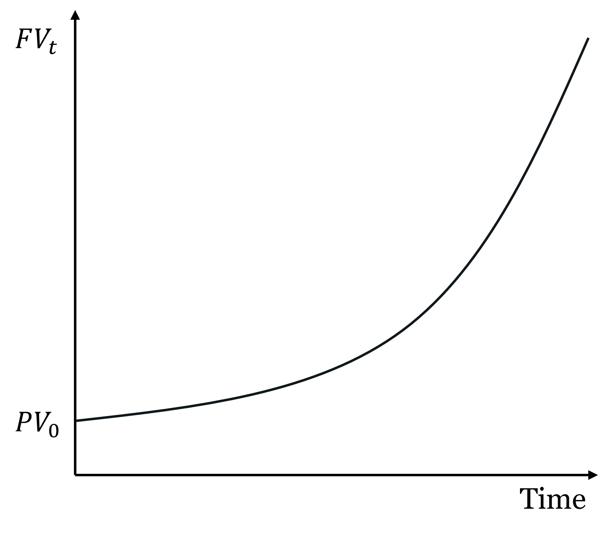
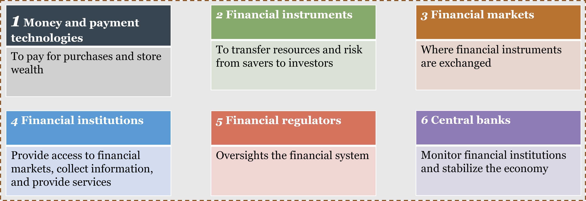
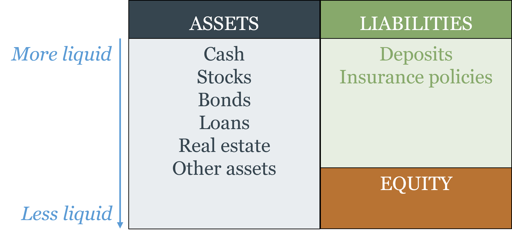

# How Financial Markets Work {#sec-ch05}

::: {.callout-note}
## Learning Objectives

By the end of this chapter, you will be able to:

- Explain why interest rates exist in a world without money, and distinguish the interest rate as the price of time from the price of money
- Derive the relationship between time preference and the interest rate using a supply-and-demand framework
- Distinguish between real and nominal interest rates and apply the Fisher equation
- Calculate future value and present value, and explain why the discount rate represents opportunity cost
- Explain why long-duration assets are more sensitive to interest rate changes than short-duration assets
- Describe the structure of the financial system and distinguish between direct and indirect finance, and between primary and secondary markets
- Identify the main categories of financial instruments and explain what economic function each serves
- Explain how asymmetric information — adverse selection and moral hazard — creates problems in financial markets, and describe how financial institutions and instrument design address them
:::

## Time Preference and the Interest Rate

### The Price of Time, Not the Price of Money

Chapter 4 closed by promising that Chapter 5 would explain what interest rates *mean* economically — not just how the Fed targets them, but what they are and where they come from. The answer begins with a clarification that will reframe how you think about everything that follows.

**The interest rate is not the price of money. It is the price of time.**

This statement may seem strange. We are used to hearing central banks talk about "the cost of money" when they raise rates, and finance textbooks routinely describe the interest rate as the price paid for borrowing money. But this conflates two different things, and the conflation leads to genuine analytical errors.

To see why, consider a barter economy — no money, no banks, just goods. Suppose I have 10 apples and lend them to you today, on the condition that you return 11 apples to me one year from now. There is an interest rate in this transaction: 10%. But there is no money anywhere in the picture. What is being priced? Not money — there is none. What is being priced is **time**: my willingness to give up consumption today in exchange for slightly more consumption in the future, and your willingness to have more apples now at the cost of repaying more later. The interest rate is the market price of that intertemporal exchange.

This is what economists mean by **time preference**: the tendency of people to prefer having goods sooner rather than later, all else equal. It is a fundamental feature of human psychology — a dollar today is worth more than a dollar next year, not because of inflation, but because having something now is simply more valuable than having it later. Time preference exists in barter economies, in commodity money economies, and in fiat money economies. It predates money entirely.

::: {.callout-note}
## Key Definition: Interest Rate as Price of Time

The **interest rate** is the market price of time — the premium that borrowers pay to receive resources now rather than later, and that lenders require to part with resources they could use today. It exists in any economy where people have time preferences, regardless of whether money is present. Confusing the interest rate with the price of money conflates two distinct concepts: the price of time (interest rate) and the price of the medium of exchange (1/P, the purchasing power of money, as defined in Chapter 1).
:::

Why does the confusion between the price of time and the price of money persist? Two reasons. First, there is a terminological issue in monetary policy: when the Fed changes the money supply, it does so by buying or selling credit instruments, so changes in money supply appear as changes in the credit market and therefore affect interest rates. The monetary transmission works *through* credit, which makes it look as if the interest rate is the price of money. Second — and this is worth flagging for students who go on to finance courses — the term **money market** in finance refers not to money in the Chapter 1 sense (a generally accepted medium of exchange) but to a collection of short-term credit instruments: Treasury bills, commercial paper, repurchase agreements. In that usage, "money" is a term of art for liquid short-term debt, and the rates on those instruments are indeed interest rates. The naming is historical and somewhat unfortunate, but it is entrenched. The analytical point stands: interest rates price the intertemporal exchange of resources, not the medium of exchange itself.

### Time Preference and the Credit Market

Time preference varies across people. Some people are very impatient — they highly value consumption today and require a substantial premium to defer it. Others are relatively patient — they are willing to lend their current resources for even a small return. This heterogeneity is what makes a market for credit possible.

The credit market works exactly like any other market, with time as the good being traded. The **supply of credit** comes from savers — households and firms willing to lend purchasing power today in exchange for repayment with interest tomorrow. Higher interest rates attract more saving: as the return to waiting rises, more agents choose to defer consumption. The **demand for credit** comes from borrowers — households wanting to consume before they have the income, firms wanting to invest before they have the profits, governments wanting to spend before they have the tax revenue. Lower interest rates attract more borrowing: as the cost of accessing resources now falls, more agents choose to borrow. The equilibrium interest rate $i^*$ clears this market — equating the total amount that savers are willing to lend with the total amount that borrowers want to access. This equilibrium is determined by the underlying time preferences of all agents in the economy, by the productivity of capital (which determines the return to investment and therefore the demand for credit), and by the supply of saving.

::: {#fig-demand_and_supply}

The market for loans. The supply of loans ($S$) slopes upward: higher interest rates attract more lenders willing to defer consumption. The demand for loans ($D$) slopes downward: lower rates attract more borrowers. The equilibrium rate $i^*$ clears the market. Monetary policy shifts the supply curve — expansionary policy increases the supply of loanable funds, pushing the rate below $i^*$; contractionary policy reduces supply, pushing it above.
:::

Monetary policy works by affecting this equilibrium. When the Fed expands the money supply, it injects additional purchasing power into the credit market, effectively adding to the supply of loanable funds and pushing the interest rate below its equilibrium. When it contracts, it withdraws purchasing power and pushes rates up. The Fed is not "pricing money" — it is intervening in the market for time to influence economic activity through the intertemporal prices that govern investment, saving, and consumption decisions.

### Real vs. Nominal Interest Rates: The Fisher Equation

The interest rate as price of time is a *real* concept — it is about the exchange of real goods (apples today for more apples tomorrow) not about nominal dollar amounts. But in practice, financial contracts are written in nominal terms: a loan is denominated in dollars, not apples. This creates a problem: if the price level changes between when the loan is made and when it is repaid, the nominal interest rate on the contract will not accurately reflect the real exchange of purchasing power taking place.

The **nominal interest rate** $i$ is what you see written on the loan contract — the percentage of the dollar principal paid as interest. The **real interest rate** $r$ is the nominal rate adjusted for the change in purchasing power over the life of the loan — the percentage of real goods effectively transferred as interest.

If you lend \$100 at a nominal rate of 5% for one year, you will receive \$105 at the end of the year. But if inflation has been 3% during that year, the \$105 you receive buys only as much as \$101.94 would have bought when you made the loan. Your real return — the increase in actual purchasing power — is approximately 2%, not 5%.

[Irving Fisher](https://en.wikipedia.org/wiki/Irving_Fisher) formalized this relationship. When you enter a loan contract, the future inflation rate is unknown — you must form an **expectation** $\pi^e$. The exact Fisher equation is:

$$(1 + i) = (1 + r)(1 + \pi^e)$$

Expanding:

$$i = r + \pi^e + r\pi^e$$

Since $r\pi^e$ is very small for typical values of $r$ and $\pi^e$, the standard approximation is:

$$i \approx r + \pi^e$$

::: {.callout-note}
## Key Definition: The Fisher Equation

$$i \approx r + \pi^e$$

The **nominal interest rate** equals the **real interest rate** plus **expected inflation**. Equivalently, the real interest rate equals the nominal rate minus expected inflation: $r \approx i - \pi^e$. The Fisher equation captures a long-run relationship: in equilibrium, lenders demand a nominal rate high enough to cover both their real return and the expected erosion of purchasing power. Persistent high inflation therefore tends to be associated with persistent high nominal rates.
:::

The Fisher equation has several important implications. First, it clarifies who bears inflation risk in a loan contract. If actual inflation $\pi$ turns out to be higher than expected $\pi^e$, the real return to the lender falls below $r$ — the borrower benefits at the lender's expense, as Chapter 1 discussed. If actual inflation is lower than expected, the lender benefits at the borrower's expense. Only when inflation equals expectations does neither party gain or lose relative to their plans.

Second, it explains why central banks can only control nominal rates directly but care about real rates. The Fed sets the federal funds rate — a nominal rate. But the economically relevant rate for investment and consumption decisions is the real rate, $r \approx i - \pi^e$. If the Fed raises $i$ by 1% while leaving $\pi^e$ unchanged, real rates also rise by 1%, tightening financial conditions. But if inflation expectations rise simultaneously (perhaps because the market interprets the Fed's action as insufficient), the effect on real rates is muted. This is why managing inflation expectations is not just a communication exercise — it is the mechanism through which monetary policy actually transmits to real economic decisions.

Third, the Fisher equation connects Chapter 1's discussion of inflation to the financial market analysis that follows. A central bank that tolerates persistently high inflation will see nominal rates rise to compensate — lenders are not willing to be systematically fooled. This is why price stability is a precondition for a well-functioning credit market, and why the monetary anchor discussed in Chapters 3 and 4 matters for financial markets, not just for macroeconomic stability.

## Present Value and Future Value

### Future Value: How Money Grows Over Time

If the interest rate is the price of time, then **future value** is what a sum of money today is worth at some future date, given that it can be invested at the going interest rate. It is the arithmetic of time preference applied to a specific dollar amount.

If you invest \$100 today at an annual interest rate $i$, after one year you have:

$$FV_1 = \$100 \times (1 + i)$$

If you leave the entire amount invested for a second year, you earn interest not just on the original \$100 but on the first year's interest as well — this is **compounding**:

$$FV_2 = \$100 \times (1 + i)^2$$

After $n$ years:

$$FV_n = PV \times (1 + i)^n$$

where $PV$ is the initial amount (present value). The general formula makes clear that future value grows exponentially with both the interest rate and the time horizon — the characteristic curve shown below.

::: {.callout-tip}
## Math Connection: Exponential Growth

The future value formula is an exponential function in disguise. Compare:

$$FV_n = PV \times (1+i)^n \qquad \longleftrightarrow \qquad y = a \cdot b^x$$

The correspondence is: $y = FV_n$ (the outcome), $a = PV$ (the initial value, which scales the curve), $b = (1+i)$ (the base, which must be $> 1$ for growth — guaranteed as long as $i > 0$), and $x = n$ (the exponent, time). This is why the compounding curve has the characteristic shape it does: slow at first, then steeply accelerating. Any time you see $FV_n = PV \times (1+i)^n$, you are looking at an exponential function with base $(1+i)$. The higher the interest rate, the larger the base, and the faster the curve bends upward.
:::

::: {#fig-compounding}
{width=50%}

The exponential growth of a sum invested at a constant interest rate over time. Growth is slow at first and accelerates as the interest base expands — each period's interest becomes the base for the next period's interest. This is the mathematical signature of compounding.
:::

::: {.callout-tip}
## Intuition Builder: The Power of Compounding

At 3% annual return, \$1,000 grows to approximately \$1,344 after 10 years, \$1,806 after 20 years, and \$2,427 after 30 years. At 6%, those same numbers are \$1,791, \$3,207, and \$5,743. Doubling the rate more than doubles the 30-year outcome — because compounding means you earn returns on returns. The difference between a retirement account earning 3% and one earning 6% is not twice as much money at retirement; it is nearly four times as much. Time and compounding together are why early saving matters far more than later saving, even when the dollar amounts are the same.
:::

When interest compounds more frequently than annually — monthly, daily, continuously — the effective annual rate is higher than the stated rate, because interest is being earned on interest within the year. For a stated annual rate $i$ compounded $k$ times per year, the future value after $n$ years is:

$$FV_n = PV \times \left(1 + \frac{i}{k}\right)^{kn}$$

As $k \to \infty$ (continuous compounding), this converges to:

$$FV_n = PV \times e^{in}$$

For most practical purposes in this course, annual compounding is sufficient. The more frequent compounding formulas become important when pricing bonds and other instruments that pay semi-annual or monthly coupons — which we will encounter in Chapter 6.

### Present Value: Discounting Future Cash Flows

**Present value** is the inverse operation: given a cash flow to be received in the future, what is it worth today? The logic is exactly the inversion of future value. If \$100 today will grow to $100 \times (1 + i)$ in one year, then a payment of $CF$ to be received in one year is worth:

$$PV = \frac{CF}{(1 + i)}$$

More generally, a cash flow $CF_t$ received $t$ periods from now has present value:

$$PV = \frac{CF_t}{(1 + i)^t}$$

And a stream of cash flows $CF_1, CF_2, \ldots, CF_n$ received at different future dates has total present value:

$$PV = \sum_{t=1}^{n} \frac{CF_t}{(1 + i)^t} = \frac{CF_1}{(1+i)} + \frac{CF_2}{(1+i)^2} + \cdots + \frac{CF_n}{(1+i)^n}$$

This is the fundamental formula of financial valuation. Every financial asset — a bond, a stock, a mortgage, a derivative — can ultimately be understood as a claim on one or more future cash flows. Present value converts those future claims into today's dollars using the interest rate as the conversion factor. Once you understand present value, you have the conceptual toolkit for pricing any financial asset.

::: {.callout-important}
## Key Takeaway: The Discount Rate Is Opportunity Cost

The interest rate $i$ in the present value formula is called the **discount rate**. It is not arbitrary — it represents the **opportunity cost** of the funds: the return you could earn on the best available alternative investment of similar risk. If you could earn 5% per year risk-free by holding government bonds, then you should discount any other cash flow stream at least at 5% to determine whether it is worth holding instead. A project that generates \$110 in one year is worth \$104.76 today at a 5% discount rate, making it preferable to investing \$100 in government bonds. At a 10% discount rate, the same \$110 is worth only \$100 today — exactly equal to the bond alternative, making you indifferent. The discount rate encodes your alternatives; present value tells you whether the asset under consideration beats them.
:::

### Present Value Sensitivity: Why Duration Matters

The present value formula has an important property: cash flows received further in the future are discounted more heavily than near-term cash flows, and the present value of long-dated cash flows is therefore more sensitive to changes in the discount rate than the present value of short-dated cash flows.

To see why, compare two assets. Asset A pays \$100 in one year. Asset B pays \$100 in ten years. Both promise the same nominal cash flow, but at a 5% discount rate:

$$PV_A = \frac{\$100}{1.05} = \$95.24$$

$$PV_B = \frac{\$100}{(1.05)^{10}} = \$61.39$$

Now suppose the discount rate rises from 5% to 6%:

$$PV_A' = \frac{\$100}{1.06} = \$94.34 \quad \text{(fell by \$0.90, or 0.9\%)}$$

$$PV_B' = \frac{\$100}{(1.06)^{10}} = \$55.84 \quad \text{(fell by \$5.55, or 9.1\%)}$$

The same one-percentage-point rise in the discount rate reduces Asset A's value by less than 1% but reduces Asset B's value by over 9%. Long-dated assets are far more interest-rate sensitive than short-dated ones. This property is called **duration**: a measure of the weighted average time until cash flows are received, which also serves as a measure of interest rate sensitivity.

::: {.callout-note}
## Key Definition: Duration

**Duration** ($D$) is the weighted average time until a financial asset's cash flows are received, where the weights are each cash flow's present value as a share of the total:

$$D = \frac{\sum_{t=1}^n t \cdot \frac{CF_t}{(1+i)^t}}{PV}$$

Duration measures both *when* you get your money back (on average) and *how sensitive* the asset's price is to changes in interest rates. A bond with a duration of 5 years will lose approximately 5% of its value for every 1 percentage point rise in interest rates. A bond with a duration of 10 years will lose approximately 10%. This is why long-term bonds are riskier than short-term bonds in a rising rate environment — a lesson SVB learned painfully in 2022–2023, as discussed in Chapter 4.
:::

The duration concept will be essential in Chapter 6 when we price bonds and examine the yield curve. The inverse relationship between bond prices and yields — one of the most important relationships in fixed income — is a direct consequence of present value mechanics: when discount rates rise, the present value of a bond's future cash flows falls. To see what that looks like concretely: a bond is a stream of coupon payments plus a final principal repayment, all discounted at the market yield; a stock is a potentially infinite stream of dividends discounted at the required return on equity. Both are present value problems — Chapter 6 works through each in detail. First, though, we need to understand the institutional landscape in which these instruments are issued and traded.

## The Financial System

### What Financial Markets Do

With the analytical tools of time preference, present value, and duration in hand, we can now examine the institutional landscape those tools were built to describe. **Financial markets** are the collection of institutions, instruments, and practices through which savers and borrowers — those with surplus funds today and those who need funds today — find each other and transact.

The financial system has six broad components, each serving a distinct function:

::: {#fig-financial-functions}

The six components of the financial system. Each layer performs a distinct function: money and payment technologies enable exchange; financial instruments transfer resources and risk; financial markets provide the venues for trading those instruments; financial institutions provide access, information, and services; regulators oversee the system; and central banks monitor institutions and stabilize the macroeconomy.
:::

Financial markets in the narrower sense serve three fundamental economic functions:

**Channeling resources across time.** Financial markets move resources from those who have them now (savers) to those who can use them productively now (investors) — bridging the gap between a farmer who needs to invest before the harvest, a household that wants to buy a home before decades of saving, and a firm that has identified a profitable investment before it has the cash to fund it. Without this intertemporal coordination mechanism, vast amounts of productive investment would simply not happen.

**Sharing and diversifying risk.** Individual agents face idiosyncratic risks — a factory fire, a bad harvest, a business failure — that financial markets allow to be pooled and distributed across many participants, so that no single agent bears the full consequences of bad outcomes. Insurance contracts, equity ownership, and diversified portfolios are all mechanisms for spreading risk that would otherwise be concentrated.

**Aggregating and transmitting information.** Financial prices — interest rates, bond yields, stock prices — aggregate the dispersed beliefs of millions of participants into publicly observable signals. A rising bond yield signals deteriorating creditworthiness; a falling stock price signals revised earnings expectations. These signals guide resource allocation in ways that no central authority could replicate.

### Direct and Indirect Finance

Resources move from savers to borrowers through two broad channels:

**Direct finance** is when borrowers raise funds directly from savers in financial markets, without a financial intermediary standing between them. A company issuing bonds or stock is raising funds directly from whoever buys those securities. The borrower and the ultimate provider of funds are connected through the market, with investment banks and underwriters facilitating the transaction but not intermediating the funds themselves.

**Indirect finance** is when a financial intermediary — a bank, an insurance company, a mutual fund — stands between savers and borrowers. A depositor places funds at a bank; the bank lends those funds to a business. The depositor and the business are never directly connected. The intermediary transforms the depositor's claim (a demand deposit, redeemable at any time) into the borrower's obligation (a term loan, repaid over years). This maturity transformation and risk transformation is the core economic function of financial intermediaries, as discussed in Chapter 4.

Financial intermediaries share a common balance sheet structure that reflects their intermediary role:

::: {#fig-balance-sheet}
{width=70%}

The balance sheet of a financial intermediary. Assets (left) are ordered from more liquid to less liquid: cash, stocks, bonds, loans, real estate. Liabilities (right) are the claims of depositors, policyholders, and other creditors. Equity is the residual owned by shareholders. Financial intermediaries profit from the spread between the return on assets and the cost of liabilities — but this structure creates the maturity mismatch that makes them fragile, as Chapter 4 discussed.
:::

Financial intermediaries come in several distinct forms, each solving the matching problem differently. **Depository institutions** — commercial banks, S&Ls, thrift institutions, and credit unions — take deposits and make loans, earning the spread between deposit rates and lending rates; their deposit liabilities form part of M1 and M2, giving them a monetary significance that other intermediaries lack. **Investment banks** facilitate primary market transactions — underwriting securities, advising on mergers, connecting issuers with investors — without taking deposits or transforming maturities. **Contractual savings institutions** — insurance companies and pension funds — collect premiums or contributions on a scheduled basis and invest them in long-term assets to meet future obligations, giving them a more predictable liability structure than banks. **Investment intermediaries** — mutual funds, ETFs, and hedge funds — pool funds from many investors into diversified portfolios, providing small investors access to diversification and professional management that would be unavailable individually.

Most financial systems rely on both direct and indirect channels, with the balance differing across countries. The US and UK are relatively more market-based; continental Europe and Japan more bank-based. The difference has implications for monetary policy transmission and for the kinds of financing available to firms.

### Primary and Secondary Markets

**Primary markets** are where new financial instruments are sold for the first time — where the issuer receives the proceeds. When a company conducts an [initial public offering (IPO)](https://en.wikipedia.org/wiki/Initial_public_offering) or when the US Treasury auctions new bonds, these are primary market transactions. Primary market transactions typically involve an **underwriter** — usually an investment bank — that evaluates the issuer, helps price the security, and takes on the risk of distributing it to investors.

**Secondary markets** are where already-issued securities are subsequently traded between investors — where the issuer receives nothing. When you buy Apple stock on the NASDAQ, you are buying from another investor, not from Apple. Secondary markets are typically larger and more active than primary markets; without them, nobody would buy securities in primary markets since they could not exit before maturity. The liquidity that secondary markets provide — the ability to convert an asset into cash quickly without significant price impact — is what makes primary markets viable.

### Financial Instruments

A **financial instrument** is a contract that defines when and under what conditions payments will take place between parties. It is not a good, not a currency — it is a *contract* specifying cash flows. Different instruments differ in the size, timing, certainty, and conditionality of those cash flows, which is what generates the enormous variety in modern markets.

**Debt instruments** obligate one party to pay specified amounts at specified times, regardless of how the issuer performs. A **bond** is the canonical form — it promises periodic coupon payments and return of the principal at maturity — but bonds come in many variants (floating-rate, sinking fund, perpetuity) that adjust the timing and conditionality of those cash flows. What all bonds share is contractual flexibility and tradability in secondary markets. A **loan** negotiated directly with a bank is less standardized and less liquid. **Asset-backed securities (ABS)** pool individual loans and issue securities backed by the pool's cash flows. Debt holders have a fixed, senior claim — they have priority over equity holders in any recovery, which makes debt less risky but caps the upside. Chapter 6 examines debt valuation in detail.

**Equity instruments** represent residual ownership claims — a share of whatever remains after all debt has been paid. Equity has no fixed payment schedule and no maturity date: holders receive the residual, which can be very large if the firm performs well and zero if it doesn't. Equity is riskier than debt but offers unlimited upside. Chapter 6 examines equity valuation in detail.

**Derivatives** are contracts whose value derives from an underlying asset, index, or rate — futures, options, swaps. They exist primarily to transfer specific risks to those better able to bear them, though they can also be used to amplify risk. Chapter 7 examines derivatives in detail.

::: {.callout-tip}
## A Note on the "Money Market"

In finance, the **money market** refers to short-term debt instruments — Treasury bills, commercial paper, repurchase agreements — not to "money" in the Chapter 1 sense. The rates on these instruments are interest rates — the price of short-term credit. See §5.1 for the full distinction.
:::

### The Regulatory Landscape

Financial markets are extensively regulated — for prudential reasons (systemic failures impose costs beyond immediate parties), disclosure reasons (asymmetric information cannot be fully resolved by markets alone), and competition reasons (concentrated financial markets can exploit market power). In the United States the landscape is fragmented across the Federal Reserve and OCC (bank supervision), the SEC (securities markets), the CFTC (derivatives), the FDIC (deposit insurance and bank resolution), and the CFPB (consumer protection). This fragmentation creates coordination challenges — the 2008 crisis partly reflected shadow banking activity that fell between jurisdictions — but it also introduces competition among regulators, giving each agency reputational incentives to stay competent and current. The post-crisis Dodd-Frank Act created the Financial Stability Oversight Council (FSOC) to coordinate across agencies. Chapter 7 returns to financial regulation in detail.

## Asymmetric Information

### The Problem: When Information Gaps Shut Down Markets

The financial markets described in the previous section depend on a crucial assumption: that parties to a transaction have sufficient information to price the risks they are taking on. In practice, this assumption is routinely violated. **Asymmetric information** occurs when one party to a transaction has relevant information that the other does not.

Asymmetric information is ubiquitous in financial markets. A firm seeking to issue bonds knows far more about its financial condition than potential bondholders do. A homeowner applying for a mortgage knows far more about their employment stability and spending habits than the lender does. A used car dealer knows whether a car has been in an accident; the buyer often does not. Asymmetric information is not merely an inconvenience — in extreme cases it can cause markets to break down entirely.

The foundational insight comes from [George Akerlof](https://en.wikipedia.org/wiki/George_Akerlof)'s 1970 paper "The Market for Lemons," which earned the 2001 Nobel Prize. Akerlof showed that in a market where sellers know the quality of their goods but buyers do not, adverse selection can eliminate trade in high-quality goods — a cascade that can destroy the entire market.

### Adverse Selection: The Problem Before the Transaction

**Adverse selection** is the problem that arises *before* a transaction takes place: the fact that the parties most eager to transact tend to be those for whom the transaction is most advantageous to themselves and least advantageous to you.

Akerlof's used car example illustrates the logic. Suppose used cars are either "peaches" (high-quality, worth \$20,000) or "lemons" (low-quality, worth \$10,000), in equal proportions. Sellers know which they have; buyers do not. A risk-neutral buyer's expected value is \$15,000 (the average). If buyers offer \$15,000 for any car:

- Sellers of peaches refuse — their car is worth \$20,000 and they are being offered less
- Sellers of lemons accept eagerly — their car is worth \$10,000 and they are being offered more

Buyers quickly learn that any car offered at \$15,000 must be a lemon, since peach owners won't sell at that price. So buyers revise down to \$10,000. But now sellers of the higher-quality lemons — those in better condition — refuse to sell at \$10,000. The market unravels from the top down, potentially collapsing entirely.

In financial markets, adverse selection takes the following form. Suppose investors cannot distinguish between firms with good prospects and firms with bad prospects. Both types of firms seek financing. The good firms know their stock is undervalued at the average market price (which blends good and bad firms); they are reluctant to sell equity at a discount. The bad firms know their stock is overvalued at the average market price; they are eager to sell. Investors, anticipating this selection, discount all equity issuances — which drives away good firms further, worsening the selection, potentially shutting down the equity market for firms with good prospects entirely.

This logic explains several institutional features of financial markets that might otherwise seem puzzling. **Investment banks** exist as underwriters precisely because their reputations are on the line: by vouching for an issuer through due diligence, they use their own credibility as a certification device — a costly signal that a fly-by-night operator could not mimic. **Credit rating agencies** solve a scale problem: no individual investor can evaluate the creditworthiness of thousands of bond issuers, so agencies that specialize in that evaluation become a shared infrastructure. **Collateral requirements** work because a borrower who pledges assets is putting skin in the game — a defaulting borrower loses the collateral, making the pledge credible in a way that a mere promise is not. And **mandatory disclosure** — financial statements, material event announcements, insider trading restrictions — addresses the information gap at source, rather than working around it.

The adverse selection problem extends well beyond financial markets. Insurance markets face the same spiral: people in poor health are more likely to seek health insurance than healthy people, driving up premiums, driving away the healthier buyers, and raising premiums further. This is a key reason why health insurance is often made **mandatory** — by requiring everyone to participate, mandatory enrollment prevents the healthy from opting out and collapsing the risk pool. The same logic applies to compulsory car insurance in most jurisdictions.

### Moral Hazard: The Problem After the Transaction

**Moral hazard** is the problem that arises *after* a transaction takes place: when one party's behavior changes in ways that harm the other party, because the transaction has altered the incentives.

The term originated in insurance. A person who buys comprehensive car insurance has less incentive to drive carefully than an uninsured driver: the insurer bears the cost of accidents, so the insured party partially externalizes the risk. The insurance contract changes the insured party's behavior in ways the insurer cannot easily observe or prevent.

In financial markets, moral hazard operates in two important contexts:

**Equity financing.** When a firm sells equity, the founders' ownership stake declines. If the founders previously owned 100% of a profitable firm, they captured all the gains from any extra effort or prudent decision-making. After selling 50% to outside investors, they capture only 50% of the gains from those same choices. Their incentive to work hard, take care of assets, and invest prudently is reduced. This is the **principal-agent problem**: the investors (principals) want the firm's managers (agents) to maximize firm value, but managers' interests are not perfectly aligned with shareholders' interests once their ownership stake is diluted.

The principal-agent problem is the mechanism behind several features of corporate finance that might otherwise seem puzzling. Manager compensation tied to stock options and equity grants is not generosity — it is an alignment device, engineering a situation where managers personally gain when shareholders gain and personally lose when shareholders lose. Covenants in debt contracts are a pre-emptive form of monitoring: rather than hoping borrowers will behave prudently after the loan is made, lenders build behavioral restrictions directly into the contract. And the activism of large institutional investors — attending shareholder meetings, voting proxies, pushing management on strategy — reflects the same logic applied at scale: when you own enough of a firm to make exit costly, voice becomes more efficient than selling.

**Debt financing.** Moral hazard in debt takes a different form. Once a firm has borrowed, it has an incentive to take on more risk than the lender anticipated. Here is why: if a risky investment succeeds, the firm captures the upside (the lender receives only the promised interest, regardless of how well the investment performs). If the investment fails badly, the lender absorbs much of the loss (through default). The firm has an asymmetric payoff — heads I win, tails you lose — that creates an incentive to gamble with borrowed money.

A concrete example makes this vivid. Suppose a firm has borrowed \$90 and has \$10 of its own equity at stake — total assets of \$100. It faces a choice between a safe project (returns \$105 with certainty) and a risky project (returns \$150 with 50% probability, \$60 with 50% probability). The expected value of the risky project (\$105) equals the safe project, so from a social standpoint they are equivalent. But from the firm's perspective: the safe project leaves \$15 for equity holders (\$105 minus the \$90 debt repayment); the risky project leaves either \$60 for equity holders (if it succeeds) or nothing — because if it returns only \$60, the lender takes everything and the equity is wiped out. The firm's expected payoff on the risky project is $0.5 \times \$60 + 0.5 \times \$0 = \$30$, far better than the safe project's certain \$15. The firm rationally chooses the riskier project even though lenders would prefer the safe one — the debt contract has created a systematic bias toward excessive risk.

This risk-shifting problem is why loan covenants restrict borrowers' investment activities, why banks require borrowers to maintain minimum equity levels (so the borrower has skin in the game), and why secured lending — where the lender can seize specific assets in default — is so prevalent. Moral hazard also operates at the systemic level: government deposit insurance reduces depositors' incentive to monitor their banks, and too-big-to-fail expectations reduce large creditors' incentive to monitor the institutions they lend to. Chapter 4 examined both of these in detail — the deposit insurance moral hazard problem and the Bagehot rule's role in preserving market discipline are direct applications of the logic developed here.

### How Financial Markets Mitigate Information Problems

The persistence of financial markets despite these information problems is itself informative: markets and institutions have developed mechanisms that partially address them. The solutions are imperfect, but they are substantial enough to allow financial markets to function.

**Disclosure and transparency.** Mandatory disclosure requirements — financial statement reporting, material event announcements, insider trading restrictions — reduce the information gap between issuers and investors. This is the rationale for securities regulation more broadly: not to substitute for market judgment, but to ensure that market judgment is based on information that is reasonably complete and accurate.

**Intermediation and screening.** Banks and other financial intermediaries develop expertise in evaluating borrowers that individual investors cannot replicate. A bank that lends to hundreds of small businesses develops information about creditworthiness, industry conditions, and borrower behavior that is unavailable to a retail investor trying to assess a single loan. This information advantage is part of what intermediaries are paid for through the interest rate spread between deposits and loans.

**Collateral and net worth requirements.** Requiring borrowers to pledge assets or maintain minimum equity creates a mechanism for borrowers to credibly signal their commitment and gives lenders a way to recover losses in default. Collateral requirements also solve a piece of the moral hazard problem: a borrower who will lose their house if they default has a stronger incentive to repay than one with no skin in the game.

**Signaling.** Parties with favorable private information can sometimes credibly signal that information through costly actions that unfavorable types would not want to imitate. A firm that chooses to pay dividends — committing to return cash to shareholders — signals confidence in its future earnings, since a poorly performing firm cannot sustain dividends. An executive who holds large equity stakes signals alignment with shareholders. A borrower who chooses a shorter loan maturity signals confidence in their ability to repay quickly. These signals work precisely because they are costly — cheap signals can be mimicked by bad types and therefore convey no information.

::: {.callout-warning}
## Common Mistake: Confusing Adverse Selection and Moral Hazard

Both concepts involve asymmetric information, but they operate at different points in a transaction:

**Adverse selection** is a *pre-transaction* problem: the wrong parties are attracted to the transaction because they have private information about how it will benefit them at your expense. The problem is in *who* transacts with you.

**Moral hazard** is a *post-transaction* problem: once the contract is in place, one party changes its behavior in ways that harm the other, because the contract has shifted who bears the consequences. The problem is in *how* your counterparty behaves after you've committed.

In insurance: adverse selection means sick people buy health insurance more than healthy people (before the contract). Moral hazard means insured people take more health risks than uninsured people (after the contract).
:::

## Looking Ahead

The tools developed in this chapter — time preference, present value, duration, and the taxonomy of financial instruments — are not ends in themselves. They are the vocabulary for the chapters that follow. Chapter 6 puts them to work on the two most important financial assets in modern markets: bonds and stocks. A bond is a stream of promised cash flows discounted at a market yield — and understanding why bond prices fall when yields rise, why longer-maturity bonds are more volatile, and what the shape of the yield curve tells us about expectations for interest rates and the economy all follow directly from the present value mechanics developed in §5.2. A stock is a claim on uncertain future earnings discounted at a rate that reflects both time preference and risk — and equity valuation requires combining the present value framework with a theory of what discount rate is appropriate for a given level of uncertainty. Chapter 7 then takes up the instruments designed specifically to manage the risks that bond and stock holders face: derivatives. By the end of Chapter 7, the financial system described in §5.3 will have been populated with priced assets, risk profiles, and the instruments used to reshape them. The map drawn in this chapter will have become a working model.

## Key Takeaways

::: {.callout-important}
## Chapter 5 Summary

**Interest rate as price of time:** The interest rate is the price of time — the premium paid to access resources now rather than later — not the price of money. It exists in barter economies with no money present. The price of money is 1/P (purchasing power), as defined in Chapter 1. The "money market" in finance terminology refers to short-term credit instruments, not to money in the economic sense — a naming convention, not a conceptual equivalence.

**Real vs. nominal rates and the Fisher equation:** The nominal interest rate $i$ is the rate written on a contract. The real interest rate $r$ adjusts for expected inflation: $r \approx i - \pi^e$. The Fisher equation $i \approx r + \pi^e$ implies that lenders demand nominal rates high enough to cover both their real return and expected purchasing power erosion. Persistent high inflation therefore produces persistent high nominal rates. Central banks control nominal rates directly; real rates — which govern actual economic decisions — depend on the gap between nominal rates and inflation expectations.

**Future value and present value:** Future value is the growth of a present sum through compounding: $FV_n = PV \times (1+i)^n$. Present value is the current worth of a future cash flow: $PV = CF_t / (1+i)^t$. For a stream of cash flows: $PV = \sum CF_t / (1+i)^t$. The discount rate in the PV formula represents the opportunity cost of funds — the return available on the best alternative investment of similar risk. Present value is the universal valuation tool for financial assets.

**Duration and interest rate sensitivity:** Duration measures the weighted average time to receive cash flows and the sensitivity of an asset's price to interest rate changes. Long-duration assets lose more value when rates rise than short-duration assets. A 1 percentage point rise in rates reduces a 5-year duration asset by approximately 5%, a 10-year duration asset by approximately 10%. This is the mechanism behind the inverse bond price-yield relationship and explains SVB's vulnerability to the 2022–2023 rate cycle.

**The financial system:** Financial markets channel resources across time (from savers to borrowers), share and diversify risk, and aggregate dispersed information into prices. Direct finance connects borrowers to savers through markets; indirect finance uses intermediaries. Primary markets issue new securities (issuers receive proceeds); secondary markets trade existing securities (issuers receive nothing, but liquidity in secondary markets enables primary issuance). Financial instruments include debt (fixed senior claims), equity (residual ownership claims), and derivatives (contracts whose value derives from underlying assets).

**Asymmetric information:** When one party to a transaction has relevant information the other lacks, two problems arise. Adverse selection (pre-transaction): the parties most eager to transact tend to be those for whom it is most advantageous to themselves. Akerlof's lemons model shows this can destroy markets from the top down. In financial markets, adverse selection makes equity issuance expensive and drives good firms away. Moral hazard (post-transaction): once a contract is in place, one party's behavior changes in ways that harm the other. In equity financing, managers with diluted ownership have weakened incentives to maximize firm value (the principal-agent problem). In debt financing, borrowers have incentives to take excessive risk (heads I win, tails you lose). Solutions include disclosure requirements, intermediary screening, collateral requirements, and signaling mechanisms. None fully solves these problems — which is why financial regulation exists, and why financial crises recur.
:::
