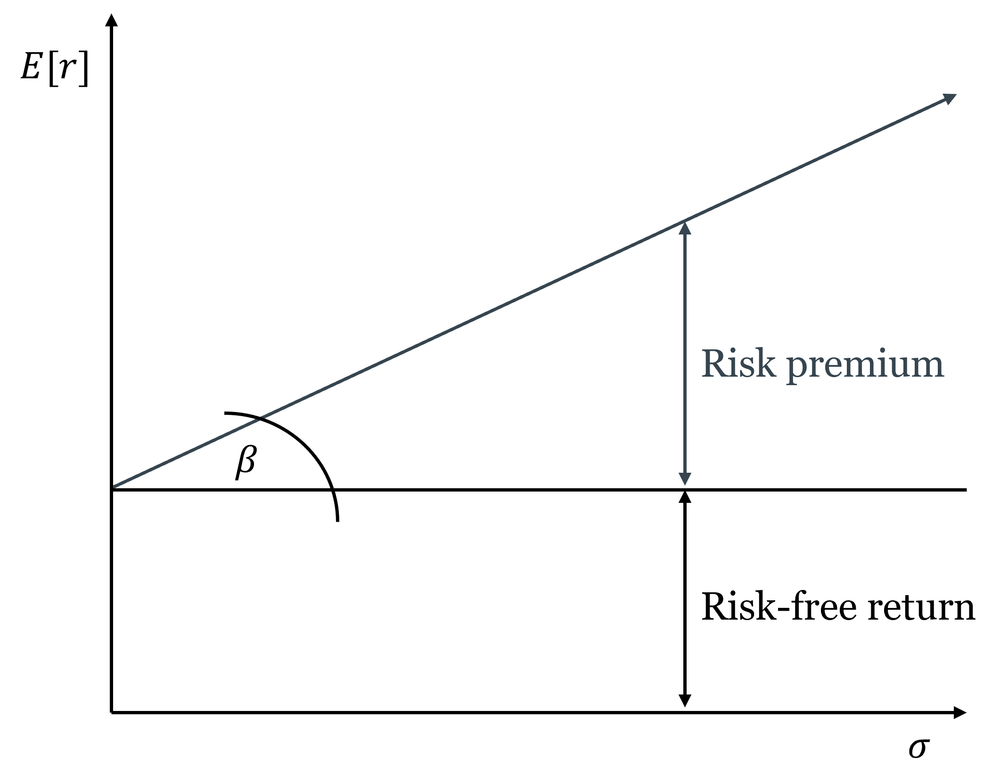
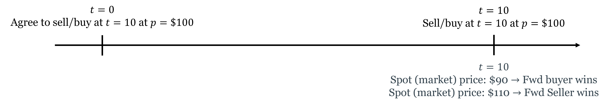
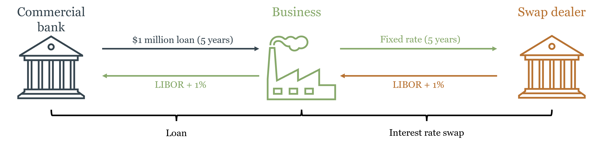
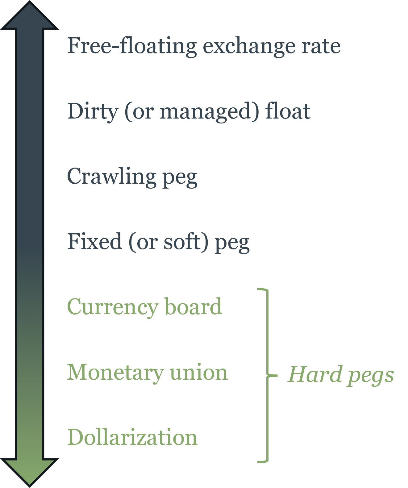
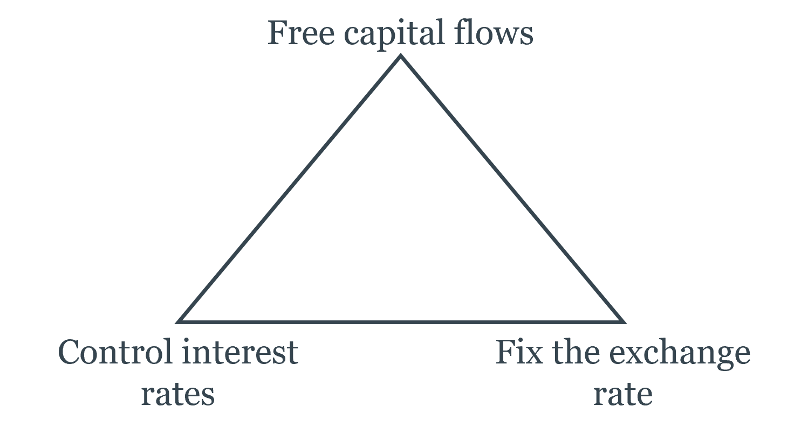

# Managing Risk in Financial Markets {#sec-ch07}

::: {.callout-note}
## Learning Objectives

By the end of this chapter, you will be able to:

- Define risk in economic terms and explain the difference between idiosyncratic and systematic risk
- Calculate expected value, variance, and standard deviation as measures of risk
- Explain how diversification reduces idiosyncratic risk but cannot eliminate systematic risk
- Describe the Capital Asset Pricing Model conceptually and interpret beta as a measure of systematic risk
- Identify the main categories of derivatives and explain the economic function each serves
- Explain how futures and options can be used to hedge or to speculate, and describe the asymmetric payoff structure of options
- Trace the historical arc of US financial regulation and explain why the regulatory landscape is fragmented across multiple agencies
- Define the nominal and real exchange rate, apply purchasing power parity, and explain interest rate parity
- Explain the Mundell trilemma and use it to interpret exchange rate regime choices
- Describe how monetary policy transmits through the exchange rate channel
:::

## Risk and Return

### What Risk Means Economically

Risk, in everyday language, means the possibility of something bad happening. In economics, the definition is more precise and more symmetric: **[risk](https://en.wikipedia.org/wiki/Risk)** is uncertainty about future outcomes — the possibility that what actually happens will differ from what was expected, in either direction. An investment that might return 20% or might return -10% is risky; so is one that might return 5% or 15%, even though neither outcome is "bad" in absolute terms. What matters is the dispersion of outcomes around the expected value, not just the downside.

This definition matters because it determines what investors demand as compensation. People are generally **risk-averse**: holding expected return constant, they prefer less uncertainty. This means risky investments must offer higher expected returns to attract investors — the **risk-return tradeoff** that runs through all of modern finance. Every yield spread in Chapter 6 — the term premium, the credit spread, the equity risk premium — is a concrete application of this principle.

### Measuring Risk: Expected Value, Variance, and Standard Deviation

The formal tools for measuring risk start with the **[expected value](https://en.wikipedia.org/wiki/Expected_value)** — the probability-weighted average of all possible outcomes. When you look at a stock's historical price chart and see it swinging 20% in a month while another barely moves 2%, standard deviation is the formal measure of that difference in volatility — the same concept, applied rigorously. If an investment returns \$1,400 with 50% probability and \$700 with 50% probability:

$$E[X] = 0.5 \times \$1,400 + 0.5 \times \$700 = \$1,050$$

The expected value tells you the center of the distribution. Risk is about the spread around that center. The **variance** measures that spread:

$$V[X] = E\left[(X_i - E[X])^2\right] = 0.5 \times (\$1,400 - \$1,050)^2 + 0.5 \times (\$700 - \$1,050)^2 = \$^2 122{,}500$$

The squaring serves two purposes: it ensures that deviations above and below the mean both contribute positively (so they don't cancel), and it penalizes large deviations more than small ones. The **[standard deviation](https://en.wikipedia.org/wiki/Standard_deviation)** $\sigma$ is the square root of the variance, which restores the original units:

$$\sigma = \sqrt{V[X]} = \sqrt{\$^2 122{,}500} = \$350$$

Standard deviation is the most commonly used measure of risk in finance. An investment with a standard deviation of \$350 around an expected value of \$1,050 is more volatile — and therefore riskier — than one with a standard deviation of \$100 around the same mean. A higher $\sigma$ means more dispersion of outcomes, which risk-averse investors require more expected return to accept.

### Idiosyncratic vs. Systematic Risk

Not all risk is alike. The most important distinction in financial economics divides risk into two fundamentally different types.

**Idiosyncratic risk** (also called **firm-specific** or **unsystematic risk**) is risk that is specific to a particular firm or asset — a bad earnings report, a product recall, a management scandal, a factory fire. These events affect one company without necessarily affecting others. Crucially, idiosyncratic risks tend to be *uncorrelated* across companies: when one firm has a bad quarter, it doesn't systematically cause another firm in a different industry to have a bad quarter.

**Systematic risk** (also called **market risk**) is risk that affects the entire economy simultaneously — a recession, a spike in inflation, a financial crisis, a global pandemic. These events move all asset prices in the same direction because they affect the underlying economic conditions that all firms depend on.

The distinction matters because of **[diversification](https://en.wikipedia.org/wiki/Diversification_(finance))**: holding a portfolio of many assets rather than a single asset. When you hold 50 stocks from different industries and sectors, the idiosyncratic shocks tend to cancel out — a bad outcome for one firm is offset by a good outcome for another. The variance of the portfolio falls as you add uncorrelated assets, while the expected return stays the same. Diversification is, in this sense, a free lunch: you can reduce risk without sacrificing expected return, simply by spreading investments across many uncorrelated assets.

::: {.callout-tip}
## Intuition Builder: Diversification as Hedging

Consider two companies: 3M (a diversified manufacturer) and Texaco (an oil company). Both have a 50% chance of returning \$120 and a 50% chance of staying at \$100. Suppose, importantly, that their outcomes are *uncorrelated* — a good year for 3M says nothing about Texaco's year.

If you invest \$100 in 3M alone: expected value = \$110, standard deviation = \$10.

If you invest \$50 in each: there are now four possible outcomes — both up (\$120), 3M up/Texaco flat (\$110), 3M flat/Texaco up (\$110), both flat (\$100). The expected value is still \$110, but because the bad outcomes for one firm are partially offset by good outcomes for the other, the standard deviation falls to \$7.07.

The same expected return, less risk. This is diversification working exactly as intended. Now imagine doing this with 500 stocks rather than 2 — the idiosyncratic risk approaches zero while the expected return is unchanged.
:::

But diversification has a limit. No matter how many stocks you hold, you cannot diversify away systematic risk. A recession reduces earnings across virtually all industries simultaneously; no portfolio of domestic stocks protects you from a market-wide decline. The systematic component of each stock's risk remains in the portfolio regardless of how widely you diversify.

This is why risk-averse investors can eliminate idiosyncratic risk for free (through diversification) but must be *compensated* for bearing systematic risk. The **equity risk premium** — the excess return of stocks over risk-free bonds — is compensation for the systematic risk inherent in equity ownership. It cannot be diversified away, so investors demand payment for bearing it.

### The Capital Asset Pricing Model

The [Capital Asset Pricing Model](https://en.wikipedia.org/wiki/Capital_asset_pricing_model) (CAPM), developed by [William Sharpe](https://en.wikipedia.org/wiki/William_F._Sharpe) (Nobel Prize, 1990), formalizes the relationship between systematic risk and expected return. The key insight is that since only systematic risk is priced — idiosyncratic risk can be diversified away for free — the relevant measure of a stock's risk is not its total volatility but its *correlation with the overall market*.

**Beta** ($\beta$) measures this: it is the sensitivity of a stock's return to the market's return. A stock with $\beta = 1$ moves exactly with the market — when the market rises 10%, the stock tends to rise 10%. A stock with $\beta = 2$ moves twice as much — when the market rises 10%, the stock tends to rise 20%, and when the market falls 10%, the stock tends to fall 20%. A stock with $\beta = 0.5$ is half as sensitive as the market. A stock with $\beta < 0$ — rare, but possible for certain assets like gold — tends to move against the market, which makes it particularly valuable for diversification.

The CAPM then says the expected return on any asset equals the risk-free rate plus a premium proportional to its beta:

$$E[r_i] = r_f + \beta_i \left(E[r_m] - r_f\right)$$

where $r_f$ is the risk-free rate, $E[r_m]$ is the expected return on the overall market, and $(E[r_m] - r_f)$ is the **market risk premium** — the extra return the market as a whole offers above the risk-free rate. This linear relationship between beta and expected return is called the **security market line**.

::: {.callout-note}
## Key Definition: Beta and the Security Market Line

**Beta** ($\beta_i$) measures a stock's systematic risk — its sensitivity to market-wide movements. **The security market line** plots the expected return of every asset as a linear function of its beta: $E[r_i] = r_f + \beta_i(E[r_m] - r_f)$. An asset plotting above the line offers more return than its systematic risk warrants — it is underpriced and will be bid up. An asset plotting below the line offers less return than its systematic risk warrants — it is overpriced and will be sold down. In equilibrium, all assets lie on the security market line.
:::

The CAPM completes the circuit that Chapter 6 opened. The discount rate in the Gordon Growth Model and the required return on equity in the DDM are not arbitrary — they are determined by the risk-free rate and the stock's beta. A high-beta technology stock has a higher required return than a low-beta utility stock even when the risk-free rate is the same, because it exposes its holder to more systematic risk that cannot be diversified away. This is why high-growth firms have high discount rates and therefore lower valuations relative to current earnings — not because the market is skeptical of their growth, but because their growth is more volatile and more correlated with the economic cycle.

CAPM is a model — it makes simplifying assumptions (homogeneous expectations, no taxes or transaction costs, normally distributed returns) that are not fully satisfied in practice. The empirical evidence on whether beta alone explains cross-sectional differences in returns is mixed; the Fama-French three-factor model adds size and value factors as additional explanators. But CAPM remains the foundational framework for thinking about the risk-return tradeoff and the pricing of systematic risk, and it is the starting point for virtually all subsequent asset pricing theory.

::: {#fig-capm}

The risk premium of a given stock is an addition to the risk-free rate that compensates investors for bearing the stock's systematic risk. The higher the beta, the higher the risk premium, and therefore the higher the expected return required by investors to hold that stock. This is the essence of the risk-return tradeoff: more risk requires more expected return.
:::

## Derivatives

### What Derivatives Are and Why They Exist

A **[derivative](https://en.wikipedia.org/wiki/Derivative_(finance))** is a financial contract whose value is derived from an underlying asset, index, or rate — not from a direct claim on cash flows. Derivatives do not create new wealth; they redistribute existing risk. This is their primary economic function: allowing parties who face unwanted risk to transfer it to parties who are willing to bear it, typically for a price.

The analogy to insurance is exact. A farmer who has planted wheat is exposed to the risk that wheat prices will fall by harvest time. A food company that needs wheat is exposed to the risk that prices will rise. A futures contract that locks in a price today transfers the price risk from both parties to whoever is willing to speculate on future price movements. Both farmer and food company can now plan with certainty; the speculator earns a return for absorbing the price uncertainty they shed.

Derivatives serve two broad purposes that are not mutually exclusive: **[hedging](https://en.wikipedia.org/wiki/Hedge_(finance))** (reducing risk you already face) and **speculation** (deliberately taking on risk in expectation of profit). The same instrument can serve either purpose depending on the position of the user. What makes derivatives powerful — and dangerous — is **[leverage](https://en.wikipedia.org/wiki/Leverage_(finance))**: a small initial outlay controls a large notional position, amplifying both gains and losses. A futures contract on \$1 million of wheat might require only \$50,000 in initial margin — a 20-to-1 leverage ratio that turns a 5% price move into a 100% gain or loss on the margin.

### Forwards and Futures

A **[forward contract](https://en.wikipedia.org/wiki/Forward_contract)** is a private agreement between two parties to buy or sell an asset at a specified price on a specified future date. The buyer of a forward agrees to purchase the asset at the forward price regardless of what the [spot price](https://en.wikipedia.org/wiki/Spot_contract) is at delivery; the seller agrees to deliver at that price. Both parties are locked in — neither can walk away.

The key features: forwards are customized (terms are negotiated between the two parties), traded over-the-counter (not on exchanges), and carry **counterparty risk** (if one party defaults before the delivery date, the other is exposed).

A **[futures contract](https://en.wikipedia.org/wiki/Futures_contract)** standardizes the forward contract and trades on an exchange. Standardization — specified contract size, delivery dates, and quality grades — makes futures easily tradable in secondary markets. Exchange trading eliminates counterparty risk through a **clearinghouse** that stands between buyer and seller, guaranteeing performance. Daily **mark-to-market** settlement means gains and losses are credited and debited daily rather than accumulated until expiration — which limits the buildup of counterparty exposure.

Futures contracts are settled either by physical delivery (the commodity is actually delivered) or cash settlement (the difference between the futures price and the spot price at expiration is paid in cash). Most financial futures (on stock indices, interest rates, currencies) are cash-settled.

::: {#fig-forward}

In a forward or future contract, parties agree to exchange an asset at a future date for a price agreed upon today. The buyer of the contract is long the asset (benefits if the price rises), while the seller is short (benefits if the price falls). The contract's value fluctuates with changes in the underlying asset's price, and leverage amplifies these fluctuations.
:::

**Hedging with futures:** a wheat farmer who sells a futures contract locks in today's price, protecting against a price decline. If prices fall, the gain on the short futures position offsets the loss on the physical crop. If prices rise, the gain on the physical crop is offset by the loss on the futures — but the farmer's goal was price certainty, not speculation. The food company that buys the futures contract is similarly hedged against a price increase.

**Speculating with futures:** a speculator with no underlying exposure can take a futures position as a bet on price direction. The leverage inherent in futures — small initial margin controls large notional positions — makes futures contracts attractive to speculators willing to accept the amplified risk.

### Options

An **[option](https://en.wikipedia.org/wiki/Option_(finance))** gives the holder the *right but not the obligation* to buy or sell an underlying asset at a specified price (the **strike price**) on or before a specified date. This asymmetry — a right, not an obligation — is what makes options fundamentally different from futures, and is the source of their value.

There are two basic types:

A **call option** is the right to *buy* the underlying at the strike price. The buyer of a call benefits when the underlying price rises above the strike: they can buy at the strike and immediately sell at the higher market price, or simply sell the option which has now appreciated in value. If the underlying price stays below the strike, the call expires worthless — the buyer's maximum loss is the **premium** paid to acquire the option.

A **put option** is the right to *sell* the underlying at the strike price. The buyer of a put benefits when the underlying price falls below the strike: they can sell at the strike when the market price is lower. If the price stays above the strike, the put expires worthless and the buyer loses only the premium.

The asymmetric payoff structure — unlimited upside (for a call), limited downside (to the premium paid) — is the defining feature of options. This asymmetry has a price: the option premium, which is higher when the underlying is more volatile (more chance of ending up in-the-money), when the time to expiration is longer (more time for the underlying to move favorably), and when the strike is closer to the current market price.

::: {.callout-tip}
## Intuition Builder: Options as Insurance

Think of a put option as car insurance. You pay a premium today for the right to "sell" your car at a predetermined value (the strike price, analogous to the insurance payout) if its value falls (an accident). If nothing bad happens, the insurance expires worthless and you've lost the premium — but you were happy to pay for the protection. If something bad happens, the insurance pays off. The insurance company (the option seller) earns the premium in exchange for bearing the downside risk you don't want.

The call option is the mirror image: the right to buy at a fixed price if the value rises above it. This is how employee stock options work — you have the right to buy company stock at today's price in five years. If the stock price rises, the option is valuable. If it falls, you simply don't exercise it.
:::

Options can also be combined to create more complex risk profiles. Buying a call and selling a put at the same strike and expiration is equivalent to a long futures position. This "put-call parity" relationship — which must hold by arbitrage — illustrates how derivatives are not independent instruments but are deeply interconnected through the no-arbitrage principle.

Options are classified by exercise timing: **American options** can be exercised at any time on or before expiration; **European options** can only be exercised at expiration. Most exchange-traded equity options are American; most index options and currency options are European.

### Swaps

A **[swap](https://en.wikipedia.org/wiki/Swap_(finance))** is an agreement between two counterparties to exchange cash flow streams over a specified period. The most common type is the **interest rate swap**: one party pays a fixed interest rate on a notional principal; the other pays a floating rate. The notional principal itself never changes hands — only the interest payments are exchanged.

Why would two parties want to exchange interest rate streams? Consider a commercial bank that has made a long-term fixed-rate loan to a business (earning a fixed cash flow) but has funded itself with floating-rate deposits (paying a variable cost). The bank faces **interest rate risk**: if rates rise, its funding costs rise while its loan income stays fixed. By entering a swap where it pays fixed and receives floating, the bank converts its fixed loan income into effectively floating income, matching its funding costs.

Interest rate swaps are now among the largest financial markets in the world — the notional value of outstanding interest rate swaps runs to hundreds of trillions of dollars globally. This is not because the underlying economic risk is that large, but because the same notional principal can be used in many transactions simultaneously, and because many institutions with interest rate mismatches on their balance sheets use swaps to manage them.

::: {#fig-interest_rate_swap}

Interest rate swaps (IRS) allow parties to exchange fixed and floating interest payments, effectively transforming the risk profile of their cash flows. A bank with fixed-rate assets and floating-rate liabilities can use an IRS to convert its fixed income into floating income, reducing its exposure to rising interest rates. The swap market is a critical component of the financial system's risk management infrastructure.
:::

The connection to monetary policy is direct. Interest rate swaps effectively allow participants to separate the duration risk of a long-term bond from its credit risk — a bank can hold a long-term bond (for its credit return) while swapping out the interest rate risk. The floor system discussed in Chapter 4, where the Fed pays IORB to anchor short-term rates, interacts directly with the swap market: movements in IORB affect the short end of the swap curve, which then propagates through the entire market for fixed-income instruments.

### Derivatives and Systemic Risk: The 2008 Lesson

The first thing to understand about derivatives is that they do not make risk disappear. They *move* it — from parties who don't want it to parties who are willing to bear it. This is their entire economic function. The question that the 2008 crisis answered brutally is: what happens when the parties absorbing the risk don't actually have the capacity to bear it, and when they took on that risk partly because they expected to be rescued if things went wrong?

**Credit default swaps (CDS)** are derivatives in which the seller agrees to compensate the buyer if a specified borrower defaults. They function like insurance on bonds: a bank holding mortgage-backed securities could buy CDS protection against default, transferring the credit risk to the CDS seller. In principle, this is exactly what derivatives are supposed to do — transfer risk to parties better able to bear it.

The problem was that CDS sellers — most prominently [AIG](https://en.wikipedia.org/wiki/American_International_Group) — wrote enormous volumes of protection without holding adequate reserves. AIG had written over \$440 billion in CDS protection by 2008, with almost no capital set aside to cover potential losses. This is not how insurance is supposed to work: an insurer that collects premiums without maintaining reserves is not transferring risk — it is concentrating it while pretending to diversify it.

Why did AIG accumulate such exposure? The answer connects directly to the moral hazard discussion from Chapter 4. AIG was a systemically important institution — large enough, interconnected enough, that its failure would cascade through the entire financial system. Market participants understood this. AIG's counterparties had little incentive to scrutinize its reserve adequacy because they implicitly expected that if AIG failed, the government would step in. AIG's managers had limited incentive to maintain costly reserves because they too understood that the downside was socialized — any catastrophic loss would become a public problem, not just a private one. The TBTF implicit guarantee discussed in Chapter 4 distorted incentives not just for banks themselves but for the entire network of counterparties transacting with them. Derivatives moved the risk from banks' balance sheets to AIG's — but the underlying moral hazard meant the risk hadn't truly been transferred to a party better able to bear it. It had been transferred to the implicit public guarantee.

When the housing market collapsed and the mortgage-backed securities that CDS had been written on began defaulting en masse, AIG faced losses far exceeding its capital. Its failure would have triggered defaults across the entire financial system — every institution that had bought CDS protection from AIG would suddenly find itself unhedged. The US government intervened with an \$85 billion rescue to prevent this cascade — confirming exactly the implicit guarantee that had enabled the risk accumulation in the first place.

The AIG episode illustrates two principles that run through the entire course. First, derivatives move risk — they do not eliminate it. The question that matters is whether the party absorbing the risk is genuinely capable and willing to bear it, not whether a contract exists that appears to transfer it. Second, when systemically important institutions operate under an implicit government backstop, market discipline breaks down: counterparties stop monitoring, managers stop managing, and risk accumulates invisibly until it becomes a public crisis. The 2010 Dodd-Frank Act responded by requiring most standardized derivatives to be centrally cleared — moving them from bilateral over-the-counter contracts (where counterparty risk accumulates invisibly) to exchange-like clearinghouses (where it is visible, margined, and managed).

## Financial Regulation

### Why Regulation Exists

Chapter 5 established the three rationales for financial regulation: systemic externalities (a failing bank imposes costs on parties not involved in any transaction with it), asymmetric information (investors and depositors cannot fully evaluate the risk of the institutions they deal with), and market power (concentrated financial markets can extract rents from captive participants). These rationales have not changed since Chapter 5, but the historical record of US financial regulation illustrates how the regulatory response to each failure has evolved — and how deregulation has repeatedly set the stage for the next crisis.

### A Brief History of US Financial Regulation

The pattern of US financial regulation follows a recurring arc: crisis → regulation → complacency → deregulation → crisis → re-regulation. Understanding this arc makes the current regulatory landscape intelligible rather than arbitrary.

**The National Banking Acts (1863–1864).** Chapter 2 established that the National Banking System created inelastic currency and concentrated risk through branching prohibitions and bond-backed reserve requirements. The acts themselves were regulatory responses to the perceived instability of the antebellum banking era — but that era's instability was itself largely regulatory in origin. The "free banking" period of 1837–1862 was, in most states, not genuine free banking: it was banking under state-specific regulations of varying quality, some of which produced fragile institutions. The claim that it was characterized by rampant "wildcat banking" — reckless note issue by fly-by-night operators — is more myth than history. Research by economists Hugh Rockoff and Arthur Rolnick and Warren Weber found that the worst banking failures of the period were concentrated in states with specific regulatory defects, not evidence of unregulated competition failing systemically. The National Banking Acts responded to a problem that was partly real and partly manufactured, and in doing so created a new set of regulatory distortions — precisely the branching prohibitions and reserve requirements that produced the panics of 1873, 1884, 1893, and 1907. The lesson is the book's recurring one: regulatory failures are attributed to markets, and the policy response extends government involvement rather than removing the original distortion.

**The Federal Reserve Act (1913).** As Chapter 3 established, the Fed was created as a political response to the Panic of 1907 — itself a product of the National Banking System's distortions. The Fed was supposed to provide an elastic currency and a lender of last resort. Its failure to fulfill either function in 1929–1933 made the Great Depression a catastrophe rather than a severe recession.

**Glass-Steagall and the FDIC (1933).** The Banking Act of 1933 — better known by its authors, [Carter Glass](https://en.wikipedia.org/wiki/Carter_Glass) and [Henry Steagall](https://en.wikipedia.org/wiki/Henry_Steagall) — made two lasting changes. First, it created the [FDIC](https://en.wikipedia.org/wiki/Federal_Deposit_Insurance_Corporation), providing federal deposit insurance up to specified limits — solving the retail bank run problem discussed in Chapter 4 at the cost of the moral hazard also discussed there. Second, and more controversially, it separated **commercial banking** (taking deposits, making loans) from **investment banking** (underwriting securities, trading). The rationale was that commercial banks had used depositor funds to speculate in securities markets, and the resulting losses had contributed to the banking collapse. Glass-Steagall drew a hard regulatory wall between the two activities for over 60 years.

**The Bretton Woods regulatory framework (1944).** At the international level, Bretton Woods established the IMF and World Bank and created a system of fixed exchange rates under dollar-gold convertibility — as Chapter 2 described. It also implicitly endorsed capital controls: most countries restricted cross-border capital flows, which insulated domestic monetary policy from international pressure. This architecture held as long as the dollar's gold convertibility was credible.

**The S&L Crisis and Deregulation (1980s).** By the 1970s, inflation had eroded the profitability of savings and loan institutions (S&Ls), which were locked into long-term fixed-rate mortgages while their funding costs rose with inflation. Congress responded with partial deregulation — allowing S&Ls to expand into riskier commercial lending while maintaining federal deposit insurance. This created a classic moral hazard: S&L managers, operating with insured deposits and limited supervision, took increasingly risky bets. When those bets failed, taxpayers absorbed losses eventually totaling over \$130 billion — the largest financial bailout in US history to that point. The S&L crisis is the canonical example of what happens when deposit insurance expands to cover riskier activities without a commensurate increase in supervision.

**Gramm-Leach-Bliley (1999).** The [Financial Services Modernization Act](https://en.wikipedia.org/wiki/Gramm%E2%80%93Leach%E2%80%93Bliley_Act) of 1999 formally repealed Glass-Steagall's separation of commercial and investment banking. Financial "supermarkets" — institutions combining banking, insurance, and securities activities — were now permitted. The stated rationale was that the separation had become outdated and that combining activities would produce efficiencies. Critics argued it would allow commercial banks to use insured deposits to fund investment banking risk — the same concern that motivated Glass-Steagall in 1933. The crisis of 2008 did not resolve this debate definitively, but it demonstrated that very large, diversified financial institutions could fail in ways that created exactly the systemic risk that Glass-Steagall had been designed to prevent.

**Dodd-Frank (2010).** The [Dodd-Frank Wall Street Reform and Consumer Protection Act](https://en.wikipedia.org/wiki/Dodd%E2%80%93Frank_Wall%E2%80%93Frank_Act) was the most comprehensive financial regulatory overhaul since the 1930s. Its key provisions: the **Volcker Rule** restricts banks from proprietary trading (trading for their own account rather than for clients), echoing Glass-Steagall in a narrower form; the **FSOC** (Financial Stability Oversight Council) creates a cross-agency body to identify systemic risks; enhanced supervision and capital requirements for **systemically important financial institutions (SIFIs)**; mandatory central clearing for standardized derivatives; and the **CFPB** (Consumer Financial Protection Bureau) for retail financial consumer protection.

::: {.callout-important}
## Key Takeaway: Regulation as Whack-a-Mole

The history of US financial regulation reveals a recurring pattern: a crisis reveals a gap between the risks being taken and the safeguards in place → regulation is enacted to close the gap → the regulated industry adapts, finding new ways to take similar risks outside the regulatory perimeter → risk re-emerges in a new location → crisis → re-regulation. This is financial regulation played as whack-a-mole: every time risk is suppressed in one place, it pops up somewhere else.

Glass-Steagall pushed risk out of commercial banking. It reappeared in investment banks and, eventually, the shadow banking system. Dodd-Frank pushed derivatives onto centralized clearinghouses. Risk migrated to money market funds and non-bank financial institutions outside the clearing mandate. This is not a failure of regulatory intent — it is a predictable consequence of trying to contain risk rather than to make it visible and tradeable.

A more durable regulatory philosophy would focus not on prohibiting risk-taking but on *transparency*: ensuring that risk is visible, properly capitalized against, and allocated to parties who genuinely understand and can bear it. The goal is not to cage risk in a regulatory box but to ensure that when it moves — as it always will — it moves to parties who are pricing it correctly and holding adequate reserves. Capital requirements, margin requirements, and central clearing mandates all work in this direction. Prohibitions on specific activities (Glass-Steagall, the Volcker Rule) work against it: they relocate risk rather than price it.
:::

### The Regulatory Landscape Today

The post-Dodd-Frank regulatory landscape represents an attempt to address both problems simultaneously: the coordination failure exposed by 2008 (through FSOC) and the competitive benefits of regulatory pluralism (through the retained fragmentation). The result is a framework with multiple agencies, each with distinct jurisdiction:

- The **Federal Reserve** supervises bank holding companies and systemically important financial institutions; sets monetary policy; serves as LOLR
- The **OCC** (Office of the Comptroller of the Currency) charters and supervises nationally chartered banks
- The **FDIC** insures deposits and resolves failed banks
- The **SEC** regulates securities markets, investment advisors, and public company disclosure
- The **CFTC** regulates futures and derivatives markets
- The **CFPB** protects retail financial consumers
- **State banking regulators** charter and supervise state-chartered banks

Why so many? The fragmentation has costs: coordination failures (the 2008 shadow banking system fell between jurisdictions) and regulatory inconsistency (similar activities may be regulated differently depending on which agency has jurisdiction). But it also has a benefit that is easy to underestimate: **regulatory competition**. Finance is a dynamic, internationally competitive industry that changes faster than any single regulatory body can track. Multiple regulators create incentives for each agency to maintain competence and responsiveness — an agency that falls behind loses jurisdiction as regulated entities migrate to competitors. This is the same argument for competitive markets over monopoly applied to regulatory institutions: competition, even among regulators, tends to produce better outcomes than monopoly.

The FSOC, created by Dodd-Frank, attempts to capture the coordination benefits of a unified regulator (sharing information, identifying systemic risks that cross jurisdictional lines) while preserving the competitive benefits of multiple agencies. Whether this architecture is sufficient to prevent the next crisis or merely to manage it more effectively remains the central open question in financial regulatory design.

## The Foreign Exchange Market

### What Exchange Rates Are

An **[exchange rate](https://en.wikipedia.org/wiki/Exchange_rate)** is the price of one currency in terms of another. When we write $e_{EUR} = \frac{\text{USD}}{\text{EUR}}$, we are quoting the number of US dollars required to purchase one euro. If $e_{EUR} = 1.10$, one euro buys \$1.10. When this rate rises — say from 1.10 to 1.20 — the euro has *appreciated* (it now buys more dollars) and the dollar has *depreciated* (each dollar now buys fewer euros). This directionality matters: students often confuse themselves by forgetting which currency is in the numerator.

::: {.callout-warning}
## Common Mistake: Which Way Does the Exchange Rate Move?

When $e_{EUR}$ rises, it takes *more dollars* to buy a euro — the dollar is weaker, the euro is stronger. A rising $e_{EUR}$ means dollar depreciation, not appreciation. A useful check: if $e_{EUR}$ rises from 1.10 to 1.20, a European vacation that cost \$11,000 now costs \$12,000 — Americans are worse off. So a rising $e_{EUR}$ is bad for Americans: the dollar has depreciated.
:::

The **nominal exchange rate** is this direct currency price. The **real exchange rate** adjusts for relative price levels across countries:

$$\text{RER} = e \cdot \frac{P_{\text{foreign}}}{P_{\text{domestic}}}$$

The real exchange rate measures the relative price of a representative basket of goods across countries — how much of the domestic basket must be exchanged to get one unit of the foreign basket. It is the exchange rate that matters for trade competitiveness: a country with low inflation but a rising nominal exchange rate may have a stable or improving real exchange rate, meaning its exports remain competitively priced.

### Exchange Rates in the Long Run: Purchasing Power Parity

In the long run, exchange rates are anchored by the **[law of one price (LOOP)](https://en.wikipedia.org/wiki/Law_of_one_price)**: in competitive markets with no barriers to trade, the same good should sell for the same price everywhere when expressed in a common currency. If a commodity sells for \$100 in the US and €80 in Europe, then the exchange rate must be $e_{EUR} = \frac{100USD}{80EUR} = 1.25 \frac{USD}{EUR}$ — otherwise arbitrageurs would profit by buying where it's cheap and selling where it's expensive until prices equalize.

**[Purchasing Power Parity (PPP)](https://en.wikipedia.org/wiki/Purchasing_power_parity)** applies the law of one price to the general price level: the exchange rate should equal the ratio of the two countries' price levels.

$$e = \frac{P_{\text{USD}}}{P_{\text{EUR}}}$$

In its **relative** form, PPP says that the *percentage change* in the exchange rate equals the inflation differential:

$$\%\Delta e \approx \pi_{\text{USD}} - \pi_{\text{EUR}}$$

If US inflation runs 3% and European inflation runs 1%, the dollar should depreciate by approximately 2% against the euro per year — otherwise US goods become progressively more expensive relative to European goods, which trade flows would eventually correct.

PPP holds approximately in the long run but poorly in the short run. Non-tradable goods (haircuts, restaurant meals, real estate) don't face international arbitrage and can have very different prices across countries. Transportation costs, tariffs, and quality differences all create wedges. But over horizons of 10–20 years, countries with systematically higher inflation do see their currencies depreciate, broadly consistent with PPP. The implication for Chapter 1's inflation discussion: countries that inflate their currencies lose purchasing power not only domestically (the inflation tax) but also internationally (exchange rate depreciation).

### Exchange Rates in the Short Run: Interest Rate Parity

If PPP cannot explain short-run exchange rate movements — and it demonstrably cannot, since exchange rates routinely move by several percent in a single day while price levels move by fractions of a percent over months — then what does?

The answer requires a shift in perspective. PPP is a theory of exchange rates as relative *goods* prices: it asks where it is cheaper to buy a basket of commodities, and assumes trade flows will arbitrage away the difference. But in modern financial markets, the dominant force determining exchange rates is not the desire to buy foreign goods — it is the desire to buy foreign *financial assets*. An investor deciding whether to hold US Treasury bonds or German Bunds is not interested in the price of foreign restaurant meals. They are interested in which asset offers the better risk-adjusted return, once the cost of currency conversion is accounted for.

In the short run, the exchange rate is determined by capital flows, not trade flows. Currencies are financial assets, and their prices respond to the same forces that drive all asset prices: expected returns, risk perceptions, and shifts in investor sentiment. When the Fed raises interest rates, dollar-denominated assets become more attractive to global investors, capital flows into the US, and the dollar appreciates — all within days, long before any trade flow adjustment could occur. The condition governing these capital flows is **[interest rate parity](https://en.wikipedia.org/wiki/Interest_rate_parity)**: in equilibrium, the expected return from investing in any currency should be equal, once exchange rate movements are accounted for.

**Covered Interest Rate Parity (CIP)** is the arbitrage condition when investors can eliminate exchange rate risk using forward contracts. A US investor choosing between a US Treasury earning $i_{USD}$ and a euro-denominated bond earning $i_{EUR}$, while locking in the future exchange rate using a forward contract, should be indifferent between the two:

$$1 + i_{USD} = (1 + i_{EUR}) \cdot \frac{F}{e}$$

where $F$ is the forward exchange rate and $e$ is the spot rate. Rearranging: the forward premium on the euro $\frac{F - e}{e}$ must equal the interest differential $i_{USD} - i_{EUR}$. CIP is essentially a no-arbitrage condition: if it violated, investors could earn riskless profits by borrowing in the low-rate currency and investing in the high-rate currency while hedging with a forward contract. Until 2008, CIP held almost perfectly — deviations were tiny and short-lived. Since 2008, persistent CIP deviations have emerged, particularly in stress periods, reflecting regulatory constraints on banks' balance sheets that limit their ability to engage in arbitrage.

**Uncovered Interest Rate Parity (UIP)** is the weaker, expectational version that doesn't require a forward contract. An investor who is *willing to accept* exchange rate risk should also be indifferent between currencies:

$$i_{USD} \approx i_{EUR} + \frac{\Delta e^e}{e}$$

The interest differential between two countries equals the expected rate of depreciation of the high-interest-rate currency. If US rates are 2% above European rates, the dollar is expected to depreciate by 2% — otherwise investors would all rush into dollars, bidding up their price until the expected depreciation made them indifferent.

UIP performs poorly empirically. High-interest-rate currencies tend to *appreciate* rather than depreciate in the short run — the opposite of what UIP predicts. This anomaly, the **[forward premium puzzle](https://en.wikipedia.org/wiki/Forward_premium_anomaly)**, supports the **carry trade**: borrowing in low-interest-rate currencies (like the Japanese yen) and investing in high-interest-rate currencies (like the Australian dollar or emerging market currencies). The carry trade earns consistent profits in normal times but suffers sharp losses during crises — suggesting the excess return is compensation for crash risk rather than evidence against rational pricing.

### Exchange Rate Regimes and the Mundell Trilemma

Countries choose how much to allow their exchange rates to float. The spectrum runs from fully flexible to fully fixed:

**Free float:** the exchange rate is determined entirely by market supply and demand; the central bank does not intervene. The US dollar, euro, Japanese yen, and British pound all operate roughly as free floats, though central banks occasionally intervene in exceptional circumstances.

**Managed float (dirty float):** the central bank allows the currency to float but intervenes occasionally to smooth excessive volatility or resist unwanted movements. Most major currencies operate this way in practice.

**Crawling peg:** the exchange rate is fixed but adjusted periodically according to a pre-announced formula, typically tied to inflation differentials.

**Fixed peg:** the exchange rate is fixed to an anchor currency (typically the US dollar or euro) at a specific rate. The central bank must buy or sell its own currency to maintain the peg, which requires adequate foreign reserves.

**Currency board:** the exchange rate is fixed and the entire monetary base is backed 100% by foreign currency reserves. Argentina operated a currency board tied to the dollar from 1991 to 2001. Hong Kong operates one today, successfully.

**Monetary union / dollarization:** countries adopt a common currency (the euro) or a foreign currency (the US dollar in Panama, Ecuador, El Salvador). No exchange rate exists within the union; monetary policy is fully ceded. Chapter 4 discusses dollarized economies in the context of the lender-of-last-resort function — the notable finding being that the absence of a domestic LOLR has not produced systemic instability in any of the three cases.

::: {#fig-fx_regimes}

Exchange rate regimes can be ranked from more to less flexible. The more flexible the regime, the more the exchange rate can adjust to shocks, but the less monetary policy autonomy the country has. The more fixed the regime, the more stable the exchange rate, but the more vulnerable the country is to external shocks and speculative attacks.
:::

The choice among these regimes involves a fundamental constraint known as the **[Mundell trilemma](https://en.wikipedia.org/wiki/Impossible_trinity)** (or the impossible trinity), developed by [Robert Mundell](https://en.wikipedia.org/wiki/Robert_Mundell) (Nobel Prize, 1999). It states that a country cannot simultaneously achieve all three of:

1. **Free capital flows** — allowing money to move freely across borders
2. **A fixed exchange rate** — maintaining a stable currency value against another currency
3. **Independent monetary policy** — setting interest rates to suit domestic economic conditions

Any two of the three are achievable; all three together are not.

Here is why. Suppose a country wants both free capital flows and a fixed exchange rate, but its economy is in recession and it wants to cut interest rates. Lower domestic rates make the domestic currency less attractive — capital flows out, seeking higher returns elsewhere. The outflow puts downward pressure on the exchange rate. To maintain the peg, the central bank must intervene, selling foreign reserves to buy domestic currency. But this drains reserves. If reserves run out, the peg collapses. The only way to maintain the peg *and* free capital flows is to keep domestic interest rates aligned with the anchor country's rates — surrendering independent monetary policy.

::: {#fig-trilemma}

The Mundell trilemma states that a country cannot simultaneously have free capital flows, a fixed exchange rate, and independent monetary policy. It must choose which corner of the trilemma to sacrifice. The eurozone sacrificed independent monetary policy; China sacrificed free capital flows; the US, UK, and eurozone as a whole sacrificed a fixed exchange rate.
:::

::: {.callout-tip}
## Intuition Builder: The Mundell Trilemma in Action

The eurozone chose free capital flows + monetary union (fixed exchange rates among members) = no independent monetary policy for member states. This is exactly the "one monetary policy, many fiscal policies" problem discussed in Chapter 3.

China for decades chose fixed exchange rate + independent monetary policy = capital controls. China maintained a managed peg to the dollar while restricting the free flow of capital across its borders, allowing it to set interest rates independently.

The US, UK, and eurozone as a whole chose free capital flows + independent monetary policy = floating exchange rate. They set interest rates for domestic purposes and let their currencies find their own level.

There is no free lunch: every exchange rate regime is a choice about which corner of the trilemma to sacrifice.
:::

The trilemma also explains **[speculative attacks](https://en.wikipedia.org/wiki/Speculative_attack)** on fixed exchange rates. When a country with a peg faces capital outflows — perhaps because its inflation is higher than the anchor country's, or because its economy is weakening — the central bank must use foreign reserves to defend the peg. If markets believe the reserves will run out before the macroeconomic imbalance is resolved, it becomes rational to attack: borrow the domestic currency, sell it for foreign currency, wait for the devaluation, then buy back the domestic currency cheaply and repay the loan. The 1997 Asian financial crisis and Argentina's 2001 collapse followed this pattern — capital flows, in a world of free movement, can overwhelm central bank reserves in days.

### How Monetary Policy Transmits Through Exchange Rates

The exchange rate is one of the central bank's most important transmission channels, particularly for open economies heavily dependent on trade. When the Fed raises interest rates, it attracts foreign capital seeking higher returns, appreciating the dollar. A stronger dollar makes US exports more expensive to foreigners and imports cheaper for Americans — net exports fall, reducing aggregate demand. This channel reinforces the domestic interest rate effect: tighter monetary policy simultaneously raises borrowing costs for domestic investment and reduces export demand through the stronger exchange rate.

The connection runs in the other direction too. Chapter 4 discussed the Taylor Rule and how central banks respond to the inflation and output gaps. In an open economy, the exchange rate enters this picture: an unexpected depreciation is inflationary (imports become more expensive), prompting a tighter monetary response; an unexpected appreciation is deflationary, prompting an easier response. Central banks in small open economies — Canada, Australia, New Zealand — monitor exchange rate movements carefully precisely because the exchange rate transmits foreign monetary conditions into the domestic economy faster than any other channel.

This is also why the "currency wars" debate matters. When the Fed eases monetary policy aggressively — as in 2008–2014 — the dollar depreciates, shifting demand toward US exports and away from foreign goods. Trading partners face an appreciation of their own currencies, weakening their exports. If they respond by easing their own monetary policy to resist appreciation, the result is a global monetary expansion that may go beyond what any individual country intended. The international monetary system has no equivalent of a central bank to coordinate these spillovers — which is why the IMF, the G20, and the Basel Committee on Banking Supervision exist, imperfectly, as coordination mechanisms.

## Where This Course Ends and Where Others Begin

Seven chapters ago, this book began with a question so basic it might seem trivial: what is money? The answer turned out not to be trivial at all. Money is not just a convenient substitute for barter — it is an institutional solution to a fundamental coordination problem. The properties that make something work as money, the mechanisms by which monetary systems emerged spontaneously or were imposed by governments, the way banking amplified the money supply and created both liquidity and fragility, the institutions that eventually centralized monetary control — all of these are not just historical curiosities. They are the foundations on which modern financial markets, monetary policy, and international finance are built.

The book's argument, stated plainly: understanding money and banking institutions is a prerequisite for understanding how the economy actually works. A central bank raising interest rates, a yield curve inverting, a currency crisis unfolding, a derivatives market seizing up — these are not random events. They are the outputs of institutional systems whose logic has been the subject of this course.

**What you now know:** You can explain why inflation is always and everywhere a monetary phenomenon — and when that statement requires qualification. You understand why free banking produced stability in Scotland and Canada and instability in the US — and why the difference was regulatory, not inherent. You know what central banks do, why they need independence, why independence alone is insufficient without accountability, and why the absence of a monetary anchor is the central challenge of fiat money. You understand why bond prices fall when yields rise, why the yield curve inverts before recessions, and what the equity risk premium is and why it exists. You know what derivatives do and what they can break when misused. You can read the Mundell trilemma and explain why the eurozone gave up independent monetary policy.

**What you don't yet know:** This course has established foundations, not a complete edifice. The following courses take the frameworks developed here much further:

**Intermediate Macroeconomics** develops the IS-LM model — the framework for analyzing the joint determination of output and interest rates in a closed economy — and its open-economy extension, the Mundell-Fleming model, which formalizes the trilemma and the role of exchange rates in monetary transmission. It also develops the dynamics of inflation, unemployment, and the business cycle in much greater depth than was possible here.

**Corporate Finance** takes the Gordon Growth Model and present value framework and applies them to the full range of corporate financial decisions: how firms choose their capital structure (debt vs. equity), how they evaluate investment projects (net present value, internal rate of return), and how the cost of capital — which Chapter 7 derived from CAPM — governs those decisions. The weighted average cost of capital (WACC) is the corporate finance counterpart to the discount rate used throughout Chapters 5 and 6.

**Investments and Portfolio Theory** formalizes what this book introduced narratively: the CAPM derivation, Fama-French multi-factor models, mean-variance optimization, the efficient frontier, and the theory of portfolio construction. It also develops the empirical evidence on market efficiency and anomalies in much greater depth than Section 6.4 could.

**International Finance and Open-Economy Macroeconomics** goes deeply into exchange rate determination, balance of payments accounting, capital flow dynamics, and the causes and consequences of currency crises. The interest rate parity conditions introduced in Section 7.4 are the starting point; the full treatment involves models of exchange rate overshooting, sudden stops, and the architecture of the international monetary system.

**Financial Institutions and Markets** examines the regulatory framework, bank management, and financial stability from an institutional perspective. The historical arc of regulation in Section 7.3 is the prologue; the full course covers capital adequacy standards (Basel I, II, III), stress testing, resolution mechanisms, and the political economy of financial regulation.

**Monetary Theory** (typically a graduate course) returns to the questions of Chapters 1–4 with more formal tools: models of money demand, the quantity theory in dynamic settings, the theory of optimal monetary policy rules, and the frontier research on central bank communication, forward guidance, and unconventional monetary policy.

One final observation. This course has been organized around institutions — the rules, norms, and organizations that structure economic activity — rather than around models. This was a deliberate choice. Models are powerful precisely because they abstract away from institutional detail, but institutions are precisely where monetary economics is most interesting and most consequential. The difference between Canada's banking stability and the US banking panics of the 19th century was not a difference in economic fundamentals — it was a difference in regulatory institutions. The reason the euro area struggles with "one monetary policy, many fiscal policies" is not a failure of the CAPM or the Gordon Growth Model — it is an institutional design choice with profound macroeconomic consequences. The difference between a country that experiences hyperinflation and one that doesn't is almost always a difference in monetary institutions — central bank independence, fiscal dominance, the credibility of the inflation anchor.

The economy is not a machine governed by equations. It is a human institution — shaped by history, by politics, by the incentives that rules create and the ones they fail to create. The equations and models encountered in this course and the courses that follow are tools for understanding how those institutions work, not substitutes for that understanding. Use them accordingly.

## Key Takeaways

::: {.callout-important}
## Chapter 7 Summary

**Risk and return:** Risk is uncertainty about future outcomes, measured by standard deviation. Idiosyncratic risk is firm-specific and diversifiable — holding many uncorrelated assets drives it toward zero without sacrificing expected return. Systematic risk is market-wide and cannot be diversified away — investors demand compensation for bearing it. The equity risk premium and credit spreads from Chapter 6 are both compensation for systematic risk. CAPM formalizes this: expected return equals the risk-free rate plus beta times the market risk premium. Beta measures systematic risk exposure; assets are priced on the security market line in equilibrium.

**Derivatives:** Derivatives transfer risk from parties who don't want it to parties who do. Forwards and futures lock in future prices; futures are standardized, exchange-traded, and cleared, eliminating counterparty risk. Options give the right but not the obligation to buy (call) or sell (put) at a strike price — the asymmetric payoff structure is worth a premium. Swaps exchange cash flow streams; interest rate swaps are among the largest financial markets globally. Derivatives can amplify rather than transfer risk when used without adequate reserves — the AIG/CDS episode in 2008 is the canonical example. Dodd-Frank responded by requiring central clearing of standardized derivatives.

**Financial regulation:** US regulation follows a recurring crisis → regulation → deregulation → crisis cycle. Key landmarks: Glass-Steagall (1933) separated commercial and investment banking and created deposit insurance; its repeal via Gramm-Leach-Bliley (1999) allowed financial supermarkets; Dodd-Frank (2010) responded to 2008 with the Volcker Rule, SIFI designation, FSOC, and mandatory derivatives clearing. The fragmented US regulatory landscape (Fed, OCC, FDIC, SEC, CFTC, CFPB) creates coordination challenges but also regulatory competition — multiple agencies have incentives to remain competent in a dynamic, international industry.

**Foreign exchange:** The nominal exchange rate is the price of one currency in terms of another; the real exchange rate adjusts for relative price levels. In the long run, PPP anchors exchange rates to inflation differentials: countries with higher inflation see their currencies depreciate. In the short run, capital flows dominate — exchange rates are asset prices, not goods prices, and they respond to expected returns within days. Covered interest rate parity (CIP) is a near-arbitrage condition linking interest differentials to forward premia; uncovered interest rate parity (UIP) links them to expected exchange rate changes. The carry trade — borrowing in low-rate currencies to invest in high-rate currencies — is a persistent UIP violation that earns returns in normal times but suffers crash risk. **The Mundell trilemma** states that free capital flows, a fixed exchange rate, and independent monetary policy cannot coexist — every regime must sacrifice one: the eurozone sacrificed monetary independence, China sacrificed capital mobility, the US sacrificed exchange rate stability. Monetary policy transmits to the real economy through the exchange rate channel: higher rates attract capital inflows, appreciate the currency, and reduce net exports.

**The course in retrospect:** This book has traced money from its origins as a spontaneous market institution through the development of banking, the emergence and design of central banks, the mechanics of monetary policy, the structure of financial markets, the pricing of financial assets, and the management and regulation of risk across borders. The institutions encountered throughout — from Scottish free banking to the FOMC to the Mundell trilemma — are imperfect human constructions, shaped by history and politics as much as by economic theory. The models and frameworks developed here are tools for understanding those institutions, not substitutes for engaging with them directly.
:::
