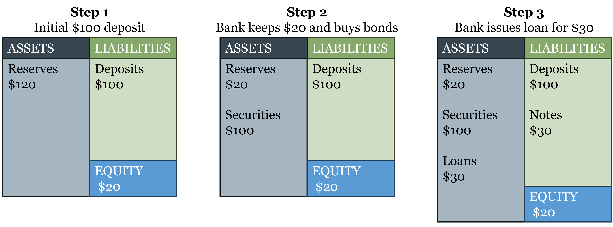
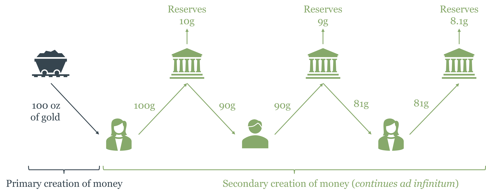
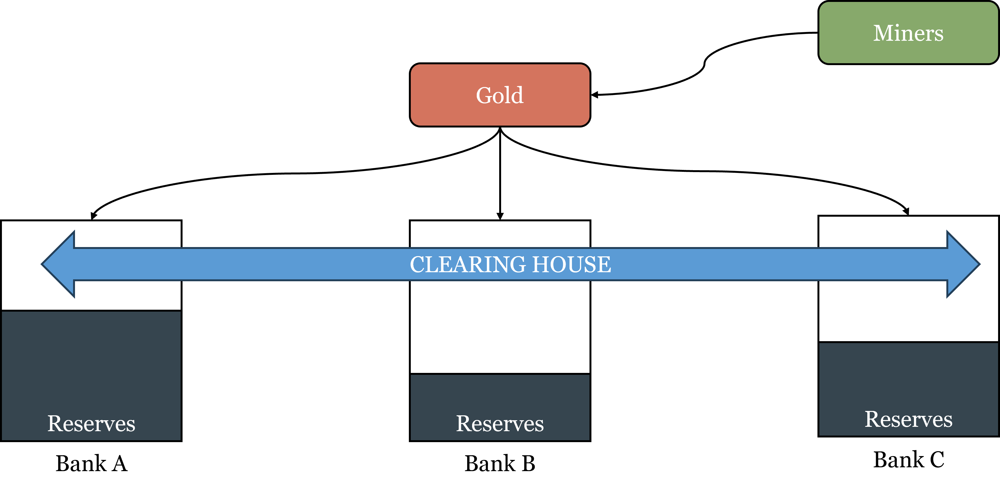
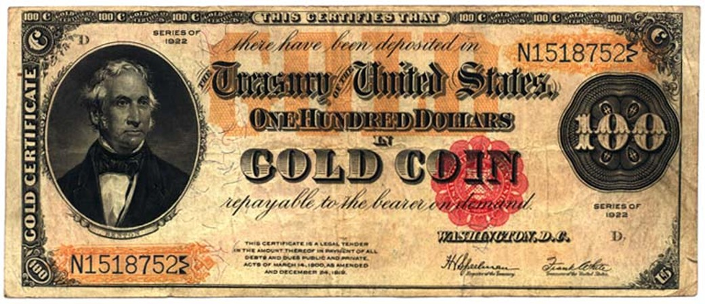
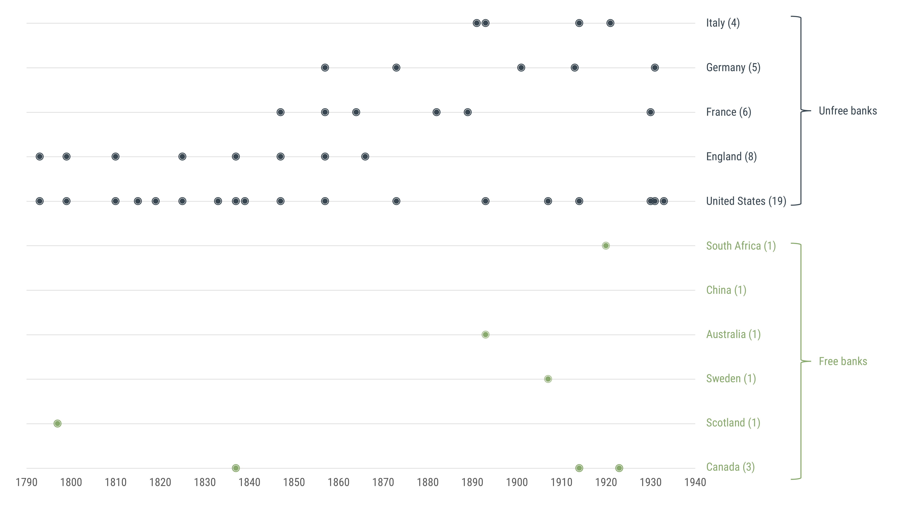

# How Banking Developed Before Central Banks {#sec-ch02}

::: {.callout-note}
## Learning Objectives

By the end of this chapter, you will be able to:

- Explain the properties that make a commodity suitable as money, and why precious metals came to dominate
- Distinguish between inside money and outside money, and explain why the distinction matters
- Define seigniorage, explain how competitive minting disciplines it, and describe how debasement works
- Explain how free banking works in theory, including the role of the adverse clearing mechanism as a market discipline device
- Distinguish free banking from currency competition and other free-market monetary arrangements
- Describe how the classical gold standard operated, and explain why it was a system of gold *substitutes* — not a fixed exchange rate system
- Evaluate the Scottish and Canadian free banking experiences and explain what each reveals about the stability of competitive banking
- Explain why the Australian crisis of 1890 reflected regulatory failure rather than an inherent instability of free banking
- Explain why the United States so-called "free banking era" was not genuine free banking, and identify the two structural flaws — branching restrictions and the Treasury bond reserve requirement — that made the system fragile
- Describe how the Bretton Woods system worked, explain the Triffin dilemma, and trace how the system's collapse set the stage for the modern debate between fixed and flexible exchange rates
:::

## Commodity Money

Chapter 1 traced the broad arc of monetary history in six stages, from commodity money through free banking, the gold standard, Bretton Woods, fiat money, and the present digital era. This chapter zooms in on the first three stages — the ones that unfolded before central banks existed — and asks a more precise question: how did banking actually work when there was no lender of last resort, no deposit insurance, and no monetary authority to bail out a failing bank? The answer is more interesting, and more reassuring, than most people expect.

::: {#fig-history-of-money}

Six stages in the history of money. The first five are well-established; the sixth is unfolding now.
:::

### What Makes a Good Commodity Money?

In a world of commodity money, not just anything can become money. The market selects — through the spontaneous process described by [Carl Menger](https://en.wikipedia.org/wiki/Carl_Menger) — those commodities that are best suited to serve as a generally accepted medium of exchange. Suitability comes down to four physical properties:

**Durability.** Money must survive repeated handling and the passage of time. Salt works well in dry climates but dissolves in rain. Iron rusts. Gold and silver do neither — a gold coin minted two thousand years ago is physically indistinguishable from one minted last year. Durability is what makes a commodity a reliable store of value, which in turn makes people willing to accept it in exchange even when they don't plan to spend it immediately.

**Divisibility.** Transactions occur at wildly different scales — a loaf of bread, a horse, a ship's cargo. Money must be divisible into units that match these different values without losing its substance. Gold and silver can be melted, alloyed, and struck into coins of any denomination, then melted again if needed. A cow cannot be divided and remain a cow.

**Portability.** High value in small volume and weight makes money easy to carry and transport. A merchant crossing a continent wants to carry his capital with him; he cannot do that with grain or timber. Gold's high value density — an ounce worth more than most goods — made it the ideal traveling companion of long-distance trade.

**Scarcity.** Money must be scarce enough that it cannot be created at will, but not so rare that there isn't enough of it to facilitate trade. Precious metals strike this balance: mining and refining gold requires real effort and resources, which puts a natural cost floor on its production. Anyone can pick up a stone; no one finds gold that easily.

::: {.callout-tip}
## Intuition Builder: Why Not Diamonds?

Diamonds are durable, scarce, and portable — but they fail on divisibility. You cannot cut a diamond in half and retain two half-diamonds; you get fragments worth far less than the original. This is why diamonds, despite their high value per unit weight, never became money. The physical chemistry of a commodity constrains its monetary destiny.
:::

These four properties explain why gold and silver emerged as money independently across civilizations that had no contact with each other — ancient China, Mesopotamia, Greece, Rome, pre-Columbian Mesoamerica. It was not coordination or convention that selected gold; it was market selection operating on physical reality.

### A Classification of Money: Inside and Outside

Before we can understand banking, we need to draw a distinction that will be essential throughout this chapter and the next. In a commodity money system — say, one where gold is money — there are two types of monetary assets:

**Outside money** is the base commodity itself: gold coins in your pocket, gold bars in a vault. "Outside" refers to the fact that this money is not a liability of anyone in the banking system. If you hold a gold coin, no bank owes you anything — the coin is the thing itself. The supply of outside **commodity** money is constrained by nature: it requires mining, refining, and minting.

**Inside money** consists of financial claims on outside money — specifically, banknotes and deposits that are redeemable for gold on demand. "Inside" refers to the fact that these assets are simultaneously a liability of the bank (it owes you gold on demand) and an asset of the holder (you have a claim on gold). Inside money is created by the banking system through the process we saw in Chapter 1: a bank takes in gold deposits and issues notes backed by those deposits, keeping only a fraction in reserve.

::: {.callout-note}
## Key Definition: Inside vs. Outside Money

**Outside money** is a monetary asset that is not a liability of anyone in the private economy — commodity money (gold, silver) is the classic example. **Inside money** is a monetary asset that is simultaneously a liability of its issuer — banknotes, checking deposits, and money market instruments are all inside money. The total money supply in an economy is the sum of both.
:::

The distinction matters for several reasons. First, outside money's supply is constrained by real costs in a world with commodity money — mining gold is expensive — which limits how much can be created. Inside money's supply is constrained by the reserve ratio banks choose to hold and by the market's willingness to accept their notes. Second, inside money can be created much more cheaply than outside money, which is why banking systems develop: it is profitable to substitute cheap paper for expensive gold as long as people trust the promise of convertibility.

A key question — one that occupied economists and policymakers through the entire 19th century — is whether the creation of inside money can be left to competitive markets, or whether it requires regulation and central authority. The rest of this chapter examines the historical evidence.

### Seigniorage, Debasement, and the Temptation of Monopoly

Understanding how mints make money is the first step toward understanding why governments eventually took control of them — and why that matters for monetary stability.

When a private mint produces coins, it performs a genuine service: it takes raw gold of uncertain weight and purity, verifies and refines it, and stamps it into certified coins of standardized weight and fineness. For this service it charges a fee called the **brassage**, which covers its operating costs. It may also earn **[seigniorage](https://en.wikipedia.org/wiki/Seigniorage)** — a profit above and beyond costs. The formal accounting is:

$$M = PQ + C + S$$

where $M$ is the nominal value of the coins produced, $P$ is the price paid per ounce of gold to the client, $Q$ is the number of ounces processed, $C$ is the brassage (operating cost), and $S$ is seigniorage. In a competitive market, the entry of rival mints bids $S$ toward zero — no mint can charge more than its costs without losing clients to a competitor offering better terms. The mint's product is valuable, but the value flows entirely to the client.

This raises an obvious question: if competitive minting drives profits to zero, why did governments so persistently seek to control minting? Two reasons. First, a **monopoly** on minting transforms the situation entirely. Once a royal mint holds the exclusive right to coin money and legal tender laws compel acceptance of its coins, the competitive pressure disappears. The mint can now pay clients less for their gold than its market value — holding $P$ below the competitive level — and pocket the difference as seigniorage. Monopoly converts a zero-profit service into a revenue source.

Second, there was a **reputational and political dimension**. Coins stamped with the sovereign's image, weight guarantees, and official insignia served as a form of royal advertising — money was a daily reminder of state authority and a signal that the government stood behind the currency's value. This association between the state and the quality of money had genuine economic value: a coin bearing the king's mark was harder to counterfeit and easier to trust than an anonymous lump of metal, and it reduced the information costs of commerce. Governments leveraged this reputational function to justify — and then exploit — their monetary monopoly.

It is worth noting that the profitability of creating money differs fundamentally between outside and inside money. A mint producing gold coins incurs real resource costs — the gold itself, plus minting expenses. The profit margin, even under monopoly, is limited by the cost of the underlying commodity. A bank issuing paper banknotes incurs almost no material cost — paper is cheap. The profit comes from the spread between the interest earned on assets (loans backed by depositors' gold) and the interest paid to depositors. This difference in cost structure explains why inside money creation became far more lucrative than outside money creation, and why the incentive to control the banking system — not just the mint — grew alongside the development of banking.

**[Debasement](https://en.wikipedia.org/wiki/Debasement)** is categorically different from seigniorage, and it is important to be precise: debasement is fraud, not merely a more aggressive form of profit extraction. With ordinary seigniorage, a client delivers 100 units of gold and receives back 100 units of gold in coin form, minus a minting fee. The coin contains what it claims to contain. With debasement, the mint secretly mixes cheaper metals — copper, tin — into the coin, so that a coin stamped "100 gold units" actually contains, say, 80 units of gold. The client and anyone who accepts the coin in trade is deceived.

The historical record is telling here. Competitive private mints guarded their reputations ferociously — a mint known to debase its coins would quickly lose business to rivals offering honest coinage. And detection was not difficult for those paying attention. Experienced merchants and money changers developed practical tests: a coin could be weighed on a balance against a known pure coin of the same denomination — any shortfall in metal content would show up immediately as a lighter weight, which is the original image behind the [scales of justice](https://en.wikipedia.org/wiki/Scales_of_justice). More informally, people would bite a coin — pure gold is soft enough to leave a slight dent from a tooth, while coins alloyed with harder base metals would resist. These simple techniques meant that debasement in a competitive market was quickly exposed and punished through reputation.

Debasement was not a market failure; it was a government failure, enabled precisely by the monopoly on issuance that made reputation irrelevant. When you are the only legal source of coins and you can compel their acceptance at face value, you can debase without losing business — because your customers have nowhere else to go. The Roman empire's silver denarius, which fell from nearly pure silver in the 1st century AD to less than 5% silver by the 3rd century, is the most famous example — enabled by imperial monopoly and sustained by legal compulsion.

For debasement to be profitable, the government must compel acceptance of debased coins at their face value — otherwise, rational merchants would simply refuse them or discount them. This is exactly what [Gresham's Law](https://en.wikipedia.org/wiki/Gresham%27s_law) describes — though it is important to state it precisely. Gresham's Law does not operate between two different currencies with a fixed exchange rate; it operates between a pure coin and a debased coin that are both denominated in the same unit of account and legally required to be accepted at the same face value. When a king decrees that a full-gold solidus and a debased solidus (containing, say, half as much gold) must both be accepted as "one solidus" in trade, people rationally hoard the full-gold coin and spend the debased one. The pure money disappears from circulation — not because it is less useful as money, but because spending it means giving up more real gold than spending the debased version. "Bad money drives out good" precisely because legal compulsion prevents the market from pricing the two coins differently. Remove the compulsion, and merchants simply discount the debased coin to its true metal value — Gresham's Law ceases to operate and the market corrects itself.

This dynamic repeats itself under fiat money. The transition from gold coins to central bank notes to digital reserves changes the technology but not the underlying incentive: whoever holds the monopoly on money creation faces a persistent temptation to exploit it. Understanding this temptation — and the institutional arrangements that constrain or fail to constrain it — is one of the central threads of this course.

::: {.callout-important}
## Key Takeaway: Monopoly Is the Key Variable

Competitive minting drives seigniorage to zero and makes debasement self-defeating — the fraudulent mint loses clients to honest competitors. Both sustained seigniorage and debasement require monopoly to survive. The lesson applies directly to central banking: a central bank monopoly on base money creation creates the same temptation that royal mints exploited for centuries — with the difference that modern money creation is far cheaper, faster, and larger in scale.
:::

## Free Banking in Theory

### What Free Banking Is — and Is Not

**[Free banking](https://en.wikipedia.org/wiki/Free_banking)** is a specific institutional arrangement: a banking system with no special regulations beyond those that apply to other commercial enterprises — no central bank, no legal restrictions on note issuance, no government-mandated reserve ratios, and freedom of entry and exit. It is, in short, a free market applied to money and banking.

The standard free banking model has a precise structure. Gold functions as outside money and as the ultimate settlement medium. $n$ banks compete by issuing convertible banknotes — paper promises redeemable for gold on demand. All $n$ banks share the same unit of account (gold), but each bank issues its own notes. Depositors hold gold in bank accounts (inside money) rather than as coin, using banknotes for trade because of their convenience and because a bank may pay interest on deposits. The whole system rests on the credibility of the convertibility promise.

### The Balance Sheet of a Commercial Bank

Before we can understand how banks multiply the money supply, we need to understand how a bank's balance sheet is structured — and how it differs from the central bank balance sheet we will encounter in Chapter 3. The figure below shows three stages in the life of a simple commercial bank, each illustrating a different step in the process of financial intermediation.

::: {#fig-bank-balance-sheet}

Three stages of a commercial bank's balance sheet. Left: the bank has just received deposits and holds them entirely as reserves. Centre: the bank has deployed its excess reserves into securities. Right: the mature free banking balance sheet — the bank holds reserves, securities, and loans, and has issued both deposits and banknotes as liabilities.
:::

**Panel 1: The bank just opened.** A gold miner deposits \$100 in gold. The bank holds \$120 in reserves on the asset side (the \$100 deposit plus \$20 in equity capital contributed by shareholders), and owes \$100 in deposits and has \$20 in equity on the liability side. At this stage the bank is entirely liquid — every dollar of deposits is backed by a dollar of reserves — but it is also entirely unproductive. It is not lending, not investing, and not earning any return on its assets. If it stayed this way, it could not pay interest to depositors or cover its operating costs. The only reason to hold 100% reserves is if the bank has not yet deployed its capital, or if it is legally required to do so — which is why 100% reserve requirements, sometimes proposed as a reform, would effectively end banking as a profit-making activity.

**Panel 2: The bank deploys its excess reserves.** The bank uses \$100 of its reserves to purchase securities — government bonds or other interest-bearing assets. Now the asset side shows \$20 in reserves and \$100 in securities; the liability side is unchanged at \$100 in deposits and \$20 in equity. The bank has moved from 100% reserves to a 20% reserve ratio. It is now earning a return on its assets, but it has also taken on liquidity risk: if all depositors demanded their money simultaneously, the bank could not pay them without selling its securities first. This is the fundamental trade-off of banking — higher returns require accepting some illiquidity.

**Panel 3: The mature free banking balance sheet.** The bank has now also made loans (\$30) and issued banknotes (\$30) in addition to taking deposits (\$100). The asset side shows reserves (\$20), securities (\$100), and loans (\$30); the liability side shows deposits (\$100), notes (\$30), and equity (\$20). Total assets equal total liabilities plus equity: \$150 = \$150. Several features of this panel are worth noting.

First, the bank has two types of liabilities: **deposits** and **banknotes**. Deposits are claims that depositors can redeem on demand by presenting themselves at the bank. Notes are claims that circulate in the economy as a medium of exchange and can be presented for redemption by anyone who holds them. Both are obligations of the bank; both are backed by the same asset pool; but they differ in *who holds them* and *how they circulate*. This distinction between deposit money and note money is central to understanding how free banking worked and how payment systems evolved.

Second, the **reserve ratio** is now 20/150 ≈ 13% — the bank holds \$20 in reserves against \$150 in total liabilities. Notice that reserves must cover *both* deposit redemptions and note redemptions, not just deposits. A bank that issues notes but ignores them when calculating its reserve adequacy is exposed to exactly the kind of run that the adverse clearing mechanism is designed to generate.

Third, **equity** acts as a buffer between asset losses and depositor/noteholder losses. If the bank's loans go bad and asset values fall by \$10, equity absorbs the loss first — depositors and noteholders are only exposed if losses exceed the equity cushion. This is why equity capital requirements and the double-liability rules of the Canadian free banking system (discussed below) were meaningful protections: they gave the bank's owners strong skin in the game.

::: {.callout-note}
## Key Definition: The Bank Balance Sheet Identity

For any bank: **Assets ≡ Liabilities + Equity**. Assets are what the bank owns (reserves, securities, loans). Liabilities are what the bank owes to outside claimants (deposits, notes). Equity is the residual claim of shareholders — what would be left for owners after all outside obligations are met. The identity always holds; it is not a theory but an accounting definition. When a bank makes a loan, both sides of the balance sheet expand simultaneously: a new loan appears on the asset side and a new deposit (credited to the borrower) appears on the liability side.
:::

This balance sheet structure — particularly the combination of short-term liabilities (deposits and notes, redeemable on demand) against longer-term assets (securities and loans, which take time to liquidate) — is the source of the fundamental fragility that all banking systems must manage. Chapter 3 returns to this when examining why the central bank's balance sheet is structured so differently, and what the central bank can do in a crisis that a private bank cannot.

### Fractional Reserve Banking and the Money Multiplier

Under free banking, banks hold only a fraction of their gold deposits as reserves — the rest is lent out. This **fractional reserve banking** is not fraud or sleight of hand; it is a profitable arrangement that benefits depositors (they earn interest or receive free services), borrowers (they access credit), and the broader economy (idle gold is put to productive use).

The mechanics of money creation work as follows. Suppose a gold miner deposits 100 grams of gold at Bank A. Bank A keeps 10g as reserves and lends out 90g. The borrower deposits the 90g loan at Bank B. Bank B keeps 9g as reserves and lends out 81g.

::: {#fig-money_multiplier}

The money multiplier process is a sequence of deposits and loans through the banking system. Even if this is an endless process, total money supply converges to a finite number.
:::

That 81g lands at Bank C, which keeps 8.1g and lends out 72.9g, and so on. The total deposits created from the original 100g converge to:

$$D = \frac{100}{0.10} = 1000 \text{ grams}$$

assuming a 10% reserve ratio. The original 100g of gold base money has supported 1,000g of deposits — a tenfold multiplication. The lower the reserve ratio, the higher the multiplier. With a 5% reserve ratio, the multiplier would be 20; with a 20% reserve ratio, it would be 5. In every case, total money supply is a finite number determined by the reserve ratio and the initial gold base — banks cannot create money out of thin air; they can only create it through the process of accepting deposits and making loans, which is constrained by their reserve holdings.

::: {#fig-money_supply_convergence}

The reserve ratio defines the level of secondary money creation, which is constrained by the amount of outside money deposits.
:::

More generally, with a reserve ratio $\rho$, a currency leakage ratio $\lambda$ (the fraction of money the public holds as gold coin rather than bank deposits), and an excess reserve ratio $\rho_E$, the money multiplier is:

$$m = \frac{\lambda + 1}{\lambda + \rho + \rho_E}$$

and total money supply is $M = G \cdot m$, where $G$ is the gold stock. Notice that the multiplier rises when $\lambda$ falls (people prefer deposits to coin), when $\rho$ falls (banks keep smaller required reserves), and when $\rho_E$ falls (banks hold less excess caution). In a free banking system, all three of these are endogenous — determined by market forces rather than regulatory decree.

### The Adverse Clearing Mechanism: Market Discipline in Action

The crucial theoretical question for free banking is: what stops a bank from issuing too many notes? What prevents a bank from printing notes far in excess of its gold reserves and spending them into existence?

The answer is the **adverse clearing mechanism** — the self-correcting discipline that operates through the interbank settlement system. The intuition is simple: a bank cannot issue more notes than its gold reserves support for the same reason an individual cannot write more checks than their deposit balance. You can try, but the moment those checks hit your bank for settlement, you will find yourself unable to cover them — and the same is true for a bank issuing notes it cannot redeem.

Here is how the mechanism works in practice. Suppose Bank A issues more notes than market demand warrants. Its customers receive extra notes and spend them. Those notes are received by other people who deposit them at Bank B, Bank C, and so on. When those banks accumulate Bank A's notes, they present them for redemption at the regular clearing — the periodic settlement between banks where outstanding claims are netted and settled in gold. Bank A must pay out gold to redeem its excess notes. Its gold reserves fall. If it continues over-issuing, it will eventually exhaust its gold reserves and be unable to honor redemption requests — forcing bankruptcy.

The mechanism creates a powerful, automatic incentive against over-issuance. Bank A cannot quietly inflate the money supply; its excess notes flow back through the clearing system and drain its reserves. The faster the clearing cycle, the faster the discipline operates. In mature free banking systems, daily clearing became common, providing nearly real-time feedback on a bank's reserve position.

There is also a more subtle case: **concerted over-expansion**, where all banks expand simultaneously. In this scenario, the notes issued by each bank are deposited at other banks in roughly the same proportions as before — no single bank accumulates a disproportionate claim on another. Average gold reserves remain stable. But the *volatility* of reserve positions increases, because the system as a whole is now operating with thinner gold backing. Each bank individually faces a greater risk of running short on any given day. It is in each bank's own interest to constrain reserve-volatility risk by keeping expansion in check — just as an individual keeps a buffer in their checking account not because any rule requires it, but because running short of funds at the wrong moment is costly.

### The Clearing House

In practice, free banking systems developed a coordination institution: the **clearing house**. A clearing house is an association of banks that agree to net their mutual claims on a regular basis. At the end of each day, Bank A's claims on Bank B, Bank B's claims on Bank C, and so on, are all totaled and offset, with only the net balance settled in gold. This dramatically reduces the gold movement required to settle transactions, making the system more efficient.

::: {#fig-free_banking_clearing}

The adverse clearing mechanism. When Bank A over-issues notes, they circulate through the economy and are deposited at other banks. Those banks present them for redemption at the clearing house, draining Bank A's reserves. Bank A must contract its issuance or face insolvency.
:::

::: {.callout-tip}
## Intuition Builder: Clearing as Netting

Imagine three friends who owe each other money: Alice owes Bob \$10, Bob owes Carol \$10, Carol owes Alice \$10. Without clearing, all three payments must be made — \$30 of money moves. With clearing, all debts cancel: net settlement is zero, and no money needs to move at all. Bank clearing houses apply this logic at scale, typically reducing gold movements by 90% or more compared to gross settlement.
:::

Beyond efficiency, clearing houses performed a second function: they served as a quality-control mechanism. Membership in a clearing house was a signal of creditworthiness — if you belonged, other banks were willing to accept your notes and settle claims against you. Banks outside the clearing house found their notes accepted at a discount or not at all, giving non-members a strong incentive to maintain sound balance sheets in order to gain and keep membership. The clearing house thus acted as a private, market-based regulator — without regulatory authority, without the power to print money, and without moral hazard.

### Currency Competition: A Different Free-Market Arrangement

Free banking is sometimes confused with **currency competition** — the proposal associated with [Friedrich Hayek](https://en.wikipedia.org/wiki/Friedrich_Hayek) that governments should allow private issuers to compete with each other and with the state in providing money denominated in their own units of account. The two are distinct, and the distinction matters.

In free banking, all banks share a common monetary standard — typically gold — and compete on the quality and reputation of their note issuance, not on the definition of the unit of account itself. There is one money (gold); there are many issuers. In Hayek's currency competition proposal, each issuer defines its own unit of account. There would be not just many issuers, but many *monies*, each competing for adoption. Importantly, issuance in Hayek's model would be entirely private and not tied to any political or geographic boundary.

Today's international monetary system is sometimes described as a form of currency competition — the US dollar, euro, yen, and other national currencies compete for use in international trade and reserve holdings. But it differs from Hayek's model in two important respects: issuance is by governments rather than private firms, and each currency is tied to a national jurisdiction. The dollar is the dollar because the US government issues it and accepts it for taxes; Hayek envisioned currencies issued by private firms, competing purely on the quality of their monetary management, with no geographic or legal anchor.

Understanding this spectrum — from commodity-backed free banking to Hayek's denationalized money to today's competing national fiat currencies — helps clarify what is genuinely novel about each monetary arrangement and what the relevant institutional constraints are in each case.

This framework also provides a way to think about cryptocurrencies more rigorously. As we discussed in Chapter 1, Bitcoin and its successors are not currently money in the economic sense — they are not generally accepted as means of payment and not used as units of account. But if they were to achieve broader monetary adoption, the resulting system would resemble currency competition more than free banking. Under free banking, all issuers share a common standard (gold); competing cryptocurrencies each define their own unit of account. A world in which Bitcoin, Ethereum, and other tokens competed for monetary adoption as distinct units — with no common commodity backing — would be structurally closer to what Hayek envisioned than to the Scottish free banking model. Hayek himself would likely have welcomed the experiment, while noting that the absence of a common standard makes coordination more difficult and price comparisons across currencies more costly. Whether cryptocurrency competition can overcome these obstacles remains an open empirical question.

## The Classic Gold Standard

### Gold as a Common Standard

By the mid-19th century, most major economies had converged on the gold standard, and a common misconception needs to be addressed directly before going further. Students often describe the gold standard as a "global fixed exchange rate system." This is inaccurate, and precision here is important to fully understand how this monetary regime works.

Under the classical gold standard, every major currency was convertible to a fixed weight of gold. A US dollar was convertible to 23.22 grains of pure gold. A British pound was convertible to 113.0 grains. These were not exchange rates — they were *definitions*. The pound and the dollar were not two different monies exchanging at a fixed ratio; they were two names for fixed weights of the same money: gold. Central bank notes issued under the gold standard were not promises to pay a certain amount of another currency; they were promises to pay a certain amount of gold, similar to how a bank check works today. There is no "exchange rate" between a Wells Fargo check and a Citibank check if both are denominated in dollars; both are claims on the same dollar standard. Similarly, there was no exchange rate between a Bank of England note and a Federal Reserve note under the gold standard — both were claims on gold at fixed weights. The "conversion" between them was arithmetic, like converting miles to kilometers, not an exchange between distinct monetary units.

This matters because it changes how we think about the gold standard's properties. What the gold standard provided was:

1. **A common international unit of account.** All participating economies priced goods in gold, meaning prices were directly comparable across borders without any currency conversion.

2. **A constraint on domestic money creation.** A country could not issue more notes than its gold reserves could back, because anyone could demand redemption. Governments that tried to over-issue would see gold drain out through the balance of payments as imports rose and exports fell — the [price-specie flow mechanism](https://en.wikipedia.org/wiki/Price–specie_flow_mechanism) described by [David Hume](https://en.wikipedia.org/wiki/David_Hume) in 1752. Under the gold standard, central banks were not free to print money at will; they were constrained by their gold stocks and the market's willingness to hold their notes — similar to how a free banking system is constrained by the adverse clearing mechanism, but operating at a slower speed and with more aggregated discipline.

3. **Long-run price stability.** With money supply constrained by gold stocks, the price level was anchored over long periods. Prices in Britain in 1913 were roughly what they had been in 1815 — a century of roughly stable prices, punctuated by short-run fluctuations. To put this in perspective: the most dramatic inflationary episode under commodity money was the [Price Revolution](https://en.wikipedia.org/wiki/Price_revolution) of the 16th and 17th centuries, when large flows of silver and gold from the Americas expanded the European money supply and raised the price level roughly sixfold over 150 years — equivalent to about 1.2% annually. Even this most significant monetary shock under commodity money produced an inflation rate lower than what modern central banks typically target.

### Strengths and Vulnerabilities

The gold standard's strengths were genuine: price stability, fiscal discipline, and the facilitation of international trade through a common standard. Its vulnerabilities were equally genuine, though they are sometimes overstated.

The most commonly cited concern is **inflexibility** — the claim that the gold standard left banks without a lender of last resort in a crisis. But this deserves careful framing. If banks faced a sudden demand for gold — a liquidity shock — they could borrow from each other, from foreign correspondent banks, and from international financial markets. The world financial system itself functioned as a source of short-term liquidity, and in practice this mechanism worked. The Ayr Bank episode, discussed below, illustrates it: when the Ayr Bank overextended and faced redemption pressure, the surviving Scottish banks provided market-based protection to depositors, without any government or central bank involvement. What the gold standard genuinely could not accommodate was *insolvency* — a bank whose assets were worth less than its liabilities — and the extraordinary fiscal needs of governments at war. These are real limitations, but they are different from the claim that ordinary liquidity shocks went unaddressed. The distinction between liquidity and insolvency is central to understanding central banking and will be a major theme in the chapter on bank runs.

A second claimed vulnerability was the **deflationary adjustment mechanism**. The price-specie flow works as follows: a country whose central bank is over-issuing notes sees rising prices, which makes its exports more expensive and its imports cheaper, leading to a trade deficit and gold outflows. As gold leaves, the money supply contracts and prices fall — automatically correcting the over-issuance before it becomes a sustained inflation. Critics argue that this correction requires falling prices and wages, generating unemployment during the adjustment. But this framing confuses cause and effect. Under the gold standard, deflation was typically the *result of productivity growth and expanding output* — more goods being produced against a slowly growing gold money supply — what economists call *good deflation*, associated with rising living standards, not recession. The deflationary downturns that haunted the gold standard era were concentrated in countries and periods where governments had previously over-issued and then faced forced contraction — problems created by departing from the standard's discipline, not by the standard itself. It is telling that the severe deflationary recessions of the 20th century — the Great Depression above all — occurred precisely as central banks were abandoning or mismanaging gold convertibility. Under genuinely competitive free banking on a gold standard, there is no reason to expect that the disciplinary mechanism would be systematically recessionary, any more than a household budget constraint that prevents overspending causes poverty.

Third — and this is more accurately a **shortcoming of governments than of the gold standard itself** — the system depended on the credible commitment to convertibility. Free banking regimes operated on the gold standard without any central bank, and there was no question of the system abandoning convertibility for fiscal reasons, because private banks have no armies to fund. The credibility problem arose specifically when *states* became the issuers of base money. The gold standard's repeated suspensions were always government decisions driven by fiscal necessity, not intrinsic flaws in the gold standard mechanism.

If the gold standard was genuinely good, why did it go away? The answer is World War I. Every major belligerent suspended convertibility to finance unprecedented military spending that no gold reserve could back. When the war ended, attempts to restore the gold standard in the 1920s were poorly managed — countries returned to prewar parities at exchange rates that did not reflect wartime inflation, generating deflationary pressure that deepened the Great Depression. The gold standard did not fail on its own terms; it was suspended by governments facing exceptional fiscal pressure, then restored badly, and finally abandoned. As we saw in Chapter 1, Bretton Woods tried to preserve some of its discipline while addressing its inflexibility, and failed; the fully fiat era began in 1971.

::: {#fig-convertible_dollar}

A US dollar note convertible to gold. Under the gold standard, all major currencies were convertible to fixed weights of gold, making them effectively different names for the same money.
:::

## Free Banking in Practice

Theory tells us that free banking should be self-regulating through the adverse clearing mechanism. History lets us check whether theory was right. Three cases are particularly informative: Scotland, Canada, and Australia. A fourth — the United States — is equally instructive, but for the opposite reason: the US case shows what happens when a system is *called* free banking but is not.

### Scotland (1716–1844): The Benchmark Case

The Scottish free banking era is the most studied case in the literature, and for good reason: it is remarkably close to the theoretical model, and its performance was remarkably good.

The story begins with the **[Bank of Scotland](https://en.wikipedia.org/wiki/Bank_of_Scotland)**, chartered in 1695 with a 21-year monopoly on note issuance. One stipulation distinguished it from the Bank of England: the Bank of Scotland was explicitly forbidden from extending loans to the government. This constraint — which the Bank of England did not share — prevented the Bank of Scotland from becoming a fiscal instrument and kept it oriented toward commercial banking. When the monopoly expired in 1716, banking was opened to competition.

By 1727, a rival had emerged: the **[Royal Bank of Scotland](https://en.wikipedia.org/wiki/Royal_Bank_of_Scotland)** (RBoS), founded largely to challenge the Bank of Scotland's dominance. The competition between the two was fierce and, at times, not particularly gentlemanly — both banks accumulated each other's notes and demanded mass redemption to drain the rival's reserves, a practice that today would be called a predatory clearing run. The competition ultimately stabilized, and the two banks coexisted as anchors of a growing system.

An important institutional innovation emerged from this competitive period: the **option clause**. Some Scottish banknotes included a clause allowing the bank to defer gold redemption for six months, paying interest during the delay. This was a market solution to the liquidity problem — rather than defaulting outright when reserves ran temporarily short, a bank could defer redemption at a cost. The principle survives in modern banking: banks today retain the legal right to require advance notice before honoring unusually large withdrawals, precisely so they can arrange the necessary liquidity without disruption. From 1762, the option clause in Scotland was forbidden by regulation, adding a cost to note issuance and, importantly, raising barriers to entry for smaller banks. The prohibition is one of the earliest examples of regulation that, however well-intentioned, limited competition under the guise of protecting depositors.

Between 1740 and the 1790s, the number of Scottish banks expanded rapidly, branches proliferated, and Scotland developed what may have been the world's most sophisticated banking system relative to its economy. By 1845 — the year the Scottish Banking Act effectively ended competitive note issuance — Scotland had 19 note-issuing banks and 363 branches, more branches per capita than England or the United States.

#### The Ayr Bank Episode

The most important test case for the adverse clearing mechanism came in 1769, when the **[Ayr Bank](https://en.wikipedia.org/wiki/Douglas,_Heron_%26_Company)** (formally, Douglas, Heron & Co.) entered the market and began aggressively over-issuing notes. The Ayr Bank expanded its circulation far beyond what market demand warranted, essentially acting as a unilateral money-printer in a system designed to discipline exactly that behavior.

The clearing mechanism worked precisely as theory predicted. Ayr Bank notes accumulated at other banks, which presented them for redemption. The Ayr Bank was forced to borrow heavily from London banks to meet redemption demands. By 1772 — just three years into its operations — the Ayr Bank was insolvent, and it formally collapsed in 1782. The failure dragged down 13 smaller banks that had extended loans to the Ayr Bank or its connected firms. It is important to be precise here: these were not innocent bystanders caught in an indiscriminate collapse. They had made the decision to extend resources to a bank that the adverse clearing mechanism was already revealing to be troubled. Banks that misallocated their resources by lending to a visibly insolvent institution bore the consequences — which is exactly how market discipline is supposed to work, and which may well have removed fragile institutions before they became larger problems.

What happened next is equally important. The day after the Ayr Bank's failure, the Bank of Scotland and the Royal Bank of Scotland jointly announced that they would continue to honor Ayr Bank notes — effectively guaranteeing that depositors would be made whole. This was not a government bailout. It was a market response: the surviving banks recognized that widespread depositor losses would damage confidence in the entire system, and they had an economic incentive to protect their own reputations and the public's trust in Scottish banking more broadly.

::: {.callout-important}
## Key Takeaway: The Ayr Bank and Market Discipline

The Ayr Bank episode is a clean illustration of adverse clearing working as theory predicts. The over-issuing bank was identified, disciplined through reserve losses, and failed. The banks that collapsed alongside it had chosen to lend to a visibly failing institution — their exit was the market's correction of that misjudgment. The spontaneous protection of depositors by surviving banks demonstrates that private institutions can provide depositor protection driven entirely by reputational incentives, without government insurance or a central bank.
:::

The Scottish experience ended not with a crisis but with a political decision. The [Peel Banking Act of 1844](https://en.wikipedia.org/wiki/Bank_Charter_Act_1844) gave the Bank of England a monopoly on note issuance in England, and the Scottish Banking Act of 1845 followed, freezing the note-issuing capacity of Scottish banks at their existing levels. Scotland's free banking era thus ended by legislative fiat, not by market failure. Remarkably, the tradition it established has never fully disappeared: the Bank of Scotland, the Royal Bank of Scotland, and Clydesdale Bank still issue their own banknotes to this day — the only privately issued banknotes that remain in regular circulation in the United Kingdom. If you visit Scotland and receive a £20 note with a portrait other than the monarch, you are holding a direct descendant of the competitive note-issuance system that functioned for over a century without a central bank.

### Canada: Branching and Stability

[Canada's banking experience](https://en.wikipedia.org/wiki/Banking_in_Canada) in the 19th century offers a natural comparison with the United States — two neighboring economies, similar in culture and legal tradition, but with dramatically different banking structures and dramatically different outcomes.

Canadian banking was never fully unregulated, but it was far less constrained than American banking. The key features of the Canadian system were:

- **Nationwide branching.** Canadian banks could open branches anywhere in the country. This allowed them to diversify their loan portfolios geographically, smoothing out local economic shocks.
- **Competitive note issuance.** Multiple private banks issued their own notes, all convertible on demand, with no requirement to back them with government bonds.
- **Double liability.** Shareholders in Canadian banks were personally liable for losses up to double the par value of their shares, giving owners a strong incentive to monitor management prudently.

The result was a small number of large, geographically diversified banks with extensive branch networks. The Bank of Montreal, chartered in 1817, became the largest, but it competed vigorously with a dozen or so other major banks across the country. Competition kept fees low and drove the system toward efficiency; geographic diversification kept individual banks resilient to local shocks.

The historical record speaks clearly. Between 1790 and 1935, Canada experienced very few banking crises, and none of systemic proportions. The same period saw the United States suffer repeated, severe banking panics: 1819, 1837, 1857, 1873, 1893, 1907, and ultimately the catastrophic wave of bank failures between 1930 and 1933. The contrast attracted significant attention from policymakers, including during the post-2008 reform debates.

The most striking single data point in this comparison is the Great Depression. Between 1930 and 1933, roughly 9,000 American banks failed — more than a third of the entire US banking system — destroying deposits, wiping out savings, and deepening what was already the worst economic contraction in modern history. The Federal Reserve, established in 1913 specifically to prevent such crises, stood by and allowed the money supply to collapse by nearly a third. Canada, by contrast, did not suffer a single bank failure during the entire Great Depression, despite operating without a central bank for most of this period — the Bank of Canada was only established in 1935, after the worst had passed. The branching system that allowed Canadian banks to diversify geographically proved more robust than the Fed's network of fragile, geographically trapped unit banks. The episode is as clean a natural experiment as monetary history provides: same global shock, radically different institutional structures, radically different outcomes.

Canada did eventually adopt a central bank — the [Bank of Canada](https://en.wikipedia.org/wiki/Bank_of_Canada) was established in 1935 — but the motivation was not a history of free banking instability. It was international pressure to conform to the emerging global norm of central banking, and the political desire to have a domestic lender of last resort during a period of global financial distress.

### Australia (1835–1890): When Regulation Caused the Crisis

Australia presents the most complex case among the three, because it involves a genuine banking crisis — but one that, on careful examination, was caused by regulatory failure rather than free banking instability.

Australian banking began in 1835 with the establishment of the Bank of Australasia (BoA). By the 1850s, following the gold rushes in Victoria and New South Wales, the banking system had expanded rapidly. Between 1850 and 1880, competition was intense: profits were declining toward competitive levels, interest rates across banks were converging, and a clearing house was established in 1867. These are exactly the signs of a well-functioning competitive market.

The crisis came in 1890, and its origin was a real estate bubble in Melbourne. Banks — particularly newer, less established ones — had concentrated their lending in Melbourne real estate, taking advantage of regulatory loopholes. The 1840 British regulations had forbidden real estate loans, but the liability limits were set so high as to be non-binding, and banks could effectively extend real estate exposure by acquiring land and making related loans without technically breaking the rules.

When the Melbourne real estate bubble burst in 1890, banks with heavy property exposure failed. Then came the intervention that turned a containable crisis into a systemic one. The government established a network called the **Associated Banks** — a cartel of surviving banks pressured to extend discount loans to each other. Critically, entry to the network was poorly managed: the Federal Bank was admitted just three days before its own failure, immediately damaging the credibility of every bank in the network. The Commercial Bank, denied emergency loans by sound banks that recognized its insolvency, was allowed by the government to continue operating despite its prior liabilities — creating confusion about which obligations were real.

A six-day banking holiday was declared. The two most stable banks, the Bank of Australasia and the Union Bank, defied the Crown's mandate and kept their branches open. This was not defiance for defiance's sake. The banking holiday, however well-intentioned, prevented the market from doing the one thing it was best positioned to do: distinguish solvent banks from insolvent ones. When all banks are forced to close, depositors cannot tell which institutions are sound and which are not. The banks that stayed open were providing exactly that information — reassuring depositors that they had nothing to fear. The banks that honored the holiday lost credibility because their forced closure was indistinguishable from genuine insolvency, and many subsequently failed. The perverse outcome was not the result of market forces; it was the result of the government's intervention obscuring the very signals the market needed to stabilize itself.

The lesson from Australia is not that free banking is fragile. The free banking period itself, up to 1880, had been one of stability and competitive efficiency. The crisis of the 1890s was caused by regulatory loopholes enabling real estate concentration, amplified by a government crisis response that disrupted rather than restored market information. That said, the political consequences were durable regardless of the analytical verdict. The crisis severely damaged public confidence in private banking, whatever its actual cause. This paved the way for a progressive expansion of government oversight and the eventual establishment of the Reserve Bank of Australia in 1960. The pattern — regulatory failure producing a crisis, the crisis being attributed to markets, and the political response extending regulation further — is a recurring theme in monetary history.

### The United States (1837–1862): Not Really Free Banking

The United States banking era from 1837 to 1862 is typically labeled the "free banking era" in American history textbooks, and the label has stuck. It is misleading. The American system of this period was not free banking in the sense that Scotland and Canada exemplified; it was a regulated banking system with two structural flaws that virtually guaranteed instability.

**Flaw 1: Branching restrictions.** Under so-called free banking laws passed by individual states (starting with Michigan in 1837 and New York in 1838), banks were generally prohibited from opening branches outside their home locality. The motivation was partly political — small-town interests feared domination by large urban banks — and partly ideological, reflecting a Jacksonian suspicion of concentrated financial power. Whatever the motivation, the effect was to create a system of thousands of tiny, geographically concentrated banks, each exposed almost entirely to the local economy of a single town or county.

Geographic concentration is the enemy of portfolio diversification. A bank in a cotton-growing county in Mississippi was essentially a leveraged bet on cotton prices. A bank in a wheat-growing county in Illinois was a leveraged bet on wheat prices. When those commodity prices fell, loans went bad and banks failed — not because banking was inherently fragile, but because regulation had prevented the risk-sharing that branching would have allowed. In Canada, a bank could spread its loans across a continent. A Canadian banking crisis required a shock to the entire national economy. An American banking crisis could be triggered by a drought in a single region.

**Flaw 2: The Treasury bond reserve requirement.** The second flaw was the requirement in most state "free banking" laws that banks back their note issuance with holdings of state government bonds. The idea was to provide security for depositors: if a bank failed, its bond portfolio could be liquidated to repay noteholders. In practice, it created two serious problems.

First, it tied the money supply to the supply of government bonds rather than to the demand for money. In a well-functioning monetary system, money supply should respond to economic activity. With the Treasury bond requirement, money supply was linked to how many bonds state governments chose to issue, which was determined by fiscal politics, not monetary conditions. When state governments ran surpluses and retired bonds, the money supply contracted regardless of what economic conditions demanded.

Second, and more fatally, the money supply became exposed to the credit quality of state governments. In the early 1840s, several southern and western states defaulted on their bonds. Banks holding these bonds as their reserve asset found their capital wiped out. Between 1841 and 1842, virtually every bank that failed in the system held at least 95% of its portfolio in the defaulted bonds. The "security" backing noteholders' claims turned out to be worthless.

::: {.callout-warning}
## Common Mistake: Blaming the Wrong System

When students read about the instability of American "free banking" — the frequent bank failures, the worthless notes of failed "wildcat banks," the financial panics — they often conclude that free banking inherently produces instability. This is wrong. The American experience demonstrates what happens when a *regulated* system imposes structural flaws — branching prohibition and bond-backed reserves — that undermine the very mechanisms that make genuine free banking stable. The correct lesson is precisely the opposite of the usual one: the US banking crises were caused by regulation, not by its absence.
:::

The so-called free banking era ended in the United States with the National Banking Act of 1863, which created nationally chartered banks and a new system of nationally standardized banknotes backed by US Treasury bonds — extending, at the federal level, the same bond-backing requirement that had proven so destructive at the state level. Recurring banking panics continued through the National Banking era, most severely in 1893 and 1907, until the Federal Reserve Act of 1913 created a lender of last resort. The creation of the Fed was, in large part, a response to the structural fragility that regulation had built into the American banking system.

## What Can We Learn from Old Free Banking Episodes?

The historical record examined in this chapter supports conclusions that extend well beyond monetary history into how we think about financial stability, regulation, and monetary institutions today.

**Stability is endogenous, not exogenous.** The central finding is not that free banking produced no failures — it did. The finding is that the failure-resolution mechanism was *built into* the system's incentive structure rather than requiring external imposition. The adverse clearing mechanism, clearing house membership discipline, and competitive reputational incentives all operated without any regulatory authority. When the Ayr Bank collapsed, surviving Scottish banks voluntarily protected depositors — not because a law required it, but because it was in their interest. This matters deeply for the case for central banking: if banking is inherently unstable and requires external stabilization, the historical record from genuine free banking regimes does not support it.

**Regulation explains more crises than markets do.** Across all the episodes examined — Scotland, Canada, Australia, and the United States — the pattern is consistent. Where crises occurred under nominally free banking, regulation was the proximate cause: loopholes that enabled concentration (Australia), prohibition on branching that prevented diversification (US), and requirements to hold government bonds as reserves that exposed banks to sovereign default (US). Where free banking was genuinely competitive and unencumbered — Scotland and Canada — stability was the norm and crises were rare, contained, and self-correcting. The first question to ask when observing instability in a nominally free banking system is not "what did markets do wrong?" but "what regulations were actually present, and how did they distort behavior?"

**The gold standard constrained governments, not just banks.** The monetary constraint under commodity money was ultimately physical: you could not create gold. This imposed discipline on governments seeking to finance spending through money creation, and it anchored prices over the long run in a way that no fiat system has yet matched. The price paid was inflexibility when governments faced genuinely extraordinary fiscal needs — above all, the fiscal demands of total warfare. That constraint was not a design flaw in the gold standard; it was its most important feature. Governments abandoned it not because it failed, but because it worked.

**The evidence scales across countries and time.** The lessons from Scotland, Canada, Australia, and the US are not idiosyncratic to those cases.

::: {#fig-banking_crises}

Banking crises were more frequent and more severe under regulated banking regimes than under free banking regimes. The pattern holds across countries and time periods, suggesting the result is not specific to any particular historical episode.
:::

The figure above shows the frequency of banking crises across a wide range of countries and historical periods, classified by whether their banking regimes were more free or more regulated. The pattern is consistent: competitive banking regimes experienced fewer crises, and those crises were typically smaller and more self-contained. Free banking's self-regulatory mechanisms — adverse clearing, competitive note issuance, clearing house discipline — were not perfect, but the historical record shows they outperformed regulated alternatives by a wide margin. This is not a conclusion derived from ideology; it is what the cross-country data show when you look at the full record rather than focusing on individual episodes.

## From Gold to Dollars: The Bretton Woods Interlude

The Classical Gold Standard ended with World War I, and the attempts to restore it in the 1920s failed badly, contributing to the deflationary pressure that deepened the Great Depression. By 1944, with the war still ongoing but its end in sight, the Allied nations faced a fundamental problem: the world needed a new international monetary order, but the gold standard as it had existed was politically and practically impossible to restore. Governments had tasted the discretion that fiat money afforded, and the labor movements that had grown stronger during the interwar period had no appetite for a system that imposed deflationary adjustment on wages.

The solution negotiated at the [Bretton Woods](https://en.wikipedia.org/wiki/Bretton_Woods_system) conference in New Hampshire in July 1944 was a compromise: a modified gold standard, centered on the US dollar, designed to preserve some of the discipline of commodity money while giving governments enough flexibility to manage their domestic economies.

### How Bretton Woods Worked

The architecture was elegant in design and fatally flawed in execution.

The US dollar was pegged to gold at \$35 per troy ounce — the same rate that had prevailed since Roosevelt's Gold Reserve Act of 1934. All other participating currencies were pegged to the dollar at fixed exchange rates, with a narrow band of ±1% within which rates could fluctuate. Crucially, the dollar-gold convertibility was restricted: ordinary citizens and businesses could not redeem dollars for gold, but *foreign central banks* could. This meant the dollar functioned as a gold substitute — a reserve currency backed by gold at one remove.

Two new international institutions were created to support the system:

- The **[International Monetary Fund (IMF)](https://en.wikipedia.org/wiki/International_Monetary_Fund)** was established to maintain the fixed exchange rate regime. Member countries could borrow from the IMF to defend their fixed parities when facing balance-of-payments pressure — providing a pool of international liquidity that would reduce the need for sharp domestic deflation as the adjustment mechanism. The IMF also served as a forum for exchange rate coordination and could approve or disapprove parity adjustments.

- The **[World Bank](https://en.wikipedia.org/wiki/World_Bank)** (formally the International Bank for Reconstruction and Development) was established to provide long-term financing for postwar reconstruction and, subsequently, for development in poorer countries. Where the IMF addressed short-term balance-of-payments financing, the World Bank addressed long-term investment needs.

Under Bretton Woods, the dollar effectively replaced gold as the international reserve currency. Countries held dollars rather than gold in their central bank reserves, because dollars earned interest (gold did not) and could be invested in US Treasury securities. The US, in turn, committed to maintaining the \$35 peg and standing ready to convert dollars to gold for foreign central banks on demand.

### The Triffin Dilemma

The system contained a structural contradiction that the Belgian-American economist [Robert Triffin](https://en.wikipedia.org/wiki/Robert_Triffin) identified in 1960, now known as the **[Triffin dilemma](https://en.wikipedia.org/wiki/Triffin_dilemma)**.

For the global economy to grow, it needed a growing supply of international reserves — the dollars that central banks held and used to settle international transactions. The only way to supply those dollars was for the United States to run persistent **balance-of-payments deficits**: spending more abroad (on imports, military bases, foreign investment) than it earned from exports, with the difference supplied as dollars to the rest of the world.

But here was the contradiction: if the US ran persistent deficits, the stock of dollar claims held by foreign central banks would grow continuously. Eventually, those dollar claims would far exceed US gold reserves, making the \$35 peg increasingly incredible. If foreign central banks lost confidence in the US ability to honor its gold commitment, they would rush to convert dollars to gold before the peg broke — exactly the kind of run that would force a devaluation or suspension.

In other words: to provide the liquidity the system needed, the US had to undermine the confidence the system required. The more dollars the world needed, the more the dollar's credibility eroded.

::: {.callout-note}
## Key Definition: The Triffin Dilemma

The **Triffin dilemma** is the inherent contradiction in any system where a single national currency serves as the international reserve currency. The issuing country must run persistent deficits to supply reserves to the rest of the world — but persistent deficits erode confidence in the currency's stability. The reserve currency supplier faces an irresolvable choice between providing international liquidity and maintaining domestic credibility.
:::

Triffin's analysis proved prophetic. Throughout the 1950s and 1960s, the US ran growing deficits as it financed the Korean War, the Vietnam War, the Great Society domestic programs, and an extensive network of overseas military commitments. The stock of dollar liabilities held by foreign central banks rose steadily, while US gold reserves declined. By the late 1960s, the gap was unmistakable: the US held roughly \$10–12 billion in gold but owed over \$50 billion in dollar claims to foreign central banks.

::: {.callout-tip}
## Intuition Builder: A Bank Running Out of Reserves

Think of the US under Bretton Woods as a bank. Its "deposits" are the dollars held by foreign central banks. Its "reserve asset" is gold. For years, the bank has been lending out more than it takes in, so its reserve ratio has been falling. Depositors (foreign central banks) start to worry. Some begin quietly converting deposits into gold — the equivalent of a slow bank run. The bank has two options: stop lending (contract the dollar supply, which would choke global growth) or eventually suspend convertibility (admit the peg is broken). It chose the latter. On August 15, 1971, President Nixon announced the suspension of dollar-gold convertibility — what became known as the **[Nixon shock](https://en.wikipedia.org/wiki/Nixon_shock)**.
:::

### The Collapse and What Came After

Nixon's announcement ended Bretton Woods, but it did not immediately resolve the question of what international monetary order would replace it. The instinct of policymakers — trained on the gold standard and Bretton Woods — was to preserve fixed exchange rates if at all possible. They knew how fixed exchange rate systems worked. Flexible exchange rates, where currencies floated freely against each other, were theoretically understood but practically untested at scale.

The first attempt at reconstruction was the [Smithsonian Agreement](https://en.wikipedia.org/wiki/Smithsonian_Agreement) of December 1971, which tried to revalue currencies against the dollar and widen the bands of permissible fluctuation, while maintaining fixed pegs. It lasted less than two years. By March 1973, the major currencies had abandoned their dollar pegs and begun floating freely. The [Jamaican Accords](https://en.wikipedia.org/wiki/Jamaica_Accords) of 1976 formally ratified what had already happened in practice: the world moved to a system of managed floating exchange rates, and gold was officially demonetized as a reserve asset.

The IMF, designed to maintain fixed exchange rate parities, found its original purpose dissolved. It reinvented itself as a crisis lender and policy advisor to countries facing balance-of-payments difficulties — a role it has played, controversially, ever since. The debate about whether the IMF's conditionality requirements (fiscal austerity and structural reforms in exchange for loans) help or harm the countries it assists remains one of the most contested in international economics.

The breakdown of Bretton Woods and the shift to floating exchange rates also launched one of the great intellectual debates in macroeconomics: the fixed versus flexible exchange rate debate. If fixed rates provide credibility and reduce transaction costs but require painful internal adjustment when they go wrong, while floating rates allow independent monetary policy but introduce exchange rate volatility — which is better, and under what conditions? This question, which the Bretton Woods collapse made urgent, is explored in depth when we turn to exchange rates and open-economy macroeconomics later in the course.

What the Bretton Woods episode illustrates, above all, is the difficulty of reconstructing a monetary order once the original institutional foundations have been destroyed. Policymakers at Bretton Woods tried to rebuild the discipline of the gold standard while avoiding its rigidity — to put Humpty Dumpty back together in a more forgiving form. The Triffin dilemma showed that the attempt was structurally flawed from the start: a gold standard without genuine gold discipline, maintained by a single country's currency, cannot solve the problem that discipline was designed to address. The world eventually accepted floating rates not because economists agreed they were optimal, but because the alternative — sustaining a fixed rate regime without a credible anchor — had repeatedly failed.

## Key Takeaways

::: {.callout-important}
## Chapter 2 Summary

**Commodity money:** Gold and silver became money because they uniquely combine durability, divisibility, portability, and scarcity. Experts detected debasement through simple physical tests — weighing coins against known pure ones (the origin of the scales of justice image) or biting them to test hardness. Gresham's Law — bad money drives out good — operates when legal tender laws compel equal acceptance of a pure and a debased coin denominated in the same unit of account. It does not apply between distinct currencies, and ceases to operate when legal compulsion is removed.

**Inside and outside money:** Outside money (gold) is not a liability of anyone in the banking system; inside money (banknotes, deposits) is. The banking system creates inside money through fractional reserve lending, multiplying the gold base into a larger money supply. The marginal cost of inside money creation is near zero, which explains why the incentive to control banking grew alongside banking itself.

**Seigniorage and debasement:** Competitive minting drives seigniorage to zero and makes debasement self-defeating — a debasing private mint loses clients. Both require monopoly to be sustainable. Debasement is fraud, not aggressive pricing. Historically it was a government failure, enabled by monopoly and legal compulsion. The same temptation recurs under fiat money.

**Free banking in theory:** Free banking is competitive note issuance under a common commodity standard, with free entry and exit. The adverse clearing mechanism — analogous to a bounced check — automatically disciplines over-issuers. Concerted over-expansion increases reserve volatility. The clearing house provides settlement efficiency and private quality control without regulatory authority or moral hazard.

**Currency competition:** Distinct from free banking — in free banking, many issuers share one standard; in Hayek's proposal, many issuers define many standards. Today's international fiat system resembles currency competition with government issuers; cryptocurrencies, if they achieved monetary adoption, would more closely resemble Hayek's model than free banking.

**The gold standard:** Money was gold; central bank notes were gold substitutes, not separate currencies. The gold standard provided long-run price stability and fiscal discipline. Deflation under the gold standard was typically good deflation — from productivity growth — not recessionary deflation. The credibility problem was a government problem. The gold standard ended because of WWI fiscal pressure, not internal logic.

**Free banking in practice:** Scotland and Canada demonstrated that competitive banking is self-stabilizing. Scottish banknotes still circulate. Australia's 1890 crisis was caused by regulatory loopholes and amplified by a banking holiday that obscured solvency. The starkest comparison: during the Great Depression, roughly 9,000 US banks failed under the Federal Reserve while Canada, without a central bank, lost none. Regulation explains more crises than markets do.

**The US "free banking" era:** Not genuine free banking. Branching prohibition prevented diversification; Treasury bond reserve requirements tied the money supply to government credit quality. The recurring 19th-century US banking crises are evidence against regulated unit banking, not against free banking.

**Bretton Woods:** The postwar attempt to reconstruct gold standard discipline around the US dollar. The dollar was pegged to gold at \$35/oz; other currencies pegged to the dollar; foreign central banks could redeem dollars for gold. The IMF was created to maintain fixed exchange rates through balance-of-payments lending; the World Bank to finance reconstruction and development. The Triffin dilemma — the issuing country must run deficits to supply reserves, but deficits undermine the peg's credibility — made the system structurally unstable. After Nixon suspended convertibility in 1971, attempts to restore fixed rates (Smithsonian Agreement) failed within two years. The world moved to managed floating rates, ratified by the Jamaica Accords of 1976. The IMF reinvented itself as a crisis lender. The fixed-versus-flexible exchange rate debate, made urgent by the Bretton Woods collapse, remains one of the central questions in open-economy macroeconomics.
:::
