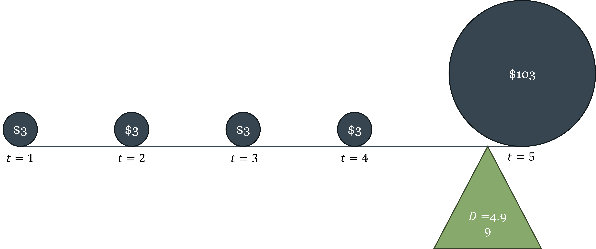
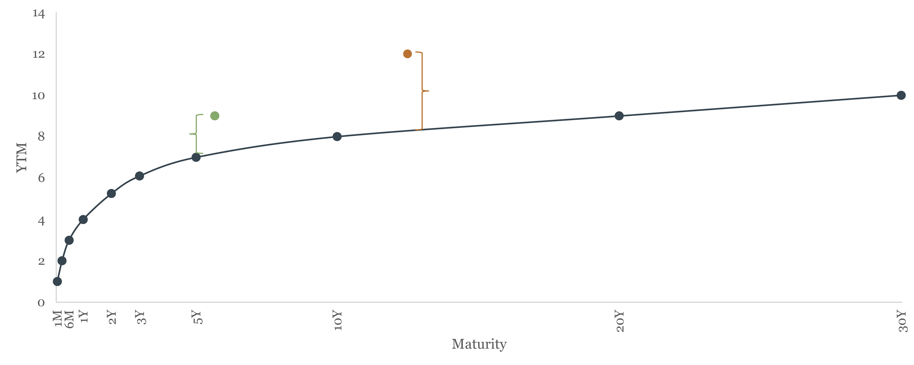

# Pricing Financial Assets {#sec-ch06}

::: {.callout-note}
## Learning Objectives

By the end of this chapter, you will be able to:

- Define the key features of a bond and price it using present value
- Derive and explain the inverse relationship between bond prices and yields
- Calculate and interpret current yield, yield to maturity, and holding period return
- Identify the main risks bonds carry and explain how credit ratings address information asymmetry in bond markets
- Calculate Macaulay duration and use it to measure a bond's interest rate sensitivity
- Describe the term structure of interest rates and explain what determines the shape of the yield curve
- State the expectations hypothesis, derive the long rate formula, and identify what the hypothesis explains and what it leaves unexplained
- Explain the term premium and use it to interpret flat and inverted yield curves
- Value a stock using the dividend discount model and interpret P/E ratios
- Describe the main US stock market indices and explain the difference between price-weighted and market-cap-weighted construction
- State the Efficient Market Hypothesis in its three forms, explain why prices change if markets are efficient, evaluate the case for passive investing, and assess the role of behavioral finance as a complement to EMH
:::

## Bond Valuation

### What a Bond Is

A **[bond](https://en.wikipedia.org/wiki/Bond_(finance))** is a debt instrument: a contract in which the issuer borrows money from the bondholder today and promises to make specified cash payments in the future. Chapter 5 introduced bonds as one category of financial instrument — a fixed, senior claim with contractual cash flows. This section develops the pricing mechanics in detail.

The canonical bond — the **bullet bond** — has three defining features:

- **Face value (principal):** the amount the issuer repays at maturity, typically \$1,000 or \$100 for government bonds
- **Coupon rate:** the annual interest payment expressed as a percentage of face value. A 5% coupon on a \$100 bond pays \$5 per year
- **Maturity date:** the date the final coupon and principal are paid

The bond's cash flow structure is thus: coupon payments at regular intervals (annually or semi-annually) plus a single principal repayment at maturity. This structure makes the bond a straightforward present value problem — which is exactly how we will price it.

::: {.callout-note}
## Key Definition: Bond

A **bond** is a contract specifying a stream of future cash flows: periodic coupon payments $C$ and a face value $F$ paid at maturity $T$. The issuer — a government, corporation, or other entity — receives the bond's price $p$ today in exchange for making these future payments. The bondholder is a creditor with a senior, fixed claim: the promised payments must be made before any residual can be distributed to equity holders.
:::

### Pricing a Bond: Present Value of Future Cash Flows

Since the bond's future cash flows are known and contractually specified, pricing it is a direct application of the present value formula from Chapter 5. The price $p$ of a bond paying annual coupon $C$ for $T$ years with face value $F$ is:

$$p = \frac{C}{(1+i)} + \frac{C}{(1+i)^2} + \cdots + \frac{C+F}{(1+i)^T} = \sum_{t=1}^{T} \frac{C}{(1+i)^t} + \frac{F}{(1+i)^T}$$

where $i$ is the discount rate — the rate the market applies to discount this bond's cash flows given its risk profile and maturity.

Two worked examples make the relationship between the coupon rate, the discount rate, and the bond price concrete. Both use a 5-year bond with \$100 face value.

**Example 1: Discount rate (5%) exceeds coupon rate (3%) → bond trades at a discount**

$$p = \frac{\$3}{1.05} + \frac{\$3}{1.05^2} + \frac{\$3}{1.05^3} + \frac{\$3}{1.05^4} + \frac{\$103}{1.05^5} = \$2.86 + \$2.72 + \$2.59 + \$2.47 + \$80.70 = \$91.34$$

The bond is worth \$91.34, an \$8.66 loss relative to the \$100 face value. The market demands a 5% return but the bond only promises 3% coupons, so the price must fall to make the effective return competitive.

**Example 2: Coupon rate (5%) exceeds discount rate (3%) → bond trades at a premium**

$$p = \frac{\$5}{1.03} + \frac{\$5}{1.03^2} + \frac{\$5}{1.03^3} + \frac{\$5}{1.03^4} + \frac{\$105}{1.03^5} = \$4.85 + \$4.71 + \$4.58 + \$4.44 + \$90.57 = \$109.16$$

The bond is worth \$109.16, a \$9.16 gain relative to face value. The bond promises above-market coupons, so investors bid up its price.

These examples demonstrate the **inverse relationship between bond prices and yields**: when market interest rates rise, the discount rate rises, and bond prices fall. When rates fall, bond prices rise. This relationship holds for *all* bonds, regardless of coupon rate, maturity, or issuer — it is a direct consequence of the present value formula.

::: {.callout-important}
## Key Takeaway: The Inverse Price-Yield Relationship

Bond prices and yields always move in opposite directions. This is not a market convention or an empirical regularity — it is a mathematical necessity that follows directly from the present value formula. If you understand present value, you understand why bond prices fall when interest rates rise.
:::

### Bond Yields: Three Measures

The **yield** of a bond is the return the bondholder earns. There are three common measures, each answering a slightly different question.

**[Current yield](https://en.wikipedia.org/wiki/Current_yield)** is the simplest: the annual coupon divided by the current market price.

$$\text{Current yield} = \frac{C}{p}$$

If a bond pays \$5 in annual coupons and its price is \$91.34, its current yield is $\frac{\$5}{\$91.34} \approx 5.47\%$. The "current" in current yield refers to the bondholder's current fiscal year — it measures the income the investor actually receives over the next 12 months relative to what they paid for the bond. It ignores the capital gain or loss the investor realizes at maturity, so it is an incomplete measure of total return.

**[Yield to maturity (YTM)](https://en.wikipedia.org/wiki/Yield_to_maturity)** is the discount rate that makes the present value of all future cash flows equal to the current market price. It is the most comprehensive yield measure because it accounts for all sources of return: coupon income, reinvestment of coupons, and capital gain or loss at maturity.

For a 2-year bond with \$100 face value and 5% coupon:

$$p = \frac{\$5}{1+\text{YTM}} + \frac{\$105}{(1+\text{YTM})^2}$$

If $p = \$100$, then YTM = 5% (equal to the coupon rate). If $p < \$100$, then YTM $>$ 5% — the investor gets the coupon income *plus* a capital gain at maturity, so the total return exceeds the coupon rate. If $p > \$100$, then YTM $<$ 5% — the capital loss at maturity reduces the total return below the coupon rate. The coupon rate, current yield, and YTM are equal *only* when the bond trades at par (price equals face value).

**[Holding period return](https://en.wikipedia.org/wiki/Holding_period_return)** applies when the investor sells the bond before maturity, at some intermediate price $p_s$:

$$\text{Holding period return} = \underbrace{\frac{C}{p}}_{\text{current yield}} + \underbrace{\frac{p_s - p}{p}}_{\text{capital gain (or loss)}}$$

The holding period return decomposes into coupon income and price appreciation. This measure matters because most bond investors do not hold to maturity — they sell in secondary markets, and their actual return depends on what price the bond fetches when they sell. That price depends on where interest rates are at the time of sale — which brings us directly to interest rate risk.

### Bond Risks

Because bonds are promises of future cash flows, they are exposed to several categories of risk that affect their pricing.

**Default (credit) risk** is the risk that the issuer fails to make the promised payments — whether partial or total. Default risk is the primary concern for most bondholders. Quantifying it requires navigating complex financial statements, hidden liabilities, and uncertain future economic conditions. This information problem — a classic case of the asymmetric information discussed in Chapter 5 — is addressed by **credit rating agencies**: [Moody's Ratings](https://en.wikipedia.org/wiki/Moody%27s_Ratings), [S&P Global Ratings](https://en.wikipedia.org/wiki/S%26P_Global_Ratings), and [Fitch Ratings](https://en.wikipedia.org/wiki/Fitch_Ratings). These agencies specialize in evaluating issuers and assigning standardized ratings that compress complex credit analysis into a single signal.

The three agencies use a similar grading scale:

| Grade               | Moody's | S&P / Fitch | Description              |
|---------------------|:-------:|:-----------:|--------------------------|
| Investment grade    | Aaa     | AAA         | Highest quality          |
|                     | Aa      | AA          | Very high quality        |
|                     | A       | A           | High quality             |
|                     | Baa     | BBB         | Good quality             |
| Speculative grade   | Ba      | BB          | Speculative              |
|                     | B       | B           | Highly speculative       |
|                     | Caa     | CCC         | Substantial default risk |
|                     | Ca      | CC          | Very high default risk   |
| High-yield ("junk") | C/D     | C/D         | In default               |

The lower the rating, the higher the default risk, and therefore the higher the yield the market demands. The spread between a junk bond yield and a AAA bond yield of the same maturity is a direct measure of how much the market is charging for credit risk — a concept developed further in Chapter 7. Bond ratings are a practical solution to asymmetric information in a market too large and complex for individual investors to evaluate each issuer independently.

**Interest rate risk** is the risk that market interest rates change after the bond is purchased, causing its price to fall. This is the risk we have been analyzing throughout this section — it is inescapable for any fixed-income investor who might need to sell before maturity.

**Inflation risk** is the risk that inflation erodes the real purchasing power of the bond's fixed cash flows. A bond that promises \$5 per year is worth less in real terms if inflation runs at 5% than if it runs at 1%. Inflation-indexed bonds (such as US Treasury Inflation-Protected Securities, or TIPS) address this risk by adjusting the principal for inflation.

### Duration: Quantifying Interest Rate Sensitivity

Chapter 5 introduced duration as the weighted average time until a bond's cash flows are received. We can now give it its full treatment.

**[Macaulay duration](https://en.wikipedia.org/wiki/Duration_(finance)#Macaulay_duration)** is defined as:

$$D = \frac{\displaystyle\sum_{t=1}^{T} t \cdot \frac{CF_t}{(1+i)^t}}{p}$$

where the numerator is the sum of each cash flow's present value weighted by its time, and the denominator is the bond's price (the sum of all discounted cash flows). Duration is measured in years and represents the effective maturity of the bond — the center of gravity of its cash flow stream.

::: {#fig-duration}

Duration as a balance point. A 5-year bond with \$3 annual coupons and \$103 at maturity has a Macaulay duration of 4.99 years — nearly the full maturity, because most of the value is in the final payment. A high-coupon bond would have a shorter duration because relatively more value is received early. Duration is the fulcrum that balances the bond's cash flows in time.
:::

The practical importance of duration is its relationship to price sensitivity. **[Modified duration](https://en.wikipedia.org/wiki/Duration_(finance)#Modified_duration)** ($MD$) measures the percentage change in bond price for a one percentage point change in yield:

$$MD = \frac{D}{1 + i}$$

Modified duration and Macaulay duration are closely related but measure different things: Macaulay duration measures the average life of the bond's cash flows — a concept in time — while modified duration measures price sensitivity — a concept in return. They are connected because the same property that makes a bond's cash flows long-dated (high Macaulay duration) is precisely what makes its price sensitive to interest rate changes (high modified duration). In continuous time the two are equivalent, $MD = D$; in discrete time they differ by the factor $1/(1+i)$, which is small when rates are low but meaningful at higher yields. In practice, for typical interest rate levels, $MD \approx D$ is a useful approximation.

A bond with a Macaulay duration of 5 years and a yield of 5% has a modified duration of $5/1.05 \approx 4.76$ — meaning a 1 percentage point rise in yields reduces the bond's price by approximately 4.76%. This is the quantitative statement of the duration-sensitivity relationship introduced in Chapter 5.

Two properties follow immediately:

First, **longer-maturity bonds have higher duration** and are therefore more interest-rate sensitive. A 30-year Treasury bond is far more volatile than a 2-year Treasury note when rates move — which is why investors demand higher yields for longer maturities even when credit risk is identical.

Second, **lower-coupon bonds have higher duration** for a given maturity. This is because a lower coupon means a greater fraction of total value is in the distant principal repayment (which gets discounted heavily) rather than in near-term coupons. A zero-coupon bond has duration exactly equal to its maturity — all value is in the final payment.

::: {.callout-warning}
## Common Mistake: Maturity and Duration Are Not the Same

Maturity is the date of the last payment. Duration is the effective time-weighted average of *all* payments. For a coupon-bearing bond, duration is always less than maturity, because some cash flows arrive before the final payment date. The exception is a zero-coupon bond, where duration equals maturity exactly. When assessing interest rate risk, duration is the correct measure — not maturity.
:::

## The Yield Curve

### What the Yield Curve Is

The **[yield curve](https://en.wikipedia.org/wiki/Yield_curve)** plots the yields of otherwise identical bonds against their maturities. "Otherwise identical" means same issuer, same credit quality, same currency — the only thing varying is time to maturity. The US Treasury yield curve is the benchmark: it shows the yield on Treasury securities from 1 month to 30 years, all free of default risk, and the shape of that curve contains important information about expectations for interest rates and the economy.

::: {#fig-yield-curve-shapes}

Three common shapes of the yield curve. An **upward-sloping** (normal) curve — short rates below long rates — is the most common configuration, reflecting positive term premiums and/or expectations that rates will rise. A **flat** curve signals uncertainty or transition. An **inverted** curve — short rates above long rates — is the most informative: it signals that markets expect rates to fall, typically because they expect economic slowdown.
:::

### Why Different Maturities Have Different Yields: The Term Structure

Two Treasury bonds identical in every respect except maturity will, in general, have different yields. Three forces drive this difference:

**Risk.** The longer the maturity, the more time for something to go wrong — even for a default-free issuer. Unexpected inflation, policy changes, and shifts in the economic environment all become more likely over longer horizons. Investors demand compensation for bearing this uncertainty.

**Expected changes in the risk-free rate.** If the market expects short-term interest rates to be higher in the future, long-term rates must be higher today to make long-term bonds competitive with rolling over short-term bonds. If the market expects rates to fall, long-term rates will be lower than current short-term rates.

**Inflation uncertainty.** Inflation is harder to forecast at longer horizons. A bondholder locked into a 30-year fixed rate faces 30 years of inflation risk; a holder of 1-month bills faces only one month. This additional inflation risk at long maturities is reflected in higher long-term yields.

### The Expectations Hypothesis

The **[expectations hypothesis](https://en.wikipedia.org/wiki/Expectations_hypothesis)** formalizes the second force: long-term rates as averages of expected future short-term rates. The key insight is that a rational investor should be indifferent between holding a 2-year bond and rolling over two consecutive 1-year bonds — if they are not indifferent, arbitrage will equalize the returns.

For a 2-year bond:

$$(1 + i_{2t})^2 = (1 + i_{1t})(1 + i_{1t+1}^e)$$

Solving for the 2-year rate:

$$i_{2t} = \sqrt{(1 + i_{1t})(1 + i_{1t+1}^e)} - 1 \approx \frac{i_{1t} + i_{1t+1}^e}{2}$$

The 2-year rate is approximately the average of today's 1-year rate and the expected 1-year rate next year. Generalizing to $n$ periods:

$$i_{nt} \approx \frac{i_{1t} + i_{1t+1}^e + i_{1t+2}^e + \cdots + i_{1t+(n-1)}^e}{n}$$

The $n$-year rate is the average of expected future 1-year rates over the next $n$ years.

::: {.callout-tip}
## Intuition Builder: Reading the Yield Curve Through the Expectations Hypothesis

If the yield curve is upward sloping — say, the 1-year rate is 3% and the 10-year rate is 5% — the expectations hypothesis says the market expects short-term rates to rise over the next decade. If the curve is flat (1-year and 10-year yields are equal), the market expects short rates to stay roughly the same. If the curve is inverted (1-year rate exceeds 10-year rate), the market expects short rates to *fall* — which typically signals that investors anticipate an economic slowdown and eventual monetary easing.
:::

The expectations hypothesis has real empirical content. It correctly predicts that short-term and long-term rates tend to move together — when the Fed raises the federal funds rate, longer-term rates generally rise too, though by less. It also correctly predicts that longer-term rates move less than shorter-term rates in response to a given policy change, because the long rate averages many expected future short rates, dampening the impact of any single rate change.

But the expectations hypothesis has a well-known shortcoming: it cannot explain why the yield curve is upward-sloping on average. If the curve simply reflected expected future rates, we would expect it to be flat on average — sometimes sloping up (when rates are expected to rise), sometimes sloping down (when rates are expected to fall), with no systematic tilt. The fact that long rates are almost always above short rates requires an additional explanation.

### The Term Premium

The missing piece is the **term premium**: the extra return investors demand for holding longer-maturity bonds rather than rolling over short-term bonds. The term premium compensates for two things: the interest rate risk inherent in long-duration bonds (which, as we saw above, can suffer large price declines if rates rise), and the greater inflation uncertainty at longer horizons.

Incorporating the term premium $\phi_t$ into the expectations hypothesis:

$$i_{nt} \approx \frac{i_{1t} + i_{1t+1}^e + \cdots + i_{1t+(n-1)}^e}{n} + \phi_t$$

The observed long-term yield has two components: the average of expected future short rates (the pure expectations component) and the term premium. This is why the yield curve is upward-sloping on average even when investors don't expect rates to rise: the term premium alone tilts the curve upward.

The term premium also explains why a **flat yield curve** is already informative — it suggests that expectations of *falling* short rates are roughly offsetting the positive term premium. And it explains why an **[inverted yield curve](https://en.wikipedia.org/wiki/Inverted_yield_curve)** is a particularly strong signal: to invert, the expected-rate-decline component must be large enough to overcome both the term premium and any remaining upward expectations effect.

### Country Risk and Sovereign Spreads

The yield curve analysis above applies to bonds of a single issuer. When comparing bonds across countries, an additional factor enters: **country risk**, also called sovereign risk. A bond issued by the Greek government carries default risk that a German government bond does not — both are euro-denominated, but Greece's fiscal position and institutional framework make default more plausible. The difference in yield between Greek and German bonds of the same maturity is the **credit spread**, and it measures the market's assessment of Greek sovereign risk relative to Germany.

::: {#fig-country_risk}

Country risk and sovereign spreads. The spread between the yields of a risk-free reference country and a riskier country reflects the market's assessment of default risk for a given maturity. Wider spreads signal greater perceived risk.
:::

During the European sovereign debt crisis of 2010–2012, discussed in Chapter 3, Greek 10-year yields reached over 25% while German yields were below 2% — a spread of over 23 percentage points reflecting the market's near-certain assessment of a Greek default. Country risk spreads are the bond market's real-time verdict on fiscal sustainability, and they move faster than any credit rating agency.

### The Inverted Yield Curve as a Recession Indicator

The inverted yield curve — when short-term rates exceed long-term rates — is one of the most reliable macroeconomic indicators we have. The historical record is striking:

| Recession | Inversion began | Recession started | Months between |
|-----------|:---------------:|:-----------------:|:--------------:|
| 1970      | Dec 1968        | Jan 1970          | 13             |
| 1974      | Jun 1973        | Dec 1973          | 6              |
| 1980      | Nov 1978        | Feb 1980          | 15             |
| 1981      | Oct 1980        | Aug 1981          | 10             |
| 1990      | Jun 1989        | Aug 1990          | 16             |
| 2001      | Jul 2000        | Apr 2001          | 9              |
| 2008      | Aug 2006        | Jan 2008          | 17             |
| 2020      | May 2019        | Mar 2020          | 10             |

Every US recession since 1970 has been preceded by an inverted yield curve. Every inversion has been followed by a recession. The lead time varies — from 6 to 17 months — but the signal has been remarkably consistent.

The mechanism runs through monetary policy and expectations. An inverted curve typically occurs when the Fed has raised short-term rates aggressively (to fight inflation) while long-term rates remain lower, reflecting market expectations that the rate hikes will eventually cause a slowdown — forcing the Fed to reverse course and cut rates. Investors rush to lock in current long-term rates before rates fall, bidding up long bond prices and pushing long yields below short yields. In essence, the inverted curve reflects markets pricing in the Fed's future easing — because they anticipate an imminent recession.

The Fed's aggressive rate hikes of 2022–2023 produced the deepest yield curve inversion in decades, with the 3-month Treasury bill yielding more than 5% while the 10-year Treasury yielded less than 4%. The recession the inversion was predicting had not materialized as of early 2025, making this episode one of the most-watched tests of the yield curve's forecasting reliability in recent memory.

## Stock Valuation

### What Equity Is — and Why It's Harder to Value Than Debt

A bond's cash flows are specified by contract — the issuer *must* pay the coupon and principal on schedule (or default). An equity share has no such contractual promise. The stockholder is a residual claimant: they receive whatever is left after all debt obligations, taxes, and operating costs have been paid. This residual can be distributed as dividends or retained in the firm to fund future growth — the decision is at the discretion of management and the board.

This makes stock valuation fundamentally more difficult than bond valuation. For a bond, you know the cash flows and need only the discount rate. For a stock, you know neither the future cash flows (dividends are discretionary and uncertain) nor with confidence the appropriate discount rate (which depends on the stock's risk profile relative to other investments). Both inputs must be estimated, and small changes in either input produce large changes in valuation.

This difference also reflects two fundamentally different investment objectives. An investor who wants to **secure a predictable cash flow** buys a bond: the coupon payments are contractual, the maturity date is known, and the return over the holding period is largely predictable from the purchase price and the coupon rate. An investor who buys a **stock** is doing something different: since dividends are discretionary and most equity returns come from price appreciation rather than dividend income, buying a stock is primarily a bet on the future price of the shares — a form of speculation on the firm's growth and the market's eventual valuation of that growth. This is not a criticism of equity investing; capital gains are a legitimate and important source of return. But it clarifies why the two instruments attract different investors with different objectives, and why equity valuation is inherently more uncertain than bond valuation.

Several approaches to stock valuation exist. **[Technical analysis](https://en.wikipedia.org/wiki/Technical_analysis)** attempts to predict future prices from historical price patterns — a methodology rejected by most academic economists for reasons connected to the EMH discussion in §6.4. **Behavioral approaches** focus on psychological factors and investor sentiment. **[Fundamental analysis](https://en.wikipedia.org/wiki/Fundamental_analysis)** — the approach we develop here — attempts to estimate intrinsic value by analyzing the firm's business and financial fundamentals. The **Gordon Growth Model** (also called the dividend discount model, or DDM) formalizes the fundamental analysis approach.

### The Gordon Growth Model

The [Gordon Growth Model](https://en.wikipedia.org/wiki/Dividend_discount_model) starts from the observation that a stock is ultimately a claim on the firm's future cash flows to shareholders — whether those flows come as dividends, buybacks, or eventual liquidation. Like a bond, a stock's value is the present value of its expected future cash flows.

The general form of the model prices a stock held for $n$ periods as the present value of expected dividends plus the expected selling price:

$$p_t = \frac{D_{t+1}}{1+i} + \frac{D_{t+2}}{(1+i)^2} + \cdots + \frac{D_{t+n} + p_{t+n}}{(1+i)^n}$$

where $D_{t+j}$ is the dividend expected in period $t+j$, $p_{t+n}$ is the expected selling price at the end of the holding period, and $i$ is the discount rate. The expected selling price itself depends on future dividends, which in turn depend on dividends after that — so ultimately, the stock price equals the present value of *all* future dividends, discounted to today.

**Worked example.** Suppose a stock is expected to pay \$1 in dividends each year for 3 years and can be sold for \$50 at the end of year 3. The appropriate discount rate is 3%. Then:

$$p_t = \frac{\$1}{1.03} + \frac{\$1}{1.03^2} + \frac{\$1 + \$50}{1.03^3} = \$0.97 + \$0.94 + \$46.68 = \$48.59$$

The stock is worth \$48.59 today. Notice that the expected selling price (\$50) dominates the valuation — the near-term dividends contribute relatively little. This is typical for growth stocks, where most of the value is in future earnings rather than near-term income.

Under the special assumption that dividends grow at a constant rate $g$ forever, the infinite sum simplifies to a closed-form expression — the Gordon Growth Model in its most compact form:

$$p_t = \frac{D_{t+1}}{i - g}$$

This formula is worth pausing on. A stock's true value depends on an infinite stream of future dividends — an unknowable sequence of cash flows stretching decades into the future. The Gordon Growth Model compresses all of that unknowable information into just two parameters: the growth rate of dividends $g$ and the required return on equity $i$. This is the model's great practical appeal: instead of forecasting dividends year by year forever, analysts need only estimate a long-run growth rate and a discount rate. Both must still be estimated with care — and as the formula makes clear, small changes in either produce large changes in price — but the information requirement has been dramatically reduced relative to a full cash-flow forecast.

The formula says that stock price rises when the growth rate $g$ rises (better growth prospects), falls when the required return $i$ rises (higher opportunity cost or risk), and is explosive as $g$ approaches $i$ — a reminder that the constant-growth assumption breaks down when growth rates are close to discount rates.

::: {.callout-warning}
## Common Mistake: Confusing the Discount Rate with the Risk-Free Rate

The discount rate $i$ in stock valuation is not the Treasury yield or the federal funds rate. It is the **required return on equity** — the return investors demand for bearing the specific risk of this stock. Required return on equity equals the risk-free rate *plus* a risk premium that compensates for the stock's exposure to market-wide risk. A risky startup and a stable utility company have very different required returns, even when the risk-free rate is the same. Chapter 7 develops the theory of how this risk premium is determined — it is one of the central questions of asset pricing. For now, the key point is that the discount rate in the DDM embeds a risk premium that must be estimated, not simply looked up.
:::

### Price-Earnings Ratios

The **price-earnings ratio (P/E)** is the most widely reported valuation metric in equity markets: the stock's current price divided by its earnings per share (EPS) over the trailing 12 months.

$$\text{P/E} = \frac{p}{\text{EPS}}$$

The P/E ratio tells you how many dollars investors are paying per dollar of current earnings — a higher P/E means investors are paying more for each dollar of profit. A large-cap technology company with strong growth expectations might trade at a P/E of 30 or 40: investors are willing to pay \$30–40 today for each \$1 of current earnings because they expect those earnings to grow substantially. A mature utility company with stable but slow-growing profits might trade at a P/E of 12–15.

P/E ratios are a useful shortcut but have important limitations. They embed implicit assumptions about growth and risk that are not made explicit. Comparing P/E ratios across firms is only meaningful if those firms have similar risk profiles and growth prospects. And P/E ratios based on historical earnings can be misleading for firms undergoing rapid change.

The Gordon Growth Model provides a conceptual foundation for the P/E ratio. If we assume dividends are a constant fraction of earnings ($D = b \cdot \text{EPS}$, where $b$ is the payout ratio), then:

$$\text{P/E} = \frac{b}{i - g}$$

This expression shows that P/E is higher when the payout ratio is higher, when the growth rate is higher, or when the required return on equity is lower. A market with low interest rates (and thus low required returns) will have high P/E ratios on average — a relationship that was visible in the 2010s and early 2020s, when historically low interest rates drove historically high equity valuations.

### Stock Market Indices

A **[stock market index](https://en.wikipedia.org/wiki/Stock_market_index)** tracks the aggregate performance of a selected group of stocks, providing a single number that summarizes the state of a broad market or sector. Indices serve several functions: they give investors a benchmark against which to compare portfolio performance, they allow passive investors to replicate "the market" through a single instrument, and they serve as an economic indicator — a rising market generally reflects improving expectations about corporate earnings and economic growth.

The main US indices differ in their construction and scope:

The **[Dow Jones Industrial Average](https://en.wikipedia.org/wiki/Dow_Jones_Industrial_Average)** (DJIA) is the oldest and most widely cited US index, tracking 30 large blue-chip companies. It is **price-weighted**: each stock's influence on the index is proportional to its share price, not its market capitalization. This means a \$500 stock affects the Dow five times as much as a \$100 stock, regardless of how large either company is — a peculiarity that makes the DJIA less theoretically satisfying than other indices, though its long history (dating to 1896) gives it cultural and historical significance.

The **[S&P 500](https://en.wikipedia.org/wiki/S%26P_500)** tracks 500 large US companies and is the standard professional benchmark. It is **market capitalization-weighted**: each stock's influence is proportional to its total market value (share price × shares outstanding). This construction means the largest companies — Apple, Microsoft, Amazon, Alphabet — have the most influence on the index. The S&P 500 covers roughly 80% of total US equity market capitalization, making it a better representation of "the US stock market" than the Dow.

The **[Wilshire 5000](https://en.wikipedia.org/wiki/Wilshire_5000)** (which actually contains several thousand stocks, not exactly 5000) is the broadest measure of the US equity market, covering essentially all publicly traded US companies. It is also market-cap weighted and is the closest thing to a comprehensive measure of total US stock market wealth.

The **[NASDAQ Composite](https://en.wikipedia.org/wiki/Nasdaq_Composite)** covers all stocks listed on the NASDAQ exchange, which is disproportionately weighted toward technology and growth companies. It is the index most sensitive to technology sector performance and growth stock valuations.

::: {.callout-tip}
## Intuition Builder: Index Funds and Passive Investing

When financial advisors recommend "investing in the market," they typically mean buying an index fund or ETF that replicates one of these indices — usually the S&P 500. A Vanguard S&P 500 index fund, for instance, holds all 500 companies in the index in proportion to their market weight, at an annual fee of roughly 0.03%. Owning such a fund means owning a tiny fraction of 500 of the largest US companies simultaneously — the practical implementation of the diversification principle and the passive investing logic that the EMH discussion in §6.4 develops in detail.
:::

## The Efficient Market Hypothesis

### The Puzzle of Active vs. Passive Management

The financial industry employs thousands of highly paid analysts, portfolio managers, and traders whose job is to identify mispriced securities and generate returns above the market average. The puzzle is: evidence consistently shows that most actively managed funds *underperform* their benchmark indexes after fees. Not occasionally, not temporarily — systematically, over long periods, across most market conditions.

::: {#fig-malkiel-monkey}
{}

[Burton Malkiel](https://en.wikipedia.org/wiki/Burton_Malkiel), in his influential book *A Random Walk Down Wall Street*, argued that a blindfolded monkey throwing darts at a newspaper's financial pages could select a portfolio that would do just as well as one carefully selected by experts. This is not a criticism of analysts' intelligence — it is a statement about market structure.  

The **Efficient Market Hypothesis** (EMH) provides the theoretical explanation for this puzzle. But before we get there, notice something about the monkey itself: the dart-throwing monkey is not just lucky. By throwing darts randomly at a full list of stocks, the monkey is — by construction — **diversifying**. A portfolio assembled by throwing enough darts will hold many stocks across many sectors, approximating the composition of the market index. This is not a coincidence. It is precisely what index funds do deliberately. The monkey's "strategy" produces market-like returns at zero cost because random selection across a broad universe is functionally equivalent to indexing. The real puzzle is not why the monkey does well — it is why professional managers, with all their research and expertise, cannot consistently do better than the monkey once fees are accounted for.
:::

### What EMH Claims

The [Efficient Market Hypothesis](https://en.wikipedia.org/wiki/Efficient-market_hypothesis), associated primarily with [Eugene Fama](https://en.wikipedia.org/wiki/Eugene_Fama) (Nobel Prize, 2013), claims that financial market prices fully reflect all available information. If prices already incorporate all information, no investor can consistently earn returns above the market average *using that information* — because the market has already acted on it. Any profit opportunity that exists will be competed away as soon as it is identified.

Three forms of EMH define what "all available information" means:

**Weak form:** prices reflect all information in past price history. Technical analysis — the attempt to predict future prices from historical price patterns — cannot generate consistent excess returns, because past prices are already incorporated. This is the most widely accepted form of EMH.

**Semi-strong form:** prices reflect all publicly available information, including past prices, earnings announcements, economic data, news, and analyst reports. Fundamental analysis — the attempt to identify undervalued stocks by analyzing publicly available financial information — cannot generate consistent excess returns. This is more controversial but well-supported empirically.

**Strong form:** prices reflect all information, including private (insider) information. Even insiders cannot consistently earn excess returns. This is the most extreme form and is generally rejected — insider trading laws exist precisely because markets recognize that insiders *do* have an information advantage.

### Why Do Prices Change If All Information Is Already Incorporated?

This is the most common source of confusion about EMH. Students often ask: if markets are efficient, why do stock prices change every second?

The answer is that prices change because *new information* arrives continuously. EMH does not say prices are correct in some absolute sense — it says prices *quickly incorporate* all *currently available* information. When a company reports unexpectedly strong earnings, its stock price rises immediately. When the Fed announces a surprise rate decision, bond and stock prices move instantly. These price changes are not evidence against EMH; they are exactly what EMH predicts.

What EMH says cannot happen is a *systematic*, *predictable* pattern of mispricing that informed investors can exploit repeatedly. Individual price movements are unpredictable — they respond to new information, which by definition is not known in advance. This is why stock prices follow something close to a **[random walk](https://en.wikipedia.org/wiki/Random_walk)**: each price change is essentially unpredictable from prior information, because prior information is already embedded in the current price.

::: {.callout-tip}
## Intuition Builder: The Random Walk

If the current stock price is \$100, EMH says the best prediction of tomorrow's price is also \$100 — not because markets are stagnant, but because any predictable deviation from \$100 would already have been exploited and arbitraged away. The price tomorrow will differ from \$100 only because of news that arrives between now and then — and that news is, by definition, not predictable today. Prices are not *random* in the sense of being arbitrary; they are random in the sense that *changes* in prices are driven by unpredictable new information.
:::

### The Case for Passive Investing

If EMH is approximately correct — even in its semi-strong form — the implications for investment strategy are stark. Actively managed funds that attempt to beat the market by selecting securities must, on average, fail after fees. The aggregate of all active investors *is* the market, so their aggregate return before fees equals the market return. After fees, the aggregate active investor underperforms the market by exactly the amount of fees paid. Some active managers beat the market in any given year, but research consistently shows this is largely luck — there is little persistence in fund performance from year to year.

The practical implication is the case for **passive investing**: holding a diversified portfolio that tracks a market index, at the lowest possible cost. [Index funds](https://en.wikipedia.org/wiki/Index_fund) and [ETFs](https://en.wikipedia.org/wiki/Exchange-traded_fund) implement this strategy at fees of 0.03–0.10% per year, compared to 0.5–1.5% for actively managed funds. The gap in fees compounds dramatically over time: the difference between 0.05% and 1.0% in annual fees over 30 years on a \$100,000 investment is over \$100,000 in lost wealth.

This does not mean active management is valueless. Active managers provide a service: by attempting to identify and trade on mispricing, they are the mechanism *by which* prices become efficient. If every investor were passive, prices would stop updating to new information, creating profitable opportunities for the first active investor to return. EMH is an equilibrium condition, not a universal truth that holds regardless of who is participating.

### Anomalies and Behavioral Finance

The EMH is not without challenge. Several well-documented **anomalies** — systematic patterns in returns that appear inconsistent with full market efficiency — have attracted extensive research:

**The momentum effect:** stocks that have outperformed over the past 6–12 months tend to continue outperforming for the next several months. This contradicts weak-form EMH.

**The value premium:** stocks with low price-to-book ratios (value stocks) have historically earned higher returns than stocks with high price-to-book ratios (growth stocks), even after controlling for other risk factors.

**The size effect:** small-capitalization stocks have historically earned higher returns than large-capitalization stocks.

Two explanations compete for each of these anomalies. The **risk-based explanation** holds that what appears to be a free lunch is actually compensation for risk that the standard models are not capturing — value stocks, for example, may systematically perform worse in recessions, making their higher average return a risk premium rather than a mispricing. The **behavioral explanation** holds that investors make systematic cognitive errors — overconfidence, loss aversion, herding — that produce predictable mispricings that the market is slow to correct.

[Behavioral finance](https://en.wikipedia.org/wiki/Behavioral_finance), associated with [Daniel Kahneman](https://en.wikipedia.org/wiki/Daniel_Kahneman) (Nobel Prize, 2002) and [Richard Thaler](https://en.wikipedia.org/wiki/Richard_Thaler) (Nobel Prize, 2017), documents these systematic biases and their market implications. The behavioral view does not claim that markets are systematically inefficient — it claims that investor psychology creates occasional, predictable departures from efficiency that persist because arbitraging them is costly or risky.

The practical bottom line is not that EMH is either perfectly correct or fundamentally wrong. It is that markets are *approximately* efficient most of the time — meaning prices incorporate available information quickly and consistently enough that outperforming the market systematically is very difficult. The burden of proof is on the active manager to demonstrate that their information or analytical advantage is large enough to overcome this efficiency, consistently enough to justify the fees they charge.

::: {.callout-important}
## Key Takeaway: What EMH Does and Does Not Say

EMH does **not** say prices are always correct, that bubbles are impossible, or that financial crises cannot happen. It says that prices quickly incorporate available information, making it difficult to consistently beat the market using that information. Bubbles can occur when investors rationally extrapolate past returns into the future — a process consistent with individuals acting on their information even if the collective result is a misaligned price level. The practical implication of EMH — that passive investing outperforms active management on average after fees — survives even if the strong form is rejected and even if behavioral anomalies exist.
:::

## Looking Ahead

This chapter has valued bonds and stocks as present value problems and examined what market prices tell us about expectations — for future interest rates, economic growth, and firm performance. But one important input has appeared repeatedly without being fully explained: the **discount rate**. For bonds, the relevant discount rate is the market yield, which we decomposed into the risk-free rate, the term premium, and the credit spread. For stocks, the relevant discount rate is the required return on equity, which equals the risk-free rate plus an equity risk premium. In both cases, the premium above the risk-free rate is compensation for bearing risk — but what risk, exactly, and how much compensation does the market demand for it?

These questions are the subject of Chapter 7. It develops the theory of risk and return: how to measure risk, how the market prices it, and how investors can manage it through diversification and derivatives. The equity risk premium embedded in every stock valuation, the credit spread embedded in every corporate bond yield, and the term premium embedded in every long-term rate all find their theoretical foundations there. Pricing financial assets, as this chapter has shown, is straightforward once you know the discount rate. Chapter 7 explains where that discount rate comes from.

## Key Takeaways

::: {.callout-important}
## Chapter 6 Summary

**Bond valuation:** A bond's price is the present value of its cash flows — coupons plus principal — discounted at the market yield. The inverse price-yield relationship follows directly from the PV formula: when yields rise, bond prices fall, and vice versa. Three yield measures capture different aspects of return: current yield (coupon ÷ price), YTM (the discount rate equating price to all future cash flows), and holding period return (current yield plus capital gain). These three are equal only when the bond trades at par.

**Bond risks:** Default risk is addressed by credit rating agencies — which exist as a solution to the asymmetric information problem in bond markets. Interest rate risk is the risk that market rates rise after purchase, reducing the bond's market value. Inflation risk is the erosion of fixed cash flows' real value. Duration — specifically Macaulay duration — quantifies interest rate sensitivity: a bond with duration $D$ loses approximately $D\%$ of its value for each 1 percentage point rise in yields. Duration is always less than maturity for coupon bonds; it equals maturity only for zero-coupon bonds.

**The yield curve:** The term structure of interest rates reflects three forces: risk at longer maturities, expected future rate changes, and inflation uncertainty. The expectations hypothesis derives long rates as averages of expected future short rates; it explains why rates tend to move together but cannot explain the systematic upward slope of the yield curve. The term premium — extra compensation for duration and inflation risk — provides the missing piece. An inverted yield curve (short rates above long rates) signals that rate-decline expectations have overwhelmed the term premium, and has preceded every US recession since 1970 with a lead time of 6–17 months.

**Stock valuation:** Equity is a residual claim with no contractual cash flows. Unlike bonds — which investors buy to secure predictable future payments — stocks are primarily purchased for capital gains: the investor is speculating on the future price, not locking in a cash flow. This makes equity valuation fundamentally harder. The Gordon Growth Model prices a stock as the present value of expected dividends plus expected selling price; under constant dividend growth, $p = D/(i-g)$. The model's practical value is information compression: instead of forecasting an infinite dividend stream, analysts estimate just two parameters — the growth rate $g$ and the required return $i$. Small changes in either, however, produce large changes in price. P/E ratios are a shortcut that embeds implicit growth and risk assumptions; high P/E is not necessarily overvaluation but may reflect high growth expectations or low required returns. Stock market indices (Dow Jones, S&P 500, Wilshire 5000, NASDAQ) aggregate individual valuations into benchmarks; the S&P 500 is the standard professional benchmark. Passive investing through index funds replicates the index at minimal cost — the practical application of the EMH logic in §6.4.

**The Efficient Market Hypothesis:** EMH holds that prices quickly incorporate all available information, making consistent excess returns impossible using that information. Weak form: past prices are already reflected — technical analysis cannot beat the market. Semi-strong form: all public information is reflected — fundamental analysis cannot consistently beat the market. Strong form (generally rejected): even private information is reflected. Prices change because new information arrives — not because of predictable patterns. The dart-throwing monkey does well by construction: random selection across a broad stock universe produces a diversified, market-like portfolio at zero cost — which is functionally equivalent to indexing. The practical implication is that passive index investing outperforms active management on average after fees. Behavioral anomalies (momentum, value premium, size effect) exist but are either risk-based premia or are difficult to exploit after transaction costs. Markets are approximately efficient most of the time.
:::
